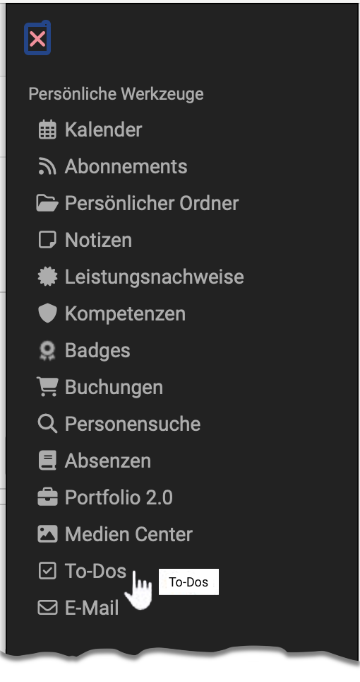

# Persönliche Werkzeuge: To-Dos

{ class="aside-right lightbox"}

Die zu erledigenden Aufgaben (To-Dos) finden sich an mehreren Stellen in OpenOlat (z.B. innerhalb eines Projektes).

Im persönlichen Menü finden Sie alle **Ihre persönlichen** To-Dos zusammengefasst in einer Übersicht.

Sie können

* neue To-Dos erstellen (1)
* Ihre To-Dos nach Status sortiert anzeigen (2)
* durch Klick auf den kleinen Pfeil am Zeilenanfang die Details eines To-Dos aufklappen (3)
* die To-Dos bearbeiten (4)
* To-Dos löschen (Nach Selektion eines To-Dos in der ersten Spalte wird der Löschen-Button angezeigt) (5)

{ class=" shadow lightbox" }

!!! note "Hinweis"

    Wenn Sie Ihre To-Dos statt im persönlichen Menü lieber in der Kopfzeile angezeigt haben möchten, können Sie die Menüoption vom persönlichen Menü dorthin verschieben. Die Einstellung dazu nehmen Sie vor unter 
    **Persönliches Menü > Einstellungen > Tab System > Abschnitt Persönliche Werkzeuge** 
    Alle Werkzeuge, die Sie hier markieren, werden statt im persönlichen Menü in der Kopfzeile rechts oben angezeigt und sind so schneller erreichbar.

## Weitere Informationen

[Allgemeines zu To-dos](../basic_concepts/To_Dos_Basics.de.md) 
[To-dos im Kurs](../learningresources/Course_todos.de.md) 
[To-dos innerhalb eines Projektes](../area_modules/Project_Todos.de.md) 
[To-dos im Kursbaustein Aufgabe](../learningresources/Course_Element_Task.de.md) 
[Massnahmen To-dos im Qualitätsmanagement](../area_modules/Quality_Management_To-dos.de.md)

