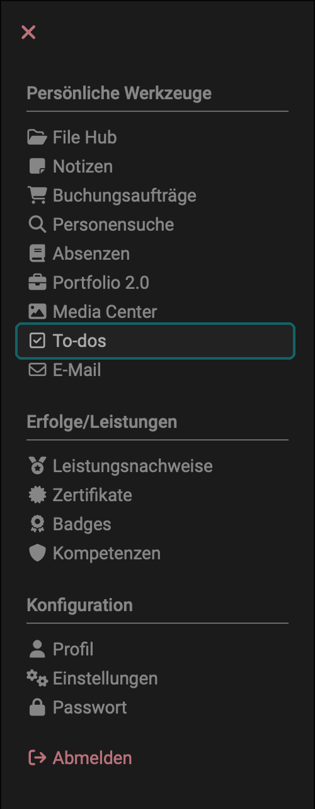
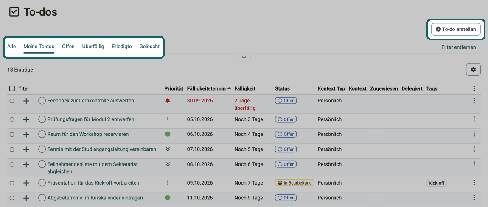
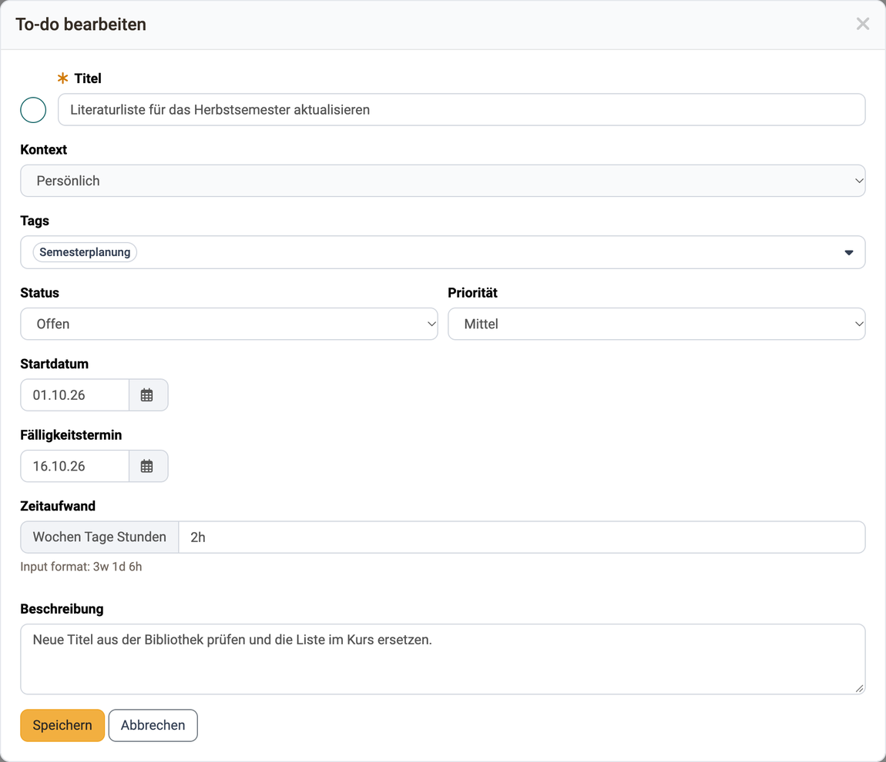
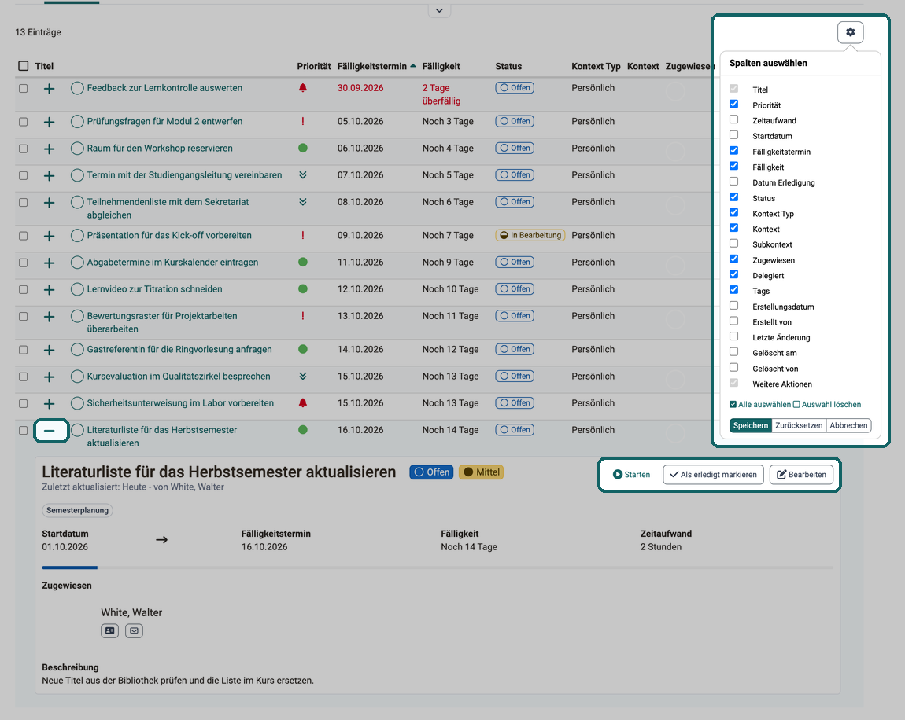

#  Persönliche Werkzeuge: To-dos {: #to_dos}

{ class="aside-right lightbox" }

Im persönlichen Werkzeug «To-dos» sehen Sie alle To-dos, bei denen Sie zugewiesen oder delegiert sind, gleich aus welchem Modul sie stammen: aus Kursen und aus dem Kursbaustein «Aufgabe», aus Projekten, aus dem Qualitätsmanagement und aus dem Course Planner. [:octicons-tag-16:{ title="ab Release 21.0 (OO-9417)" }](https://track.frentix.com/issue/OO-9417){:target="_blank"} Dazu kommen Ihre persönlichen To-dos, die Sie hier selbst erstellen. Das Werkzeug steht allen Benutzer:innen zur Verfügung, Gäste ausgenommen. Was für alle To-dos gilt, steht unter [To-dos: Grundlagen](../basic_concepts/To_Dos_Basics.de.md).

Ob das Werkzeug im persönlichen Menü erscheint, wer persönliche To-dos erstellen darf und ob sie sich anderen Personen zuweisen lassen, legen Administrator:innen in der System-Administration fest: `Administration > Module > To-do` (siehe [Modul To-do](../../manual_admin/administration/Modules_ToDo.de.md)).

{ class="shadow lightbox" title="Seite To-dos im Menü Persönliche Werkzeuge · 2026.10.02" }

Über den Button **«To-do erstellen»** legen Sie ein persönliches To-do an. Die Felder des Dialogs «To-do bearbeiten» stehen unter [Die Felder eines To-dos](../basic_concepts/To_Dos_Basics.de.md#to_do_fields).

{ class="shadow lightbox" title="Dialog To-do bearbeiten · 2026.10.02" }

## Die To-do Übersicht [:octicons-tag-16:{ title="ab Release 18.1 (OO-7038)" }](https://track.frentix.com/issue/OO-7038){:target="_blank"} {: #to_dos_overview}

In der Tabelle sehen Sie auf einen Blick, welche Aufgaben anstehen und welche überfällig sind. Mit den Tabs «Alle», «Meine To-dos», «Offen», «Überfällig», «Erledigte» und «Gelöscht» und mit den Filtern grenzen Sie die Liste ein. Über das Zahnrad-Symbol öffnen Sie das Menü «Spalten auswählen» und legen fest, welche Spalten die Tabelle zeigt.

{ class="shadow lightbox" title="Aufgeklappte Zeile und Menü Spalten auswählen · 2026.10.02" }

Über das Pluszeichen am Zeilenanfang klappen Sie den Detailbereich eines To-dos auf. Dort stehen je nach Status die Schnellaktionen «Starten», «Als erledigt markieren» und «Bearbeiten», beschrieben unter [Status und Schnellaktionen](../basic_concepts/To_Dos_Basics.de.md#status_quick_actions).

Ein Klick auf den Kreis vor dem Titel markiert ein To-do als erledigt, sofern Sie es bearbeiten dürfen. Mit einem Klick auf den Titel bearbeiten Sie das To-do. Über den Link in der Spalte «Kontext» gelangen Sie direkt zum Kurs, zum Projekt oder zum Element, aus dem das To-do stammt. Mit der Checkbox in der ersten Spalte markieren Sie mehrere To-dos und löschen sie gemeinsam; OpenOlat löscht davon nur die, die Sie löschen dürfen.

Erhalten Sie aus dem Course Planner eine E-Mail «Neue To-dos» mit mehreren To-dos, stehen hier alle diese To-dos einzeln in der Liste, auch die, die die E-Mail nur in der Zeile «… und N weitere» zählt. [:octicons-tag-16:{ title="ab Release 21.1 (OO-9731)" }](https://track.frentix.com/issue/OO-9731){:target="_blank"} Die Regeln stehen unter [Wann OpenOlat E-Mails zu To-dos verschickt](../basic_concepts/To_Dos_Basics.de.md#notifications).

### Was Sie mit einem To-do tun dürfen {: #to_do_permissions}

Welche Aktionen das Menü **«Weitere Aktionen»** (drei Punkte) am Ende einer Zeile anbietet, legt das Modul fest, aus dem das To-do stammt:

* Persönliche To-dos bearbeiten, duplizieren und löschen Sie hier.
* Bei To-dos aus Projekten bearbeiten Sie hier alle Angaben. Löschen lassen sie sich nur im Projekt.
* Bei To-dos aus Kursen und aus dem Course Planner ändern Sie hier nur den Status. Die übrigen Angaben bearbeitet, wer im Kurs beziehungsweise im Course Planner die Berechtigung dazu hat.
* To-dos aus dem Kursbaustein «Aufgabe» dienen nur der Information. Sie lassen sich weder bearbeiten noch löschen und haben kein Menü «Weitere Aktionen».

[Zum Seitenanfang ^](#to_dos)

---

## Weiterführende Informationen {: #further_information}

[To-dos: Grundlagen >](../basic_concepts/To_Dos_Basics.de.md) 
[Modul To-do (Admin) >](../../manual_admin/administration/Modules_ToDo.de.md) 
[To-dos im Kurs >](../learningresources/Course_todos.de.md) 
[Projekte: To-dos >](../area_modules/Project_Todos.de.md) 
[Kursbaustein "Aufgabe" >](../learningresources/Course_Element_Task.de.md) 
[Qualitätsmanagement: Massnahmen (To-dos) >](../area_modules/Quality_Management_To-dos.de.md) 
[Course Planner: To-dos >](../area_modules/Course_Planner_Todos.de.md)

[Zum Seitenanfang ^](#to_dos)
