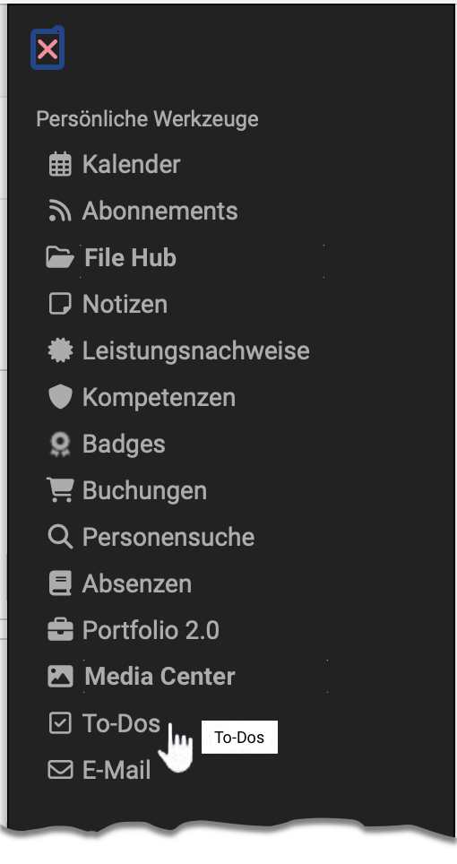

# Persönliche Werkzeuge: To-Dos {: #to_dos}

{ class="aside-right lightbox"}

{ class=" shadow lightbox" }

Alle OpenOlat User finden bei den „Persönlichen Werkzeugen“ Ihre To-dos, die ihnen in unterschiedlichen OpenOlat Kontexten zugewiesen wurden. 
Ferner können alle User hier unabhängig von OpenOlat Kursen oder Projekten eigene To-dos erstellen und bearbeiten.

{ class=" shadow lightbox" }

## Die To-do Übersicht

In der Tabelle erscheinen alle persönlichen To-dos und können bei Bedarf weiter gefiltert werden. Welche Spalten in der Tabelle angezeigt werden kann über das Zahnrad ausgewählt werden. 

{ class=" shadow lightbox" }

Schauen wir uns die Möglichkeiten an: Über das Pluszeichen lassen sich weitere Details zu einem To-do einblenden. Alternativ können passende Tabellenspalten für mehr Informationen genutzt werden.

Wird der Haken im Kreis eines To-dos gesetzt, gilt es als erledigt. Ein Klick auf den Titel ermöglicht es, das To-do zu bearbeiten. Über den Kontext-Link in der entsprechenden Spalte gelangt man direkt zum Kurs oder Projekt, aus dem das To-do stammt. Mit einem Klick auf das Quadrat am Anfang eines To-dos kann dieses markiert und anschließend gelöscht werden.

!!! note "Wichtig" 

    To-dos können immer nur dort gelöscht werden, wo sie erstellt wurden. Im persönlichen Menü können daher nur selbst erstellte To-dos entfernt werden. 

    Gelöscht werden können grundsätzlich nur To-dos die man selbst erstellt hat. 

Abgesehen von automatisch erstellten To-dos aus Aufgaben-Bausteinen eines Kurses verfügen die To-dos  über ein **3-Punkte-Menü** am Ende. Darüber lassen sich To-dos bearbeiten, duplizieren oder löschen. Welche der Optionen für ein konkretes To-do verfügbar sind, hängt davon ab, wer das To-do in welchem Kontext erstellt hat.

Im persönlichen Bereich selbst erstellte To-dos können vollständig bearbeitet, dupliziert und gelöscht werden. To-dos, die man an anderen Orten (Kurs, Projekt) selbst erstellt hat können bearbeitet und dupliziert werden, behalten aber den Kontext. Allgemeine To-dos aus Kursen, die man nicht selbst angelegt hat, lassen sich nur eingeschränkt bearbeiten, beispielsweise als erledigt markieren. 

!!! note "Beachten"

    Automatisch in Kursen zugewiesene To-dos aus einem Kursbaustein „Aufgabe“ dienen nur der Information. Sie werden nur angezeigt, können aber nicht bearbeitet oder gelöscht werden!

## Weitere Informationen  {: #further_information}

[Allgemeines zu To-dos >](../basic_concepts/To_Dos_Basics.de.md) mit weiteren Detail-Informationen 
[To-dos im Kurs >](../learningresources/Course_todos.de.md) 
[To-dos innerhalb eines Projektes >](../area_modules/Project_Todos.de.md) 
[To-dos im Kursbaustein Aufgabe >](../learningresources/Course_Element_Task.de.md) 
[Massnahmen To-dos im Qualitätsmanagement >](../area_modules/Quality_Management_To-dos.de.md)

