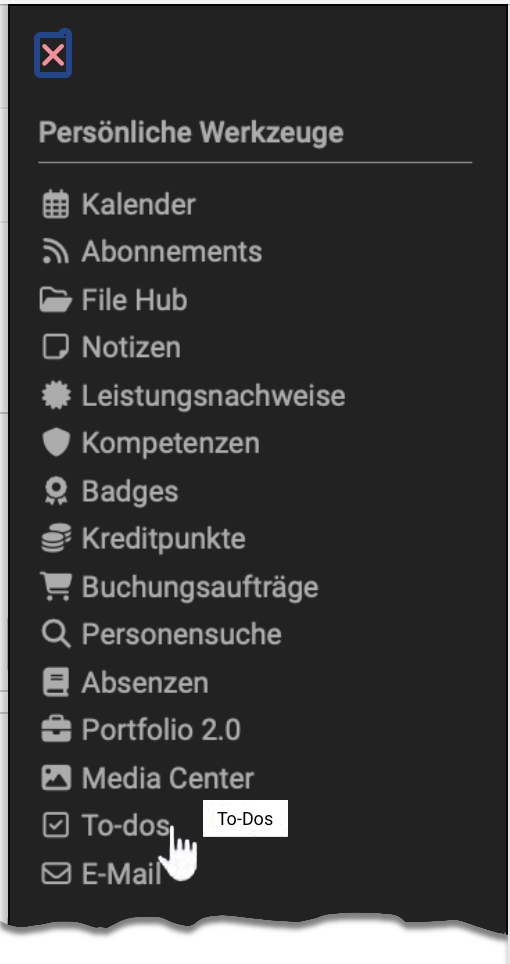
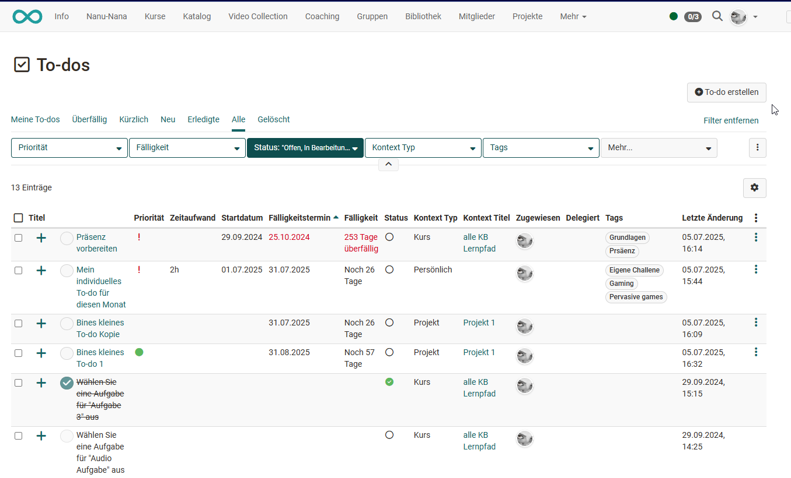
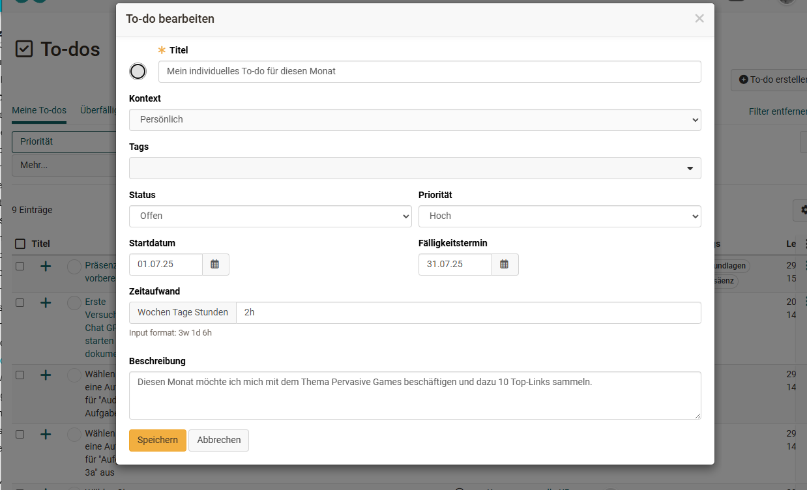
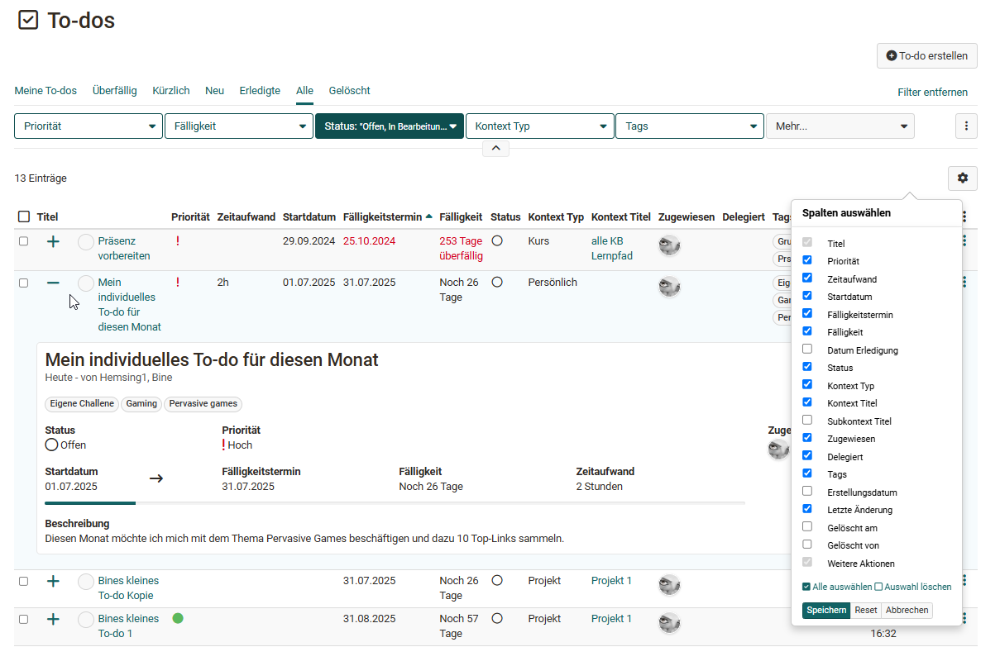

#  Personal tools: To-dos {: #to_dos}

{ class="aside-right lightbox"}

{ class=" shadow lightbox" }

All OpenOlat users find their to-dos under "Personal tools", assigned to them in various OpenOlat contexts: in the course, in the project, in quality management and in the Course Planner. [:octicons-tag-16:{ title="from Release 21.0 (OO-9417)" }](https://track.frentix.com/issue/OO-9417){:target="_blank"}
In addition, all users can create and manage their own individual to-dos here.

{ class=" shadow lightbox" }

## The to-do overview {: #to_dos_overview}

The table lists all personal to-dos and can be filtered further if needed. Which columns are shown in the table can be selected via the gear icon.

{ class=" shadow lightbox" }

Let us take a look at the options: use the plus sign to show further details of a to-do. Alternatively, suitable table columns can be used for more information.

Ticking the checkmark in the circle of a to-do marks it as done. Clicking the title lets you edit the to-do. The context link in the corresponding column takes you directly to the course or project the to-do originates from. Clicking the square at the beginning of a to-do selects it so it can then be deleted.

!!! info "Important"

    To-dos can only ever be deleted where they were created. In the personal menu, therefore, only self-created to-dos can be removed.

    In general, only to-dos that you created yourself can be deleted.

Apart from to-dos automatically created from the course element "Task" of a course, to-dos have a **three-dot menu** at the end. It lets you edit, duplicate or delete to-dos. Which options are available for a specific to-do depends on who created the to-do and in which context.

To-dos you created yourself in the personal area can be fully edited, duplicated and deleted. To-dos that you created yourself in other places (course, project) can be edited and duplicated but keep their context. General to-dos from courses that you did not create yourself can only be edited to a limited extent, for example marked as done.

!!! info "Important"

    To-dos automatically assigned in courses from a course element "Task" are for information only. They are only displayed and cannot be edited or deleted.

---

## Further information {: #further_information}

[General information on To-dos >](../basic_concepts/To_Dos_Basics.md) 
[To-dos in a course >](../learningresources/Course_todos.md) 
[To-dos within a project >](../area_modules/Project_Todos.md) 
[To-dos in the course element "Task" >](../learningresources/Course_Element_Task.md) 
[Action to-dos in the quality management >](../area_modules/Quality_Management_To-dos.md) 
[To-dos in the Course Planner >](../area_modules/Course_Planner_Todos.md)

[To the top of the page ^](#to_dos)
