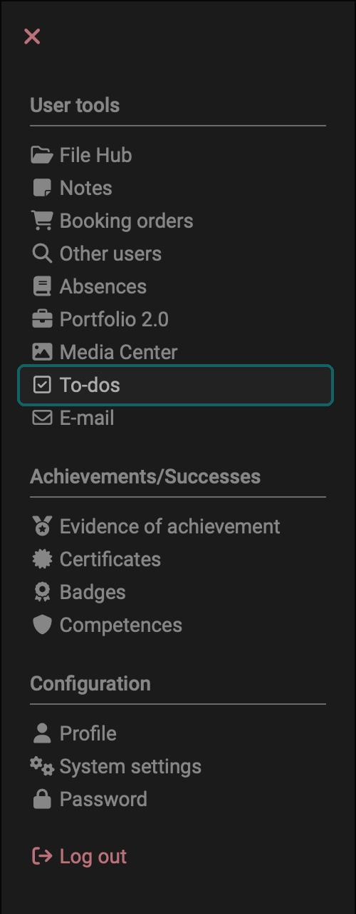
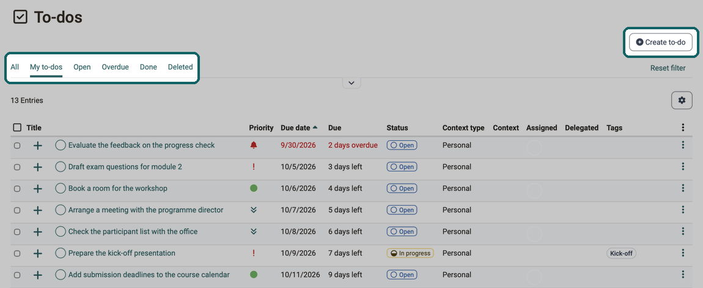
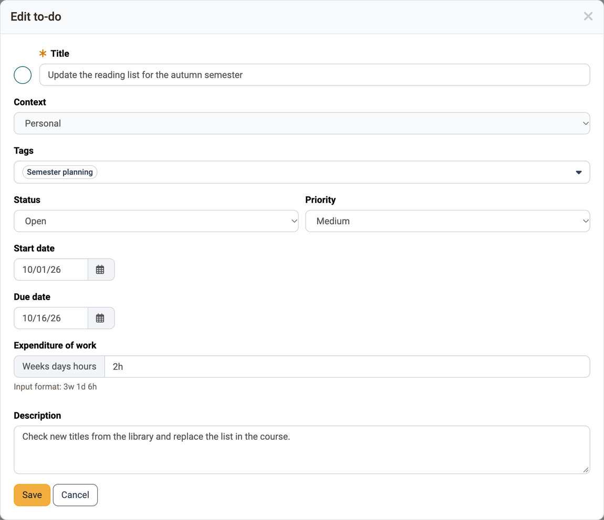
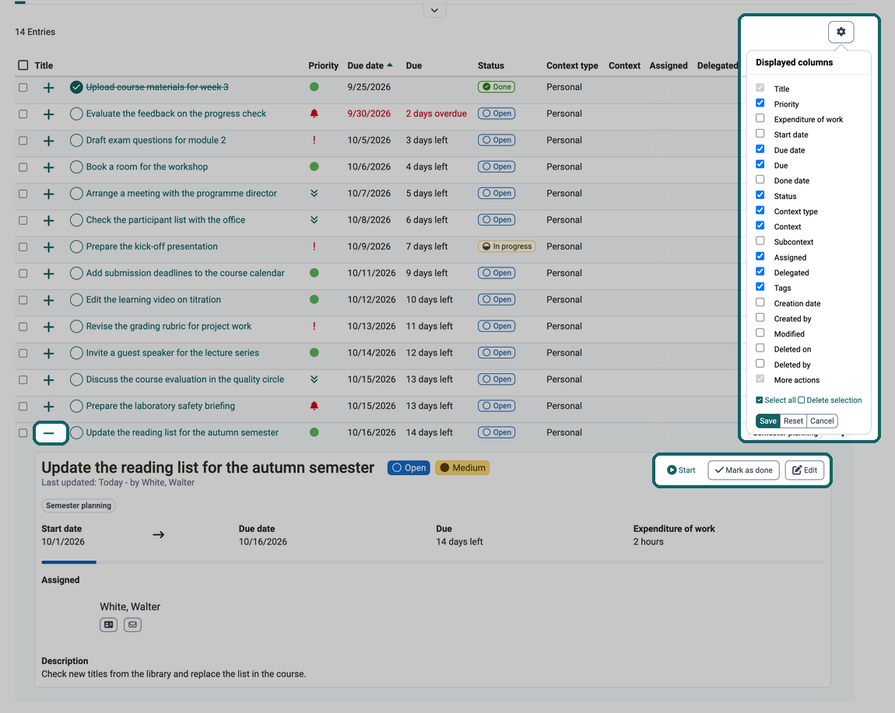

#  User tools: To-dos {: #to_dos}

{ class="aside-right lightbox" }

Under "To-dos" in the User tools you see all to-dos for which you are assigned or delegated, regardless of the module they come from: from courses and from the course element "Task", from projects, from quality management and from the Course Planner. [:octicons-tag-16:{ title="from Release 21.0 (OO-9417)" }](https://track.frentix.com/issue/OO-9417){:target="_blank"} In addition, there are your personal to-dos, which you create here yourself. The tool is available to all users except guests. What applies to all to-dos is described under [To-dos: basics](../basic_concepts/To_Dos_Basics.md).

Whether the tool appears in the personal menu, who may create personal to-dos and whether they can be assigned to other persons is set by administrators in the system administration: `Administration > Modules > To-do` (see [Module To-do](../../manual_admin/administration/Modules_ToDo.md)).

{ class="shadow lightbox" title="To-dos page in the User tools menu · 2026.10.02" }

With the **"Create to-do"** button you create a personal to-do. The fields of the "Edit to-do" dialog are described under [The fields of a to-do](../basic_concepts/To_Dos_Basics.md#to_do_fields).

{ class="shadow lightbox" title="Edit to-do dialog · 2026.10.02" }

## The to-do overview [:octicons-tag-16:{ title="from Release 18.1 (OO-7038)" }](https://track.frentix.com/issue/OO-7038){:target="_blank"} {: #to_dos_overview}

The table shows at a glance which tasks are pending and which are overdue. Use the tabs "All", "My to-dos", "Open", "Overdue", "Done" and "Deleted" and the filters to narrow down the list. The gear icon opens the menu "Displayed columns", where you choose which columns the table shows.

{ class="shadow lightbox" title="Expanded row and Displayed columns menu · 2026.10.02" }

Use the plus sign at the start of a row to expand the detail area of a to-do. Depending on the status, it offers the quick actions "Start", "Mark as done" and "Edit", described under [Status and quick actions](../basic_concepts/To_Dos_Basics.md#status_quick_actions).

A click on the circle in front of the title marks a to-do as done, provided you may edit it. A click on the title lets you edit the to-do. The link in the "Context" column takes you directly to the course, the project or the element the to-do originates from. With the checkbox in the first column you select several to-dos and delete them together; OpenOlat deletes only those you are allowed to delete.

If you receive an e-mail "New to-dos" with several to-dos from the Course Planner, all of these to-dos appear here individually in the list, including those the e-mail only counts in the line "… and N more". [:octicons-tag-16:{ title="from Release 21.1 (OO-9731)" }](https://track.frentix.com/issue/OO-9731){:target="_blank"} The rules are described under [When OpenOlat sends e-mails about to-dos](../basic_concepts/To_Dos_Basics.md#notifications).

### What you may do with a to-do {: #to_do_permissions}

Which actions the **"More actions"** menu (three dots) at the end of a row offers is determined by the module the to-do comes from:

* Personal to-dos you edit, duplicate and delete here.
* For to-dos from projects you edit all details here. They can only be deleted in the project.
* For to-dos from courses and from the Course Planner you only change the status here. The other details are edited by whoever has the permission to do so in the course or in the Course Planner.
* To-dos from the course element "Task" are for information only. They can be neither edited nor deleted and have no "More actions" menu.

[To the top of the page ^](#to_dos)

---

## Further information {: #further_information}

[To-dos: basics >](../basic_concepts/To_Dos_Basics.md) 
[Module To-do (Admin) >](../../manual_admin/administration/Modules_ToDo.md) 
[To-dos in the course >](../learningresources/Course_todos.md) 
[Projects: To-dos >](../area_modules/Project_Todos.md) 
[Course Element "Task" >](../learningresources/Course_Element_Task.md) 
[Quality Management: Actions (To-dos) >](../area_modules/Quality_Management_To-dos.md) 
[Course Planner: To-dos >](../area_modules/Course_Planner_Todos.md)

[To the top of the page ^](#to_dos)
