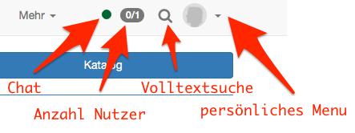
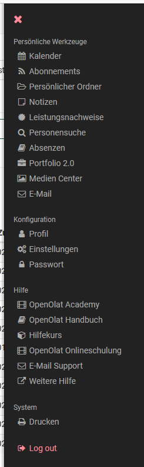

# :material-home: Persönliches Menü und allgemeine Funktionen

Jeder registrierte OpenOlat User verfügt über sein persönliches Menü, das individuell konfiguriert werden kann.

In diesem Kapitel erfahren Sie, welche
Einstellungen Sie im persönlichen Menu vornehmen können und wie sie weitere
Funktionen wie Volltextsuche und Chat nutzen und wie Sie das Portal, sofern generell aktiviert, individuell anpassen können.

!!! note "Quick Links"

    * [Persönliche Werkzeuge](../personal_menu/Personal_Tools.de.md)
    * [Konfiguration](Configuration.de.md)
    * [Volltextsuche](../basic_concepts/Full_Text_Search.de.md)
    * [Chat](../basic_concepts/Chat.de.md)
    * [Portal konfigurieren](../basic_concepts/Portal_configuration.de.md)
    * [Mathematische Formel](../basic_concepts/Math_formula.de.md)
    * [mit Tabellen arbeiten](../basic_concepts/Table_Concept.de.md)

## Navigationsleiste und persönliches Menü

In der oberen Navigationsleiste generell verfügbar ist der
[Chat](../basic_concepts/Chat.de.md) (instant Messnger) und die Suche. Welche weiteren Elemente in der Navigationsleiste rechts oben angezeigt werden, ist abhängig von Ihren unter "Konfiguration" -> "Einstellungen" im Ausklappmenü rechts oben aktivierten Werkzeugen.

{ class="shadow aside-right lightbox"}

Im persönlichen Menü finden Sie die folgenden Bereiche:

* [Persönliche Werkzeuge](../personal_menu/Personal_Tools.de.md)
* [Konfiguration](Configuration.de.md)
* Hilfe
* System sowie die Logout Funktion

{ class="shadow aside-right lightbox"}

Je nach unter "Einstellungen" ausgewählten Werkzeugen werden die Werkzeuge entweder in der oberen Leiste oder im Persönlichen Menübereich angezeigt.

Weitere Informationen zu den einzelnen Elementen finden Sie unter den entsprechenden Links.

:octicons-device-camera-video-24: **Video-Einführung**: [Navigation](<https://www.youtube.com/embed/kxfVVbfDXMw>){:target="_blank”}

:octicons-device-camera-video-24: **Video-Einführung**: [Der OpenOlat-Bildschirm](<https://www.youtube.com/embed/WbD6ZSgZ02Y>){:target="_blank”}

:octicons-device-camera-video-24: **Video-Einführung**: [Persönliches Menü](<https://www.youtube.com/embed/VxK1EKV7_rc>){:target="_blank”}

:octicons-device-camera-video-24: **Video-Einführung**: [Menüleiste](<https://www.youtube.com/embed/_abUlsfmBcs>){:target="_blank”}
