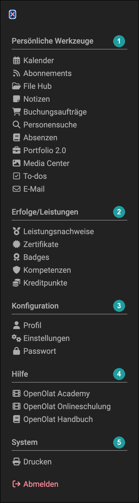
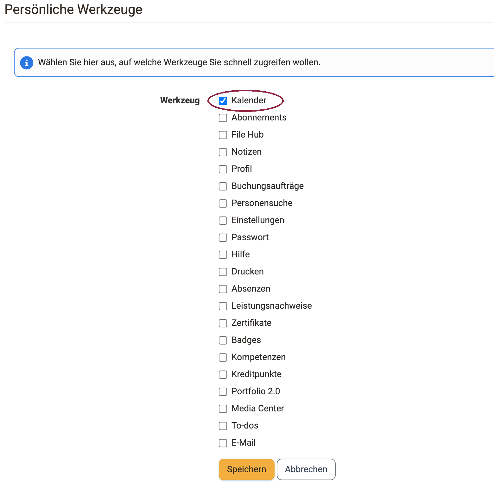
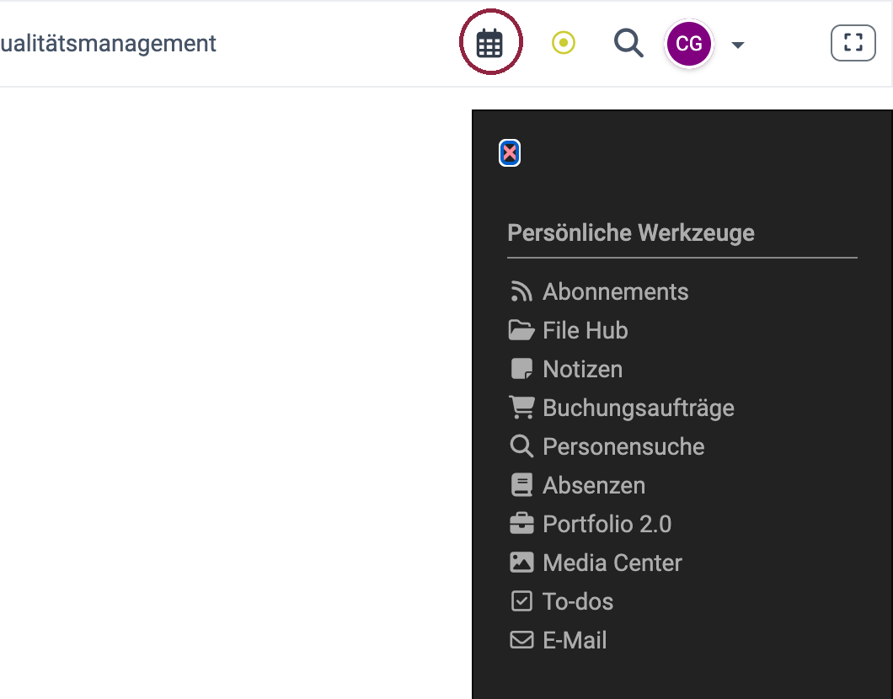

# Persönliches Menü {: #personal_menu}

Alle registrierten OpenOlat-Benutzer:innen verfügen über ein persönliches Menü. Es fasst Ihre eigenen Werkzeuge, Ihre Nachweise und Ihre persönliche Konfiguration an einer Stelle zusammen und lässt sich individuell einrichten.

Sie öffnen das Menü rechts oben in der Menüleiste mit einem Klick auf Ihr Profilbild oder auf den kleinen Pfeil daneben. Solange Sie kein Profilbild hinterlegt haben, zeigt OpenOlat dort Ihre Initialen. Das Menü legt sich als Bereich über den rechten Rand des Fensters. Mit dem Schliessen-Symbol links oben im Bereich blenden Sie es wieder aus.

{ class="shadow lightbox"}

## Steckbrief

Name | Persönliches Menü
---------|----------
Verfügbar seit | Release 10.0 (OO-963)

## Die Abschnitte des Menüs {: #sections}

{ class="shadow aside-right lightbox"}

Das persönliche Menü ist in fünf Abschnitte gegliedert:

 **Persönliche Werkzeuge**: Ihre Arbeitswerkzeuge, vom Kalender bis zum E-Mail-Postfach  
 **Erfolge/Leistungen**: alles, was Sie in OpenOlat erreicht haben  
 **Konfiguration**: Profil, Einstellungen und Passwort  
 **Hilfe**: Verweise auf Handbuch, Schulungen und Support  
 **System**: systemnahe Funktionen wie Drucken  

Am Ende des Menüs steht die Funktion **Abmelden**.

!!! note "Quick Links"

    **Persönliche Werkzeuge**

    * [Kalender](../personal_menu/Calendar.de.md)
    * [Abonnements](../personal_menu/Subscriptions.de.md)
    * [File Hub](../personal_menu/File_Hub.de.md) (darin auch Ihre [persönlichen Dateien](../personal_menu/File_Hub.de.md#personal_files))
    * [Notizen](../personal_menu/Notes.de.md)
    * [Buchungsaufträge](../personal_menu/Bookings.de.md)
    * [Personensuche](../personal_menu/Other_users.de.md)
    * [Absenzen](../personal_menu/Absences.de.md)
    * [Portfolio 2.0](../personal_menu/Portfolio.de.md)
    * [Media Center](../personal_menu/Media_Center.de.md)
    * [To-dos](../personal_menu/To-Dos.de.md)
    * [E-Mail](../personal_menu/E-Mail.de.md)

    **Erfolge/Leistungen**

    * [Leistungsnachweise](../personal_menu/Evidence_of_Achievements.de.md)
    * [Zertifikate](../personal_menu/Certificates.de.md)
    * [Badges](../personal_menu/OpenBadges.de.md)
    * [Kompetenzen](../personal_menu/Competences.de.md)
    * [Kreditpunkte](../personal_menu/Credit_Points.de.md)

    **Konfiguration**

    * [Profil](../personal_menu/Profile.de.md)
    * [Einstellungen](../personal_menu/Settings.de.md)
    * [Passwort](../personal_menu/Password.de.md)

Die Abschnitte **Hilfe** und **System** enthalten keine persönlichen Daten. Unter **Hilfe** stehen die Verweise, welche die Administration für Ihre Installation freigegeben hat, zum Beispiel auf das OpenOlat Handbuch, auf die OpenOlat Academy oder auf eine Support-Adresse. Unter **System** finden Sie systemnahe Funktionen wie **Drucken**.

Eine ausführliche Beschreibung aller Werkzeuge finden Sie auf der Seite [Persönliche Werkzeuge](../personal_menu/Personal_Tools.de.md).

## Verfügbare Werkzeuge {: #available_tools}

Welche Werkzeuge Ihnen überhaupt angeboten werden, entscheidet die Administration. Sie gibt in der System-Administration unter `Administration > Core Konfiguration > Persönliche Werkzeuge` frei, welche Werkzeuge zur Verfügung stehen, und legt in der Voreinstellung fest, welche davon standardmässig in der Menüleiste erscheinen. Ihr persönliches Menü kann deshalb mehr oder weniger Einträge enthalten, als auf dieser Seite aufgeführt sind.

Konten mit der Rolle Einladung sehen im persönlichen Menü nur Hilfe, Abonnements und Passwort, solange ihnen keine weitere Rolle zugewiesen ist.

Die Bereiche der Hauptnavigation, zum Beispiel Kurse, Gruppen oder Katalog, gehören nicht zum persönlichen Menü. Ob Sie einen Bereich sehen, entscheidet die Administration: Das Modul muss aktiv sein, der Bereich freigeschaltet und Ihre Rolle zugelassen. Sie selbst können ihn nicht einschalten. Fehlt ein Bereich, prüfen Sie zuerst das Menü **Mehr** am rechten Rand der Hauptnavigation. Was über einen Bereich entscheidet, beschreibt die Seite [Bereiche und Module](../area_modules/index.de.md#conditions).

[Core Konfiguration: Persönliche Werkzeuge (Administrationshandbuch) >](../../manual_admin/administration/Core_functions.de.md#personal_tools)

## Werkzeuge in die Menüleiste verschieben [:octicons-tag-16:{ title="ab Release 10.0 (OO-988)" }](https://track.frentix.com/issue/OO-988) {: #move_tools}

Werkzeuge, die Sie häufig brauchen, müssen nicht im persönlichen Menü bleiben. Sie können sie als Symbol direkt in die Menüleiste holen, wo sie mit einem Klick erreichbar sind.

Die Einstellung dazu nehmen Sie vor unter 
`Persönliches Menü > Konfiguration > Einstellungen > Tab "System" > Persönliche Werkzeuge`

Markieren Sie dort die Kontrollkästchen der Werkzeuge, die in der Menüleiste erscheinen sollen, und speichern Sie.

{ class="shadow lightbox"}

Zur Auswahl stehen nicht nur die persönlichen Werkzeuge, sondern auch Einträge der übrigen Abschnitte, zum Beispiel **Zertifikate**, **Einstellungen** oder **Drucken**.

!!! info "Wichtig"

    Jedes Werkzeug wird nur einmal angezeigt, entweder im persönlichen Menü **oder** in der Menüleiste.

!!! warning "Achtung"

    OpenOlat übernimmt die verschobenen Werkzeuge erst beim nächsten Login in die Menüleiste. Bis dahin bleibt die Menüleiste unverändert, und das Werkzeug steht weiterhin im persönlichen Menü. Melden Sie sich ab und wieder an, um das Ergebnis zu sehen.

Im Beispiel ist der **Kalender** in die Menüleiste verschoben. Nach dem nächsten Login liegt sein Symbol links neben dem Chat-Status, und im persönlichen Menü fehlt der Eintrag.

{ class="shadow lightbox"}

!!! tip "Tipp"

    Verschieben Sie nicht alle Werkzeuge, sondern nur die, die Sie täglich benutzen. So bleibt die Menüleiste übersichtlich.

[Einstellungen: Persönliche Werkzeuge >](../personal_menu/Settings.de.md#personal_tools)

## Immer in der Menüleiste: Chat und Suche {: #always_visible}

Zwei Werkzeuge stehen nicht im persönlichen Menü, sondern grundsätzlich in der Menüleiste: der [Chat](../basic_concepts/Chat.de.md) (Instant Messaging) mit Ihrem Status und dem Zähler der ungelesenen Nachrichten sowie die [Suche](../basic_concepts/Full_Text_Search.de.md). Sie lassen sich nicht verschieben.

{ class="shadow lightbox"}

## Weiterführende Informationen {: #further_information}

[Persönliche Werkzeuge >](../personal_menu/Personal_Tools.de.md) 
[Core Konfiguration: Übersicht (Administrationshandbuch) >](../../manual_admin/administration/Core_functions.de.md) 
[Persönliche Konfiguration: Einstellungen >](../personal_menu/Settings.de.md) 
[Chat >](../basic_concepts/Chat.de.md) 
[Volltextsuche >](../basic_concepts/Full_Text_Search.de.md)

**youtube** 
[Navigation](<https://www.youtube.com/embed/kxfVVbfDXMw>){:target="_blank"} 
[Der OpenOlat-Bildschirm](<https://www.youtube.com/embed/WbD6ZSgZ02Y>){:target="_blank"} 
[Persönliches Menü](<https://www.youtube.com/embed/VxK1EKV7_rc>){:target="_blank"} 
[Menüleiste](<https://www.youtube.com/embed/_abUlsfmBcs>){:target="_blank"}

[Zum Seitenanfang ^](#personal_menu)
