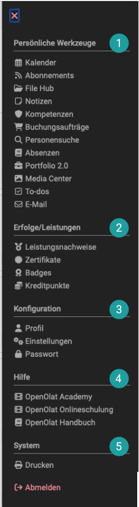

# Persönliches Menü {: #personal_menu}

Alle registrierten OpenOlat-Benutzer:innen verfügen über ein persönliches Menü, das sich individuell konfigurieren lässt.

Es öffnet sich am rechten Rand durch Klick auf das kleine Bild rechts oben oder den kleinen Pfeil daneben.

{ class="shadow lightbox"}

Im persönlichen Menü finden Sie die folgenden Abschnitte:

 **Persönliche Werkzeuge**  
 **Erfolge/Leistungen**  
 **Konfiguration** 
 **Hilfe**  
 **System**  
sowie die Funktion **Abmelden**

{ class="shadow aside-right lightbox"}

!!! note "Quick Links"

    **Persönliche Werkzeuge**

    * [Kalender](../personal_menu/Calendar.de.md)
    * [Abonnements](../personal_menu/Subscriptions.de.md)
    * [Persönliche Dateien](../personal_menu/File_Hub.de.md#personal_files)
    * [File Hub](../personal_menu/File_Hub.de.md)
    * [Notizen](../personal_menu/Notes.de.md)
    * [Kompetenzen](../personal_menu/Competences.de.md)
    * [Buchungsaufträge](../personal_menu/Bookings.de.md)
    * [Personensuche](../personal_menu/Other_users.de.md)
    * [Absenzen](../personal_menu/Absences.de.md)
    * [Portfolio 2.0](../personal_menu/Portfolio.de.md)
    * [Media Center](../personal_menu/Media_Center.de.md)
    * [To-Dos](../personal_menu/To-Dos.de.md)
    * [E-Mail](../personal_menu/E-Mail.de.md)

    **Erfolge/Leistungen**

    * [Leistungsnachweise](../personal_menu/Evidence_of_Achievements.de.md)
    * [Zertifikate](../personal_menu/Certificates.de.md)
    * [Badges](../personal_menu/OpenBadges.de.md)
    * [Kreditpunkte](../personal_menu/Credit_Points.de.md)

    **Konfiguration**

    * [Profil](../personal_menu/Profile.de.md)
    * [Einstellungen](../personal_menu/Settings.de.md)
    * [Passwort](../personal_menu/Password.de.md)

## Verfügbare Werkzeuge

Administrator:innen können eine Vorauswahl treffen und die verfügbaren Werkzeuge festlegen (aktivieren bzw. deaktivieren). Je nach Konfiguration kann die verfügbare Auswahl also mehr oder weniger Werkzeuge enthalten.

## Werkzeuge in die Hauptnavigation verschieben

Wenn Sie ein Werkzeug statt im persönlichen Menü lieber in der Kopfzeile angezeigt haben möchten, können Sie die Menüoption vom persönlichen Menü dorthin verschieben.

{ class="shadow lightbox"}

Die Einstellung dazu nehmen Sie vor im 
`Persönliches Menü > Konfiguration > Einstellungen > Tab "System" > Persönliche Werkzeuge`

Alle Werkzeuge, die Sie hier markieren, werden statt im persönlichen Menü in der Kopfzeile rechts oben angezeigt und sind so schneller erreichbar.

{ class="shadow lightbox"}

!!! info "Wichtig"

    Die Werkzeuge werden nur einmal angezeigt, entweder im persönlichen Menü **oder** in der Kopfzeile.

## Generell in der Hauptnavigation angezeigte Werkzeuge

In der Kopfzeile sind der [Chat](../basic_concepts/Chat.de.md) (Instant Messaging) und die [Suche](../basic_concepts/Full_Text_Search.de.md) immer verfügbar.

{ class="shadow lightbox"}

## Weiterführende Informationen {: #further_information}

**youtube** 
[Navigation](<https://www.youtube.com/embed/kxfVVbfDXMw>){:target="_blank"} 
[Der OpenOlat-Bildschirm](<https://www.youtube.com/embed/WbD6ZSgZ02Y>){:target="_blank"} 
[Persönliches Menü](<https://www.youtube.com/embed/VxK1EKV7_rc>){:target="_blank"} 
[Menüleiste](<https://www.youtube.com/embed/_abUlsfmBcs>){:target="_blank"}

[Zum Seitenanfang ^](#personal_menu)
