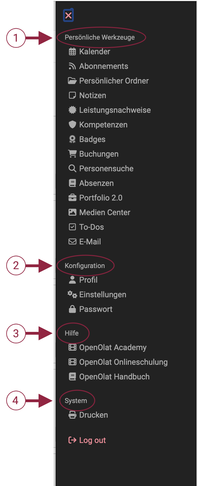
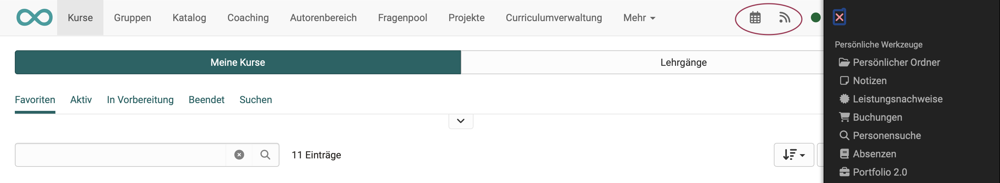
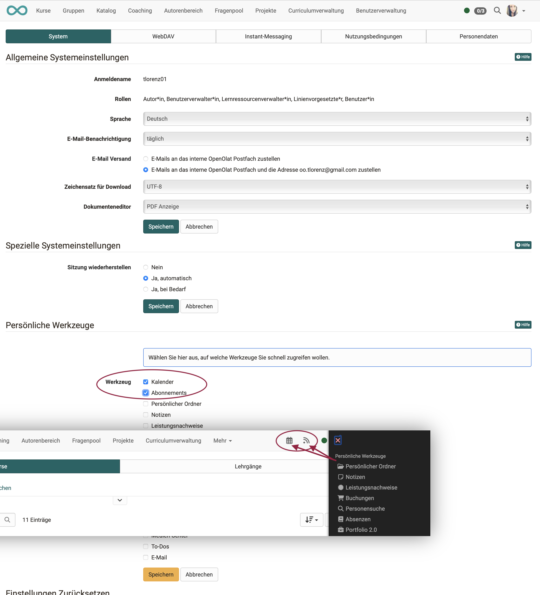

# :material-home: Persönliches Menü

Jeder registrierte OpenOlat User verfügt über sein persönliches Menü, das individuell konfiguriert werden kann.

Es öffnet sich am rechten Rand durch Klick auf das kleine Bild rechts oben oder den kleinen Pfeil daneben.

{ class="shadow lightbox"}

Im persönlichen Menü finden Sie die folgenden Abschnitte:

 **Persönliche Werkzeuge**  
 **Konfiguration**  
 **Hilfe** 
 **System**  
sowie die **Logout**-Funktion

{ class="shadow aside-right lightbox"}

!!! note "Quick Links"

    **Persönliche Werkzeuge**

    * [Kalender](../personal_menu/Calendar.de.md)
    * [Abonnements](../personal_menu/Subscriptions.de.md)
    * [Persönlicher Ordner (bis Release 18)](../personal_menu/Personal_folders.de.md)
    * [File Hub (ab Release 19)](../personal_menu/File_Hub.de.md)
    * [Notizen](../personal_menu/Notes.de.md)
    * [Leistungsnachweise](../personal_menu/Evidence_of_Achievements.de.md)
    * [Kompetenzen](../personal_menu/Competences.de.md)
    * [Badges](../personal_menu/OpenBadges.de.md)
    * [Buchungsaufträge](../personal_menu/Bookings.de.md)
    * [Personensuche](../personal_menu/Other_users.de.md)
    * [Absenzen](../personal_menu/Absences.de.md)
    * [Portfolio 2.0](../personal_menu/Portfolio.de.md)
    * [Media Center](../personal_menu/Media_Center.de.md)
    * [To-Dos](../personal_menu/To-Dos.de.md)
    * [E-Mail](../personal_menu/E-Mail.de.md)

    **Konfiguration**

    * [Profil](../personal_menu/Profile.de.md)
    * [Einstellungen](../personal_menu/Settings.de.md)
    * [Passwort](../personal_menu/Password.de.md)

## Verfügbare Werkzeuge

Administrator:innen können eine Vorauswahl treffen und die verfügbaren Werkzeuge festlegen (aktivieren bzw. deaktivieren).
Je nach Konfiguration kann die verfügbare Auswahl also mehr oder weniger Werkzeuge enthalten.

## Werkzeuge in die Hauptnavigation verschieben

Wenn Sie ein Werkzeug statt im persönlichen Menü lieber in der Kopfzeile angezeigt haben möchten, können Sie die Menüoption vom persönlichen Menü dorthin verschieben. 

{ class="shadow lightbox"}

Die Einstellung dazu nehmen Sie vor im 
**Persönlichen Menü > Abschnitt Konfiguration: Einstellungen > Tab System > Abschnitt Persönliche Werkzeuge**

Alle Werkzeuge, die Sie hier markieren, werden statt im persönlichen Menü in der Kopfzeile rechts oben angezeigt und sind so schneller erreichbar. 

{ class="shadow lightbox"}

!!! note "Beachten Sie:"

    Die Werkzeuge werden nur einmal angezeigt, entweder im persönlichen Menü **oder** in der Kopfzeile.

## Generell in der Hauptnavigation angezeigte Werkzeuge

In der oberen Navigationsleiste generell immer verfügbar ist der [Chat](../basic_concepts/Chat.de.md) (instant Messenger) und die [Suche](../basic_concepts/Full_Text_Search.de.md).

{ class="shadow lightbox"}

## Weitere Informationen

:octicons-device-camera-video-24: **Video-Einführung**: [Navigation](<https://www.youtube.com/embed/kxfVVbfDXMw>){:target="_blank”}

:octicons-device-camera-video-24: **Video-Einführung**: [Der OpenOlat-Bildschirm](<https://www.youtube.com/embed/WbD6ZSgZ02Y>){:target="_blank”}

:octicons-device-camera-video-24: **Video-Einführung**: [Persönliches Menü](<https://www.youtube.com/embed/VxK1EKV7_rc>){:target="_blank”}

:octicons-device-camera-video-24: **Video-Einführung**: [Menüleiste](<https://www.youtube.com/embed/_abUlsfmBcs>){:target="_blank”}
