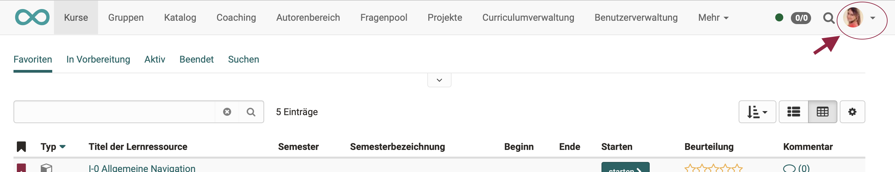
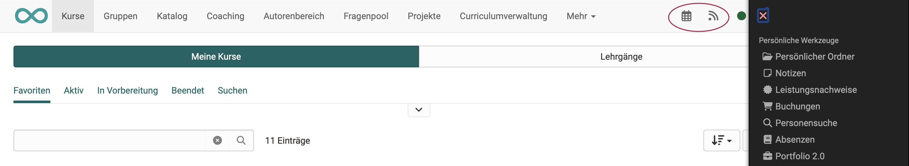
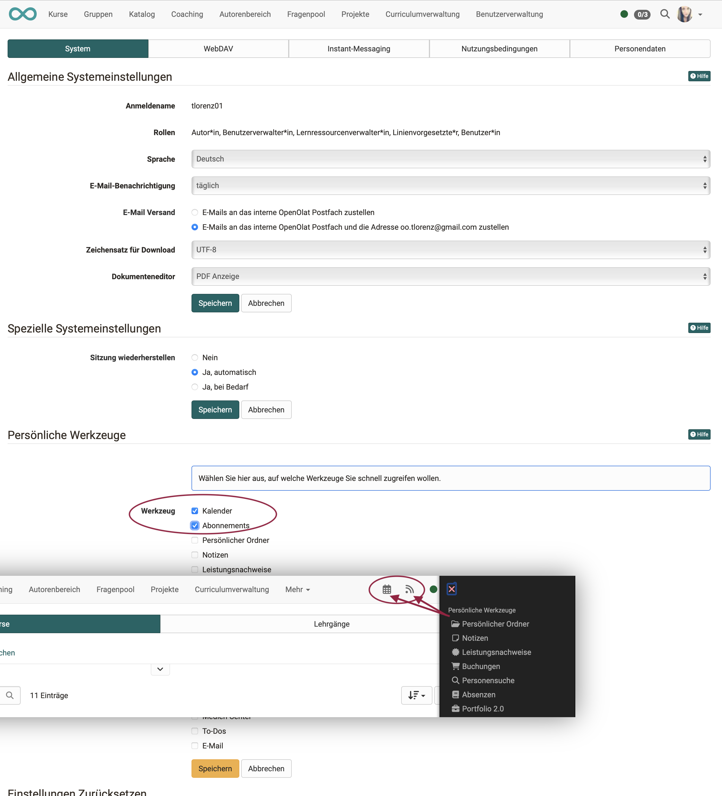

# :material-home: Personal menu and general components

Each registered OpenOlat user has a personal menu that can be configured individually.

It opens in the right margin by clicking on the small image in the upper right corner or the small arrow next to it.

{ class="shadow lightbox"}

You can find the following sections in the personal menu:

* **Personal Tools**
* **Configuration**
* **Help**
* **System**
* as well as the **Logout** function

{ class="shadow aside-right lightbox"}

!!! note "Quick Links"

    **Personal tools**

    * [Calender](../personal_menu/Calendar.md)
    * [Subscriptions](../personal_menu/Subscriptions.md)
    * [Personal folder (up to release 18)](../personal_menu/Personal_folders.md)
    * [File Hub (from release 19)](../personal_menu/File_Hub.md)
    * [Notes](../personal_menu/Notes.md)
    * [Evidence of achievements](../personal_menu/Evidence_of_Achievements.md)
    * [Competences](../personal_menu/Competences.md)
    * [Badges](../personal_menu/OpenBadges.md)
    * [Bookings](../personal_menu/Bookings.md)
    * [Other users](../personal_menu/Other_users.md)
    * Absences
    * [Portfolio 2.0](../personal_menu/Portfolio.md)
    * [Media Center](../personal_menu/Media_Center.md)
    * [To-Dos](../personal_menu/To-Dos.md)
    * [E-Mail](../personal_menu/E-Mail.md)

    **Configuration**

    * [Profile](../personal_menu/Profile.md)
    * [System settings](../personal_menu/Settings.md)
    * [Password](../personal_menu/Password.md)

## Available tools

Administrators can make a preselection and define the available tools (activate or deactivate).
Depending on the configuration, the available selection may therefore contain more or fewer tools.

## Move tools to the main navigation

If you prefer to have a tool displayed in the header instead of the personal menu, you can move the menu option from the personal menu to it.

{ class="shadow lightbox"}

You make the setting for this in the 
**Personal Menu > Section Configuration > System Tab > Section Personal tools**

All tools that you mark here are displayed in the header at the top right instead of in the personal menu and can thus be accessed more quickly.

{ class="shadow lightbox"}

!!! note "Please note:"

    The tools are displayed only once, either in the personal menu **or** in the header.

## Navigation and personal menu

In the navigation the [chat](../basic_concepts/Chat.md) (instant messenger) and the [Full Text Search](../basic_concepts/Full_Text_Search.md) are shown first.
