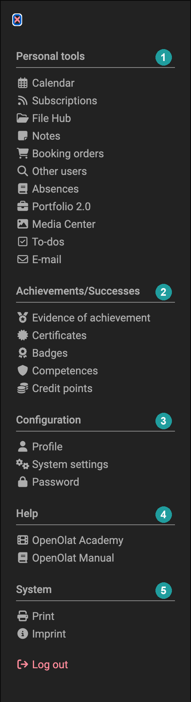
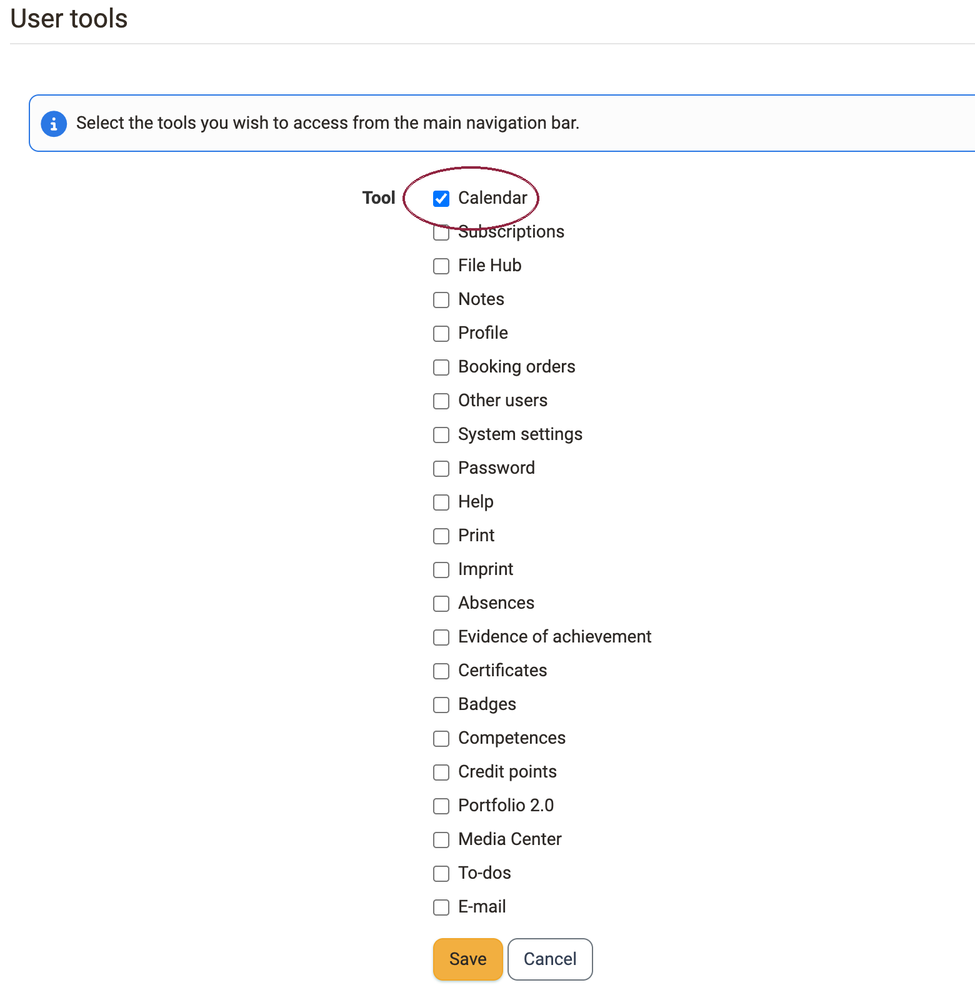
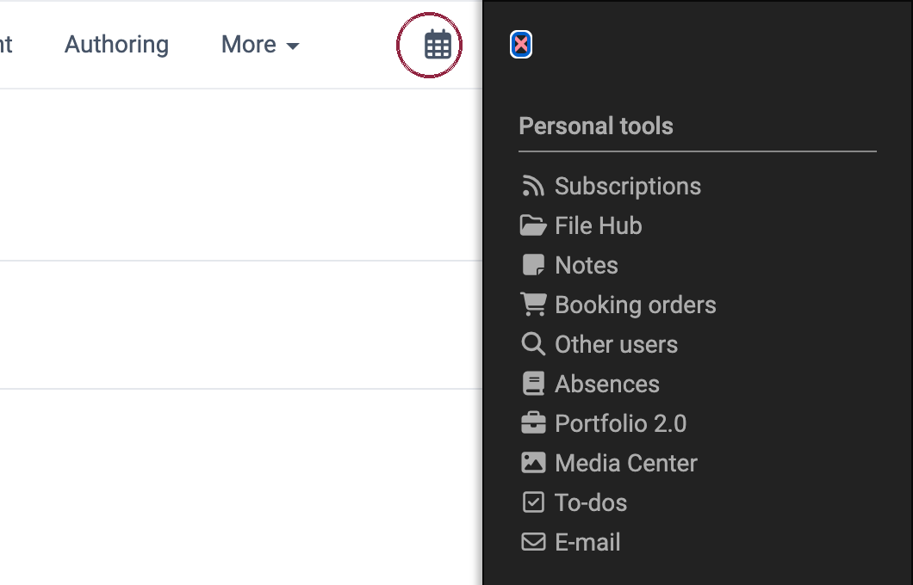

# Personal menu {: #personal_menu}

All registered OpenOlat users have a personal menu. It brings together your own tools, your records of achievement and your personal configuration in one place, and you can set it up individually.

You open the menu at the top right of the menu bar by clicking on your profile picture or on the small arrow next to it. As long as you have not stored a profile picture, OpenOlat shows your initials there. The menu appears as an area over the right edge of the window. With the close symbol at the top left of the area you hide it again.

{ class="shadow lightbox"}

## Profile

Name | Personal menu
---------|----------
Available since | Release 10.0 (OO-963)

## The sections of the menu {: #sections}

{ class="shadow aside-right lightbox"}

The personal menu is divided into five sections:

 **Personal tools**: your working tools, from the calendar to the mailbox  
 **Achievements/Successes**: everything you have achieved in OpenOlat  
 **Configuration**: profile, settings and password  
 **Help**: links to the manual, to training courses and to support  
 **System**: system related functions such as printing  

At the end of the menu you find the **Log out** function.

!!! note "Quick Links"

    **Personal tools**

    * [Calendar](../personal_menu/Calendar.md)
    * [Subscriptions](../personal_menu/Subscriptions.md)
    * [File Hub](../personal_menu/File_Hub.md) (including your [personal files](../personal_menu/File_Hub.md#personal_files))
    * [Notes](../personal_menu/Notes.md)
    * [Booking orders](../personal_menu/Bookings.md)
    * [Other users](../personal_menu/Other_users.md)
    * [Absences](../personal_menu/Absences.md)
    * [Portfolio 2.0](../personal_menu/Portfolio.md)
    * [Media Center](../personal_menu/Media_Center.md)
    * [To-dos](../personal_menu/To-Dos.md)
    * [E-Mail](../personal_menu/E-Mail.md)

    **Achievements/Successes**

    * [Evidence of achievement](../personal_menu/Evidence_of_Achievements.md)
    * [Certificates](../personal_menu/Certificates.md)
    * [Badges](../personal_menu/OpenBadges.md)
    * [Competences](../personal_menu/Competences.md)
    * [Credit points](../personal_menu/Credit_Points.md)

    **Configuration**

    * [Profile](../personal_menu/Profile.md)
    * [Settings](../personal_menu/Settings.md)
    * [Password](../personal_menu/Password.md)

The **Help** and **System** sections contain no personal data. Under **Help** you find the links that the administration has released for your installation, for example to the OpenOlat manual, to the OpenOlat Academy or to a support address. Under **System** you find system related functions such as **Print**.

A detailed description of all tools is available on the page [Personal tools](../personal_menu/Personal_Tools.md).

## Available tools {: #available_tools}

The administration decides which tools are offered to you at all. In the system administration under `Administration > Core functions > User tools` it releases the tools that are available, and in the preset it defines which of them appear in the menu bar by default. Your personal menu can therefore contain more or fewer entries than are listed on this page.

Accounts with the role Invitee only see Help, Subscriptions and Password in the personal menu as long as no further role is assigned to them.

The areas of the top navigation bar, for example Courses, Groups or Catalog, do not belong to the personal menu. Whether you see an area is decided by the administration: the module must be active, the area must be activated and your role must be permitted. You cannot switch it on yourself. If an area is missing, first check the **More** menu on the right edge of the top navigation bar. The page [Area and modules](../area_modules/index.md#conditions) describes what decides about an area.

[Core functions: User tools (Administration manual) >](../../manual_admin/administration/Core_functions.md#personal_tools)

## Move tools to the menu bar [:octicons-tag-16:{ title="from Release 10.0 (OO-988)" }](https://track.frentix.com/issue/OO-988) {: #move_tools}

Tools that you need often do not have to stay in the personal menu. You can place them as an icon directly in the menu bar, where they are available with a single click.

You make this setting under 
`Personal menu > Configuration > Settings > Tab "System" > User tools`

Select the checkboxes of the tools that should appear in the menu bar, and save.

{ class="shadow lightbox"}

Not only the personal tools are available for selection, but also entries from the other sections, for example **Certificates**, **Settings** or **Print**.

!!! info "Important"

    Each tool is shown only once, either in the personal menu **or** in the menu bar.

!!! warning "Attention"

    OpenOlat places the moved tools into the menu bar only at your next login. Until then the menu bar stays unchanged, and the tool remains in the personal menu. Log out and log in again to see the result.

In the example the **Calendar** has been moved to the menu bar. After the next login its icon sits to the left of the chat status, and the entry is missing from the personal menu.

{ class="shadow lightbox"}

!!! tip "Tip"

    Do not move all tools, only the ones you use every day. This keeps the menu bar clear.

[Settings: User tools >](../personal_menu/Settings.md#personal_tools)

## Always in the menu bar: Chat and search {: #always_visible}

Two tools are not part of the personal menu but are always in the menu bar: the [Chat](../basic_concepts/Chat.md) (instant messaging) with your status and the counter of unread messages, and the [Search](../basic_concepts/Full_Text_Search.md). They cannot be moved.

{ class="shadow lightbox"}

## Further information {: #further_information}

[Personal tools >](../personal_menu/Personal_Tools.md) 
[Core functions: Overview (Administration manual) >](../../manual_admin/administration/Core_functions.md) 
[Personal Configuration: Settings >](../personal_menu/Settings.md) 
[Chat >](../basic_concepts/Chat.md) 
[Full-Text Search >](../basic_concepts/Full_Text_Search.md)

**youtube** 
[Navigation (German)](<https://www.youtube.com/embed/kxfVVbfDXMw>){:target="_blank"} 
[The OpenOlat screen (German)](<https://www.youtube.com/embed/WbD6ZSgZ02Y>){:target="_blank"} 
[Personal menu (German)](<https://www.youtube.com/embed/VxK1EKV7_rc>){:target="_blank"} 
[Menu bar (German)](<https://www.youtube.com/embed/_abUlsfmBcs>){:target="_blank"}

[To the top of the page ^](#personal_menu)
