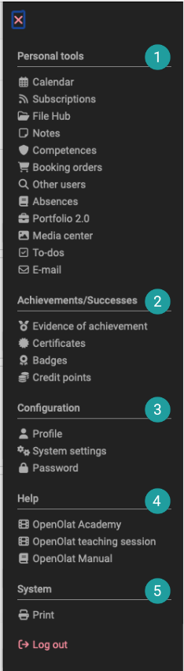
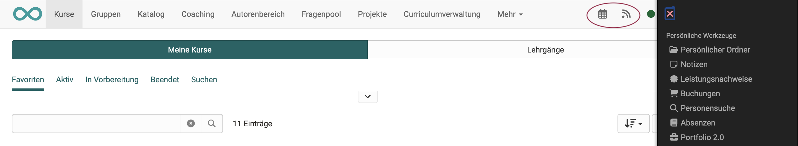
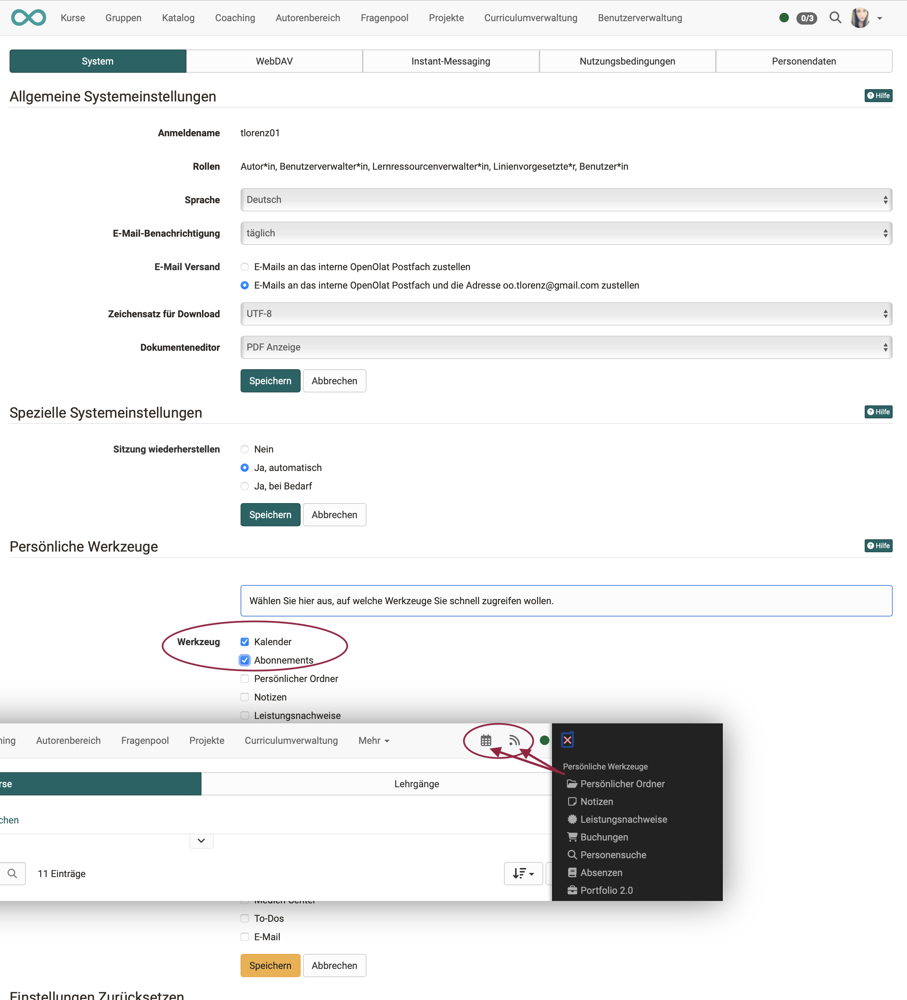
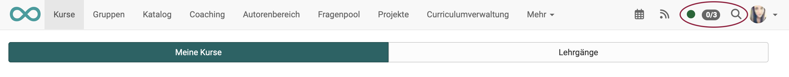

# Personal menu and general components {: #personal_menu}

All registered OpenOlat users have a personal menu that can be configured individually.

It opens in the right margin by clicking on the small image in the upper right corner or the small arrow next to it.

{ class="shadow lightbox"}

You can find the following sections in the personal menu:

 **Personal tools** 
 **Achievements/Successes** 
 **Configuration** 
 **Help** 
 **System** 
as well as the **Log out** function

{ class="shadow aside-right lightbox"}

!!! note "Quick Links"

    **Personal tools**

    * [Calendar](../personal_menu/Calendar.md)
    * [Subscriptions](../personal_menu/Subscriptions.md)
    * [Personal files](../personal_menu/File_Hub.md#personal_files)
    * [File Hub](../personal_menu/File_Hub.md)
    * [Notes](../personal_menu/Notes.md)
    * [Competences](../personal_menu/Competences.md)
    * [Booking orders](../personal_menu/Bookings.md)
    * [Other users](../personal_menu/Other_users.md)
    * [Absences](../personal_menu/Absences.md)
    * [Portfolio 2.0](../personal_menu/Portfolio.md)
    * [Media Center](../personal_menu/Media_Center.md)
    * [To-Dos](../personal_menu/To-Dos.md)
    * [E-Mail](../personal_menu/E-Mail.md)

    **Achievements/Successes**

    * [Evidence of achievement](../personal_menu/Evidence_of_Achievements.md)
    * [Certificates](../personal_menu/Certificates.md)
    * [Badges](../personal_menu/OpenBadges.md)
    * [Credit points](../personal_menu/Credit_Points.md)

    **Configuration**

    * [Profile](../personal_menu/Profile.md)
    * [Settings](../personal_menu/Settings.md)
    * [Password](../personal_menu/Password.md)

## Available tools

Administrators can make a preselection and define the available tools (activate or deactivate). Depending on the configuration, the available selection may therefore contain more or fewer tools.

## Move tools to the main navigation

If you prefer to have a tool displayed in the header instead of the personal menu, you can move the menu option from the personal menu to the header.

{ class="shadow lightbox"}

You make the setting for this in the 
`Personal menu > Configuration > Settings > Tab "System" > User tools`

All tools that you mark here are displayed in the header at the top right instead of in the personal menu and can thus be accessed more quickly.

{ class="shadow lightbox"}

!!! info "Important"

    The tools are displayed only once, either in the personal menu **or** in the header.

## Tools generally displayed in the main navigation

The [Chat](../basic_concepts/Chat.md) (instant messaging) and the [Search](../basic_concepts/Full_Text_Search.md) are always available in the header.

{ class="shadow lightbox"}

## Further information {: #further_information}

**youtube** 
[Navigation (German)](<https://www.youtube.com/embed/kxfVVbfDXMw>){:target="_blank"} 
[The OpenOlat screen (German)](<https://www.youtube.com/embed/WbD6ZSgZ02Y>){:target="_blank"} 
[Personal menu (German)](<https://www.youtube.com/embed/VxK1EKV7_rc>){:target="_blank"} 
[Menu bar (German)](<https://www.youtube.com/embed/_abUlsfmBcs>){:target="_blank"}

[To the top of the page ^](#personal_menu)
