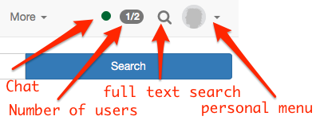

# :material-home: Personal menu and general components

Jeder registrierte OpenOlat User verfügt über sein persönliches Menü, das individuell konfiguriert werden kann. 

This chapter will inform you on how to change the settings in your personal menu, on how to
use further features like the full text search and the chat and on how to
adapt the portal to your personal needs. If you cannot see the portal it was most probably disabled by the system administrator.

!!! note "Quick Links"

    * [Personal Menu](../personal_menu/Personal_Tools.md)
    * [Configuration](Configuration.md)
    * [Full-Text Search](../basic_concepts/Full_Text_Search.md)
    * [Chat](../basic_concepts/Chat.md)
    * [Portal configuration](../basic_concepts/Portal_configuration.md)
    * [Math formula](../basic_concepts/Math_formula.md)
    * [Working with tables](../basic_concepts/Table_Concept.md)

## Navigation and personal menu

In the navigation the [chat](../basic_concepts/Chat.md) is shown first. It is followed by the
number of active users and the full text search. In the navigation your
personal menu can be opened as well. It is divided into [personal
tools](../personal_menu/Personal_Tools.md), [configuration](Configuration.md) and system.
Further information about the single elements can be found under the
corresponding link.

{ class="shadow aside-right lightbox"}

In the personal menu the areas 
* [personal tools](../personal_menu/Personal_Tools.md), 
* [configuration](Configuration.md) 
* help and 
* system 

can be found. Depending on the tools selected in "System settings" certain personal tools are moved in the navigation on the top or stay in the personal menu on
the right.