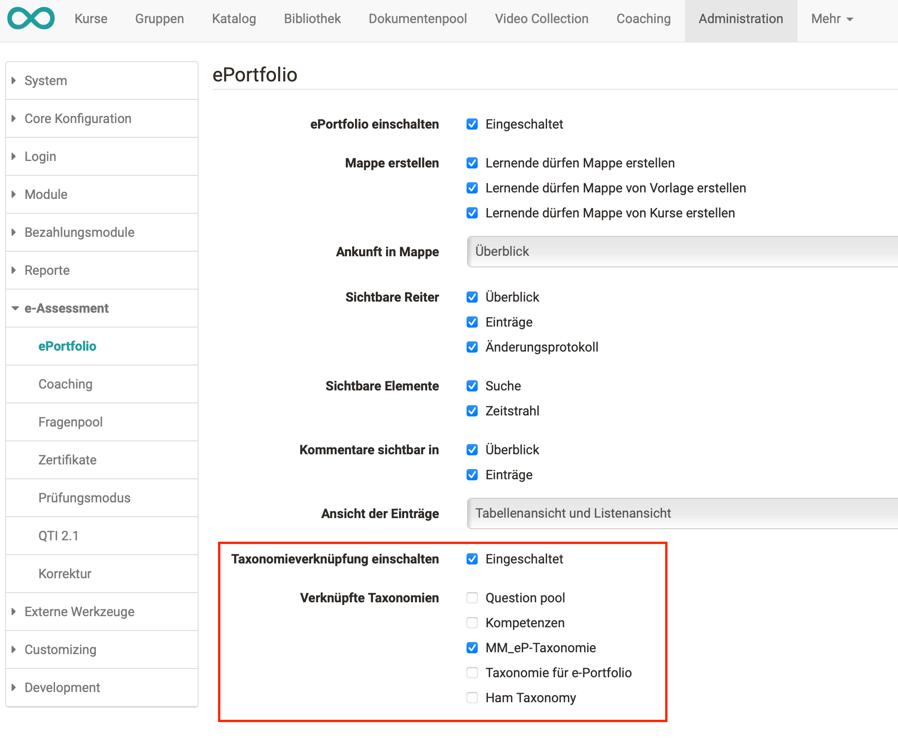
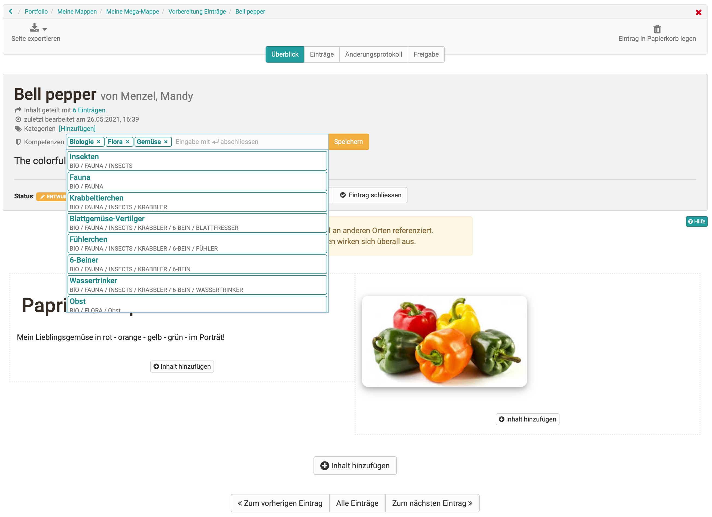

# Kompetenzen verschlagworten

Mithilfe von Taxonomien können
[Kompetenzstrukturen](Modules%EF%B9%95+Taxonomie.html#Modules%3ATaxonomie-
_eP_taxonomy_kompetenz) aufgebaut werden, die zur Verschlagwortung von
ePortfolio-Einträgen genutzt werden können. Lernende können selbstständig
verschiedene Kompetenzen aus diesen vorgegebenen Taxonomiestrukturen zu ihren
Portfolio-Seiten zuordnen und dadurch ihre erreichten Kompetenzen während der
Ausbildung aufzeigen.

Damit die Taxonomie(n) im ePortfolio verfügbar sind, müssen diese vom OpenOlat
Administrator aktiviert werden.

  

  

In einem Portfolio-Eintrag stehen den Lernenden die aktivierten Taxonomien als
Kompetenzen zur Verfügung und können über eine Vorschlagsliste ausgewählt
werden.

  

  

Eine Übersicht über alle vergebenen Kompetenzen erhalten Lernende über
"Persönliche Werkzeuge" → "Kompetenzen".

  

