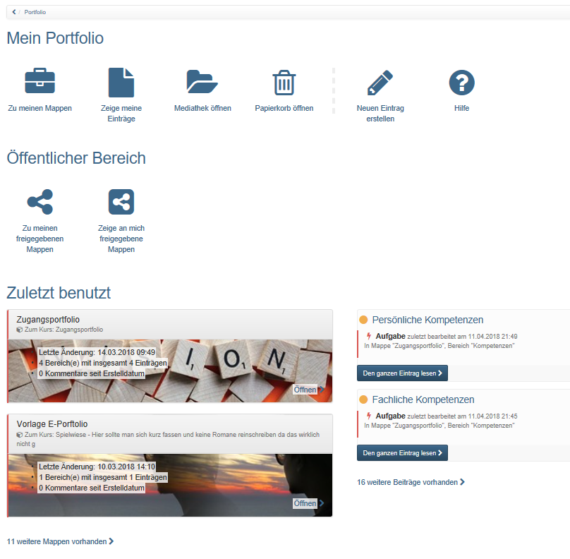

# Bestandteile des Portfolios

Jeder OpenOlat User hat über das persönliche Menü rechts oben Zugriff auf
seinen individuellen Portfoliobereich. In der folgenden Grafik sehen Sie die
Übersichtseite des Portfolio 2.0.

Die Links der Übersichtsseite führen zu weiteren Portfolio Bereichen.

 **Zu[meinen
Mappen](https://confluence.openolat.org/display/OO131DE/Meine+Portfolio+Mappen):
** ****

Hier werden alle persönlichen Mappen angezeigt und der User kann neue Mappen
erstellen.

 **Zeige[meine
Einträge](My_entries.de.md):  ** ****

Hier werden alle persönlich erstellten Einträge angezeigt und es können neue
Einträge erstellt werden.

**[Mediathek](https://confluence.openolat.org/display/OO131DE/Mediathek)öffnen:
******

Hier finden Sie Ihre Artefakte und können neue Artefakte anlegen bzw.
importieren. Ein Artefakt kann z.B. ein Dokument, eine Mediendatei oder ein
Text sein.

 **Zu[meinen freigegebenen
Mappen](https://confluence.openolat.org/display/OO131DE/Von+mir+freigegeben):**
****

Hier werden die eigenen Mappen angezeigt, die für weitere Personen freigegeben
wurden.

 **Zeige[an mich freigegebene
Mappen](https://confluence.openolat.org/display/OO131DE/An+mich+freigegeben):
** ****

Hier werden alle Mappen angezeigt, die von anderen Personen erstellt und für
den jeweiligen User freigegeben wurden. Zum Beispiel sehen hier Lehrende die
von Studierenden für sie frei gegebenen Mappen.

  

Darüber hinaus besteht Zugriff auf den Portfolio Papierkorb, Zugang zur Hilfe,
die Möglichkeit direkt neue Einträge zu erstellen sowie die Portfolio Element,
die zuletzt benutzt wurden, anzuzeigen.

