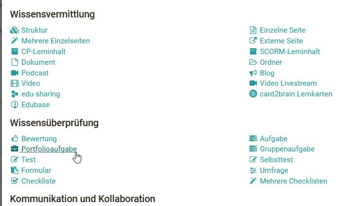
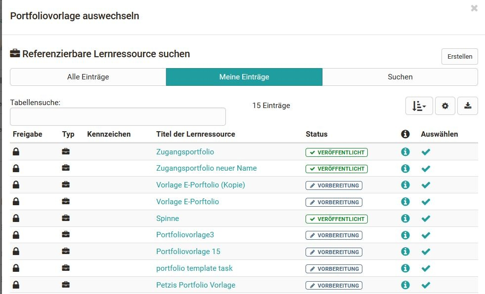

# Portfolioaufgabe erstellen

Um eine erstellte und eingerichtete Portfolio 2.0 Vorlage in einen OpenOlat
Kurs einzubinden fügen sie ihrem Kurs den Kursbaustein Portfolioaufgabe hinzu.
Gehen Sie hierfür wie folgt vor:

## 1. Kurseditor öffnen und Kursbaustein Portfolioaufgabe einfügen  

a) Im Autorenbereich unter „Meine Einträge“ Kurs suchen und öffnen.
  
  
b) Oben im Dropdown-Menü „Administration“ auf „Kurseditor“ klicken.  

c) Oben im Pop-Up „Kursbausteine einfügen“ „Portfolioaufgabe“ wählen.  

  

d) Im Tab „Titel und Beschreibung“ kurzen Titel des Kursbausteins eingeben und
speichern.  
  
  
## 2. Vorlage in den Kurs hinzufügen  
  
Nun muss dem Kursbaustein Portfolioaufgabe eine passende Lernressource Portfolio 2.0 Vorlage zugeordnet werden.

a) Im Tab Lerninhalt "Portfoliovorlage wählen oder erstellen" anklicken.

  
  
  
b) Unter "Meine Einträge" zuvor erstellte Vorlage auswählen.  
  
Alternativ kann über den Button "Erstellen" eine neue Portfolio 2.0 Vorlage erstellt werden.  
  
Damit ein Portfolio mit Punkten bewertet werden kann, muss die Portfolio
Vorlage als Kursbaustein einem Kurs hinzugefügt werden und der Haken bei
"Punkte vergeben" im Tab "Bewertung" des Kursbausteins Portfolioaufgabe
gesetzt sein.

## 3. Finalisieren 

Nachdem der Kursbaustein hinzugefügt und eingerichtet ist muss der gesamte
Kurs wie gewohnt publiziert werden. Klicken Sie hierfür auf die Option
"Publizieren" im Kurseditor und folgen den nächsten Schritten oder schließen
Sie einfach den Kurseditor um schnell zu publizieren.

Die Portfoliovorlage 2.0 steht nun im Kurs zur Verfügung und Kursteilnehmende
können die Portfolioaufgabe abholen und bearbeiten.

