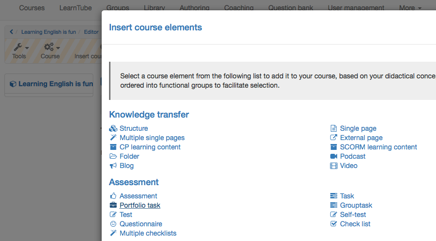
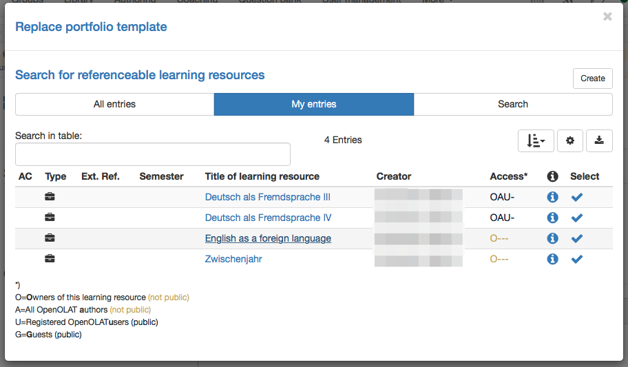

# Creating Portfolio Tasks

To integrate a Portfolio 2.0 template into an OpenOlat course follow the steps
to add the course element "Portfolio task" and link the Portfolio 2.0
template to it.

## 1. Open course editor and insert the course element Portfolio task  

a) Search for the corresponding course in authoring "My entries" and open it.
 
b) Click in the dropdown menu "Administration" on "Course editor".  
  
c) In the pop-up "Insert course elements" chose "Portfolio task".

  

d) Insert a short title in the tab "Title and description" and save.  
  
## 2. Add template to the course  

Nun muss dem Kursbaustein Portfolioaufgabe eine passende Lernressource Portfolio 2.0 Vorlage zugeordnet werden.

a) In the tab learning content "Select or create portfolio template"

  
  
b)In "My entries" select the template just created before.

 Alternatively a new template can be "Created".  
  
To grade a Portfolio with a score it has to be integrated in the course
element "Portfolio task". Also the option "Score granted" in the tab
"Assessment" of this course element has to be enabled.

## 3. Finalize

After adding the course element and linking the "portfolio 2.0 template" the
complete course must be published. You can choose fast publishing by simply
closing the course editor or follow the steps of the publishing wizard by
clicking on the option "Publish".

The Portfolio 2.0 template is now available in the course and the course
participants can collect the portfolio task to edit it.

