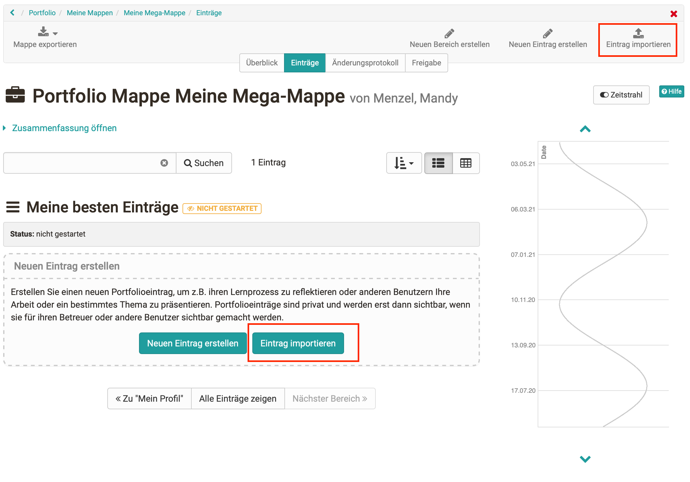
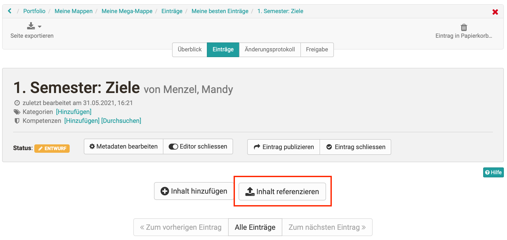
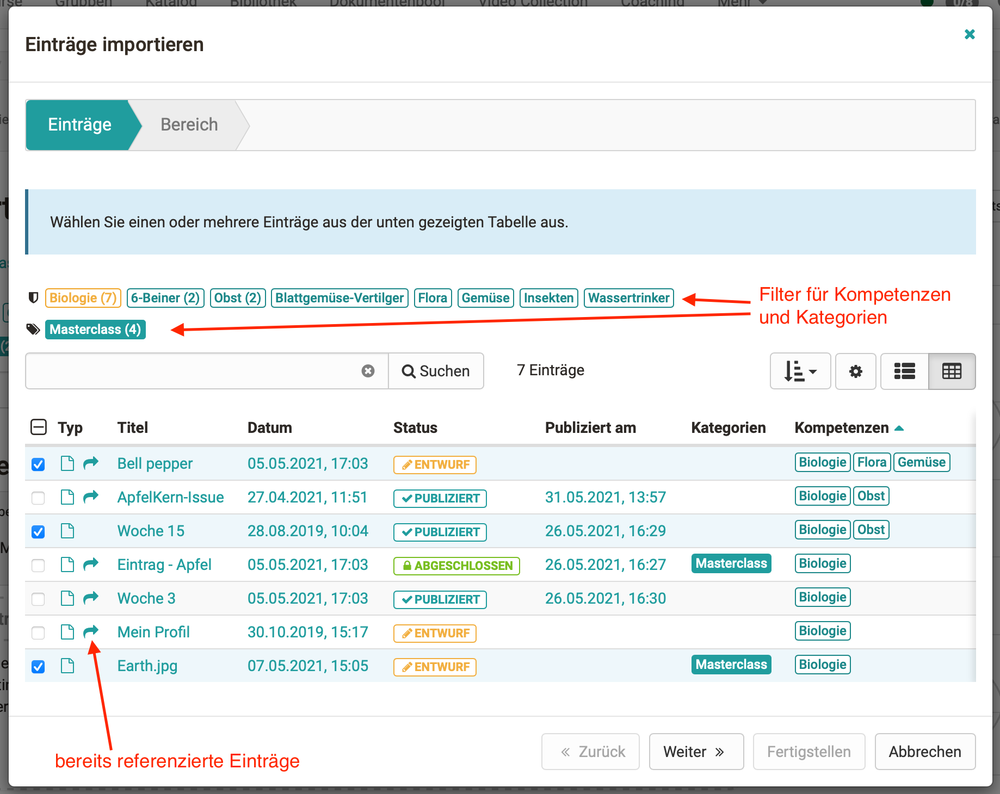

# Mehrfachverwendung von Einträgen

Es gibt verschiedene Szenarien, in denen Benutzer denselben Portfolioeintrag
in mehreren Mappen verwenden möchten. Dies kann z. B. die Präsentation des
Lebenslauf oder der eigenen Hobbys sein, oder auch eine Sammelmappe für die
Betreuenden, in der Lernende ihren Werdegang und die wesentlichen Reflexionen
zur Ausbildung zusammenzutragen und stetig ergänzen.

Um den gleichen Portfolioeintrag in mehrere Mappen einzubinden, gibt es
folgende Möglichkeiten:

 **a) Erstellen einer neuen Portfoliomappe aus bestehenden Einträgen**

Beim Anlegen einer neuen Portfoliomappe steht die Option "Mappe aus
bestehenden Einträgen erstellen" zur Verfügung. Die gewünschten Einträge
können anschliessend aus einer Liste gefiltert und selektiert werden.

|

  
  
---|---  
  
 **b) Import eines Eintrages in eine bestehende Portfoliomappe**

Innerhalb der Ziel-Portfoliomappe können auch ein oder mehrere
Portfolioeinträge aus anderen (verschiedenen) Mappen importiert werden. Dafür
werden die gewünschten Einträge aus einer Liste ausgewählt, die über den
Button "Eintrag importieren" erscheint.

|

  
  
 **c) Referenzierung des Inhaltes aus einem anderen Eintrag**

Hierfür wird ein neuer Eintrag in einer Portfoliomappe angelegt. Über den
Button "Inhalt referenzieren" kann anschliessend ein anderer Eintrag
ausgewählt werden, dessen Inhalt im neuen Eintrag übernommen wird.

|

  

  
  
Es wird jeweils die Liste der Einträge angezeigt, die referenziert bzw.
importiert werden können. Sind an den einzelnen Einträgen Kompetenzen oder
Kategorien vergeben, kann in der Maske danach gefiltert werden. Mit der Suche
können die Ergebnisse weiter verfeinert werden. Einträge, die bereits in
Mappen referenziert sind, werden entsprechend gekennzeichnet.

### **Merkmale referenzierter Einträge**

Referenzierte Einträge werden in den Auswahllisten (Import-Maske) mit einem
Pfeil gekennzeichnet. Im Eintrag selbst werden Meldungen zur Referenzierung
angezeigt sowie ein Hinweis unterhalb des Titels, in wie vielen anderen
Einträgen der gleiche Inhalt verwendet wird.

Achtung

Es handelt sich stets um denselben Eintrag. Ist ein Eintrag in Mappe A und
Mappe B eingebunden, so werden Änderungen am Eintrag in Mappe A automatisch
auch in Mappe B aktualisiert.

Ist ein referenzierter Eintrag in einer Mappe bereits (ab)geschlossen, so kann
der gleiche Eintrag in einer anderen Mappe nicht mehr geöffnet und verändert
werden. Bei unterschiedlichen Zuständen der Einträge gewinnt der
restriktivste.

Die Metadaten eines Eintrages können immer bearbeitet werden. In der
Bearbeitungsmaske der Metadaten kann entschieden werden, ob die Änderungen für
alle referenzierten Einträge übernommen werden sollen, oder - z.B. im Sinne
eines spezifischen Kontextes - nur im vorliegenden Eintrag angepasst werden.

