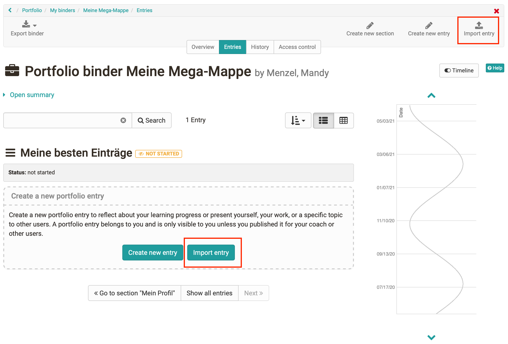
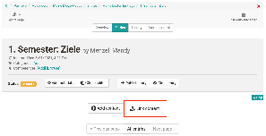
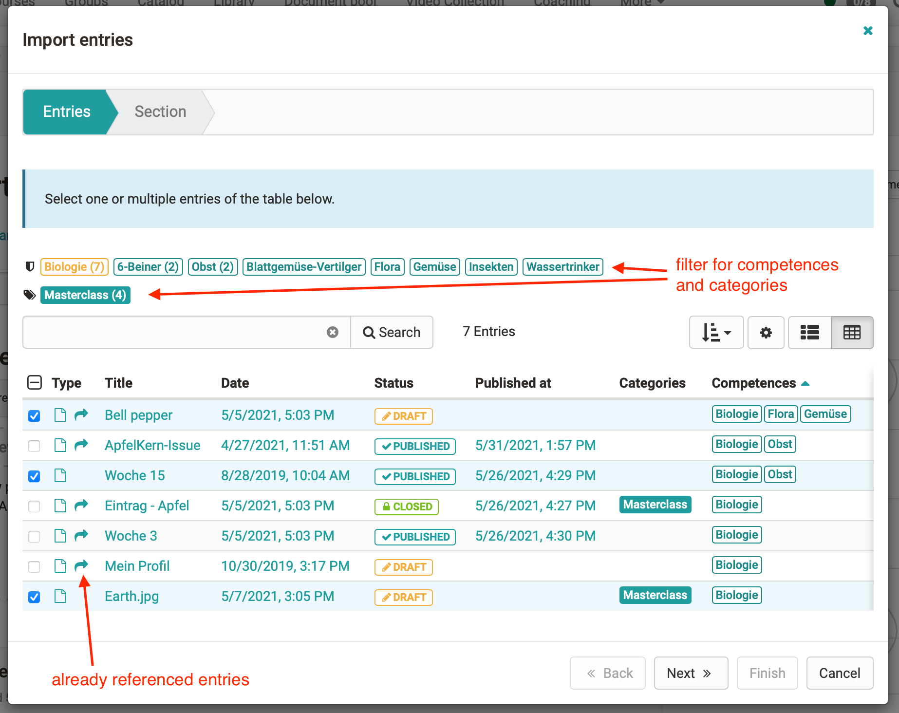
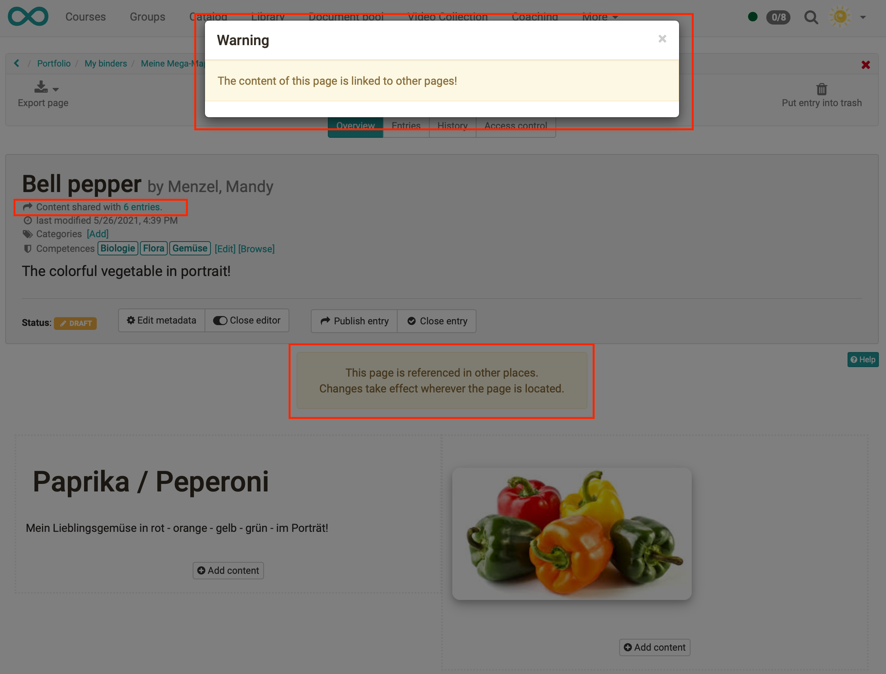
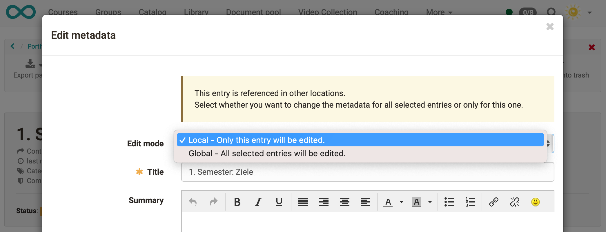

# Multiple use of entries

There are different scenarios where users may want to use the same portfolio
entry in several binders. This could be, for example, the presentation of
one's curriculum vitae or hobbies, or a collective portfolio for the coaches,
in which learners compile and constantly add to their career and essential
reflections on the training.

To include the same portfolio entry in several binders, there are the
following possibilities:

 **a) Creating a new portfolio binder from existing entries**

When creating a new portfolio binder, the option "Create folder from existing
entries" is available. The desired entries can then be filtered and selected
from a list.

|

  
  
---|---  
  
 **b) Importing an entry into an existing portfolio binder**

Within the target portfolio binder, one or more portfolio entries can also be
imported from other (different) binders. To do this, the desired entries are
selected from a list that appears via the button "Import entry".

|

  
  
 **c) Referencing the content from another entry**

For this purpose, a new entry is created in a portfolio binder. The button
"Link content" can then be used to select another entry whose content will be
taken over in the new entry.

|

  
  
The list of entries that can be referenced or imported is displayed. If
competences or categories are assigned to the individual entries, they can be
filtered in the mask. The results can be further refined with the search.
Entries that are already referenced in folders are marked accordingly.

### Characteristics of referenced entries

Referenced entries are marked with an arrow in the selection lists (import
mask). In the entry itself, referencing messages are displayed as well as a
note below the title indicating in how many other entries the same content is
used.

Attention

It is always the same entry. If an entry is included in binder A and binder B,
changes to the entry in binder A are automatically updated in binder B as
well.

  

If a referenced entry in a binder is already closed, the same entry in another
binder can no longer be opened and changed. In case of different states of the
entries, the most restrictive one wins.

The metadata of an entry can always be edited. In the metadata editing screen,
you can decide whether the changes should be applied to all referenced entries
or - e.g. in the sense of a specific context - only adapted in the current
entry.

