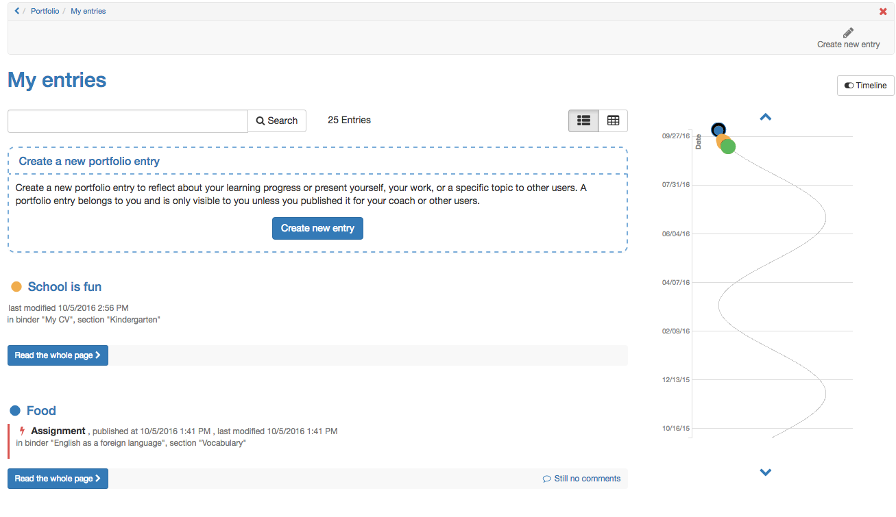

# My entries

In "My entries" all entries are listed in a chronological order. Therefore it
doesn't matter in which binder an entry is located. You've got a summary about
all your entries and with the help of the status you can see their progress.
One entry can contain several contents or artefacts.

Particular [contents](My+portfolio+binders.html#Myportfoliobinders-
portfolioinhalt) of an entry are added to the media center, depending on their
type. There they can be edited as well. Entries are not added to the media
center.

!!! info "Info"

    "My entries" can be displayed in two different ways. The table view offers the possibility to display further details of the entries, e.g. whether an entry was referenced or whether comments are available.

