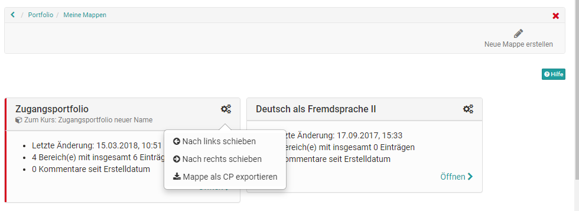

# Meine Portfolio Mappen

Im persönlichen Menü erhält jeder User Zugang zu seinem Portfolio. Über den
Link "Zu meinen Mappen" gelangt man zu allen eigenen Portfolio Mappen.

Ferner können hier unter "Neue Mappen erstellen" neue Portfolio Mappen
angelegt werden. Über das Zahnradsymbol können die vorhandenen Mappen
verschoben oder als CP exportiert werden. In einer Mappe direkt bestehen auch
noch weitere Exportoptionen wie PDF Export und Export in eine Seite.

Achtung es gibt unter "Meine Mappen" zwei Stellen an denen neue Mappen
erstellt werden können. Einmal rechts oben (siehe vorherigen Screenshot und
integriert in die Seite. Diese zweite Option bietet weitere
Erstellungsmöglichkeiten für die Portfolio Mappen.

  

# 2 Mappen Varianten

Es werden grundsätzlich zwei Arten von Mappen unterschieden:

  * 1Abgeholte Mappen
  * 2Selbst erstellte Mappen

## Abgeholte Mappen

Abgeholte Mappen erkennt man an dem roten Randstreifen und dem Hinweis auf den
zugehörigen Kurs. Diese Mappen basieren auf einer "[Portfolio 2.0
Vorlage](Portfolio_template_Creation.de.md)" und werden in der Regel
von einer anderen Person, meist dem Lehrenden, erstellt. Die Abholung erfolgt
im Kurs über die "[Portfolio

sites/manual_user/docs/portfolio/My_portfolio_binders.de.md §Portfolio_task_and_assignment_Collecting_and_editing.de.md§ 481
Aufgabe](Portfolio_task_and_assignment_Collecting_and_editing.de.md)". Alternativ
ist es auch möglich, Portfolio Vorlagen kursunabhängig zu buchen und
abzuholen.

Sobald eine Portfolio Mappe vom Lernenden abgeholt wurde erscheint sie in
seinem persönlichen Portfolio-Bereich unter "Meine Mappen".  Wenn der User
diese Mappe öffnet, kann er die dort hinterlegten Aufgaben (Typ Freitext oder
Formular) wählen und die bereitgestellten Portfolioaktivitäten bearbeiten
indem er diverse Artefakte (Texte, Dateien usw.) hinterlegt bzw. ein Formular
ausfüllt.

Hinweis

By default können Sie in einer abgeholten Mappe keine eigenen strukturellen
"Einträge" erstellen. Es können jedoch diverse Inhalte, auch aus der

sites/manual_user/docs/portfolio/My_portfolio_binders.de.md §Media_center.de.md§ 481
[Mediathek](Media_center.de.md), hinzufügen.

Über den Button "Inhalt hinzufügen" gelangt man in den Portfolio Editor. Hier
können diverse Elemente hinzugefügt werden und auch mit dem Containerelement
gruppiert werden. Durch Klick auf das Pluszeichen können weitere Blöcke
hinzugefügt und per drag and drop verschoben werden.

Alternativ zum Inhalt hinzufügen können auch schon erstellte Portfolio
Einträge über den Button ["Inhalt

sites/manual_user/docs/portfolio/My_portfolio_binders.de.md §Multiple_use_of_entries.de.md§ 481
referenzieren"](Multiple_use_of_entries.de.md)
verknüpft werden. Änderungen an den Einträgen sind dann an allen
referenzierten Stellen möglich.

## Selbst erstellte Mappen

Grundsätzlich können alle OpenOlat-User eigene Portfolio Mappen mit Bereichen,
Einträgen und Inhalten erstellen. Wie das geht, erfahren Sie

sites/manual_user/docs/portfolio/My_portfolio_binders.de.md §Three_steps_to_your_portfolio_binder.de.md§ 481
[hier](Three_steps_to_your_portfolio_binder.de.md).

Info

Die Möglichkeit, selbst Mappen zu erstellen, kann von Ihrem [Administrator

sites/manual_user/docs/portfolio/My_portfolio_binders.de.md §eAssessment_ePortfolio.de.md§ 481
](../../manual_admin/administration/eAssessment_ePortfolio.de.md)eingeschränkt werden.

Wie die Mappen mit Inhalten ausgestaltet werden können erfahren Sie im Kapitel

sites/manual_user/docs/portfolio/My_portfolio_binders.de.md §Three_steps_to_your_portfolio_binder.de.md§ 481
"[Drei Schritte zu Ihrer Mape"](Three_steps_to_your_portfolio_binder.de.md) und "[Der

sites/manual_user/docs/portfolio/My_portfolio_binders.de.md §The_portfolio_editor.de.md§ 481
Portfolio Editor](The_portfolio_editor.de.md)".

