# My portfolio binders

In the personal menu every user gets access to his portfolio via the link "To
my binders" to his portfolio folders.

Furthermore, new portfolio folders can be created here under "Create new
folders". Via the gear icon the existing folders can be moved or exported as
CP. In a folder directly there are also further export options like PDF export
and export to a page.

Attention there are two places under "My Folders" where new folders can be
created. Once on the top right (see previous screenshot and integrated into
the page. This second option offers more creation possibilities for the
portfolio folders.

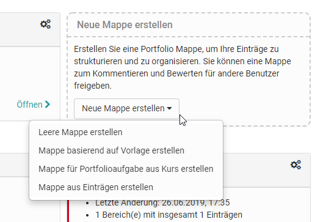

# 2 types of folders

There are basically two types of folders:

  * 1 My portfolio binders 
  * 22 types of folders
  * 3Collected binders
  * 4Self created binders 

# Collected binders

You can recognize the retrieved folders by the red border and the reference to
the corresponding course. These folders are based on a "[Portfolio 2.0
template](Portfolio+template%EF%B9%95+Creation.html)" and are usually created
by another person, usually the teacher. The collection takes place in the
course via the "[Portfolio
Task](Portfolio+task+and+assignment%EF%B9%95+Collecting+and+editing.html)".
Alternatively, it is also possible to book and collect portfolio templates
independently of the price.

As soon as a portfolio folder has been collected by the learner, it appears in
the "My binders" area of the respective collector.

When a user opens this folder, he/she can select the tasks stored there (free
text or form type) and edit the portfolio activities provided by storing
various artefacts (texts, files, etc.) or filling in a form.

Hint

By default it is not possible to create own entries in a collected binder. But
all contents of the [media center](Media+center.html) can be inserted into an
entry.

The "Add content" button takes you to the Portfolio Editor. Here various
elements can be added and also grouped with the container element. By clicking
on the plus sign, further blocks can be added and moved via drag and drop.

As an alternative to adding content, already created portfolio entries can
also be linked via the "Reference content" button. Changes to the entries are
then possible at all referenced points.

# Self created binders

In general, all OpenOlat users are allowed to create their [own portfolio
binders](Three+steps+to+your+portfolio+binder.html) with sections and entries.  

Info

The possibility to create own binders can be restricted by your administrator.

You can find out how to add content to the portfolios in the chapter "[Three
steps to your portfolio binder](Three+steps+to+your+portfolio+binder.html)"
and "The Portfolio Editor".

(move the following content to a sep. file)

##  Contents

To every entry different contents can be added.

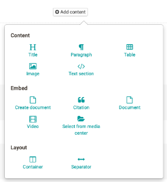

The Portfolio Editor corresponds in large parts to the form editor.

Citation, video and images are added to the media center and can be edited
only there. Editing is only possible as long as the entry, to which the media
file is linked, is not yet published!

## Content

  

## **Title**

Every entry can contain of several titles and subtitles.

With h1-h6 the heading can be selected. h1 is according to the heading 1 and
is therefore the tallest one and h6 is according to heading 6 and thus the
smallest one.

  

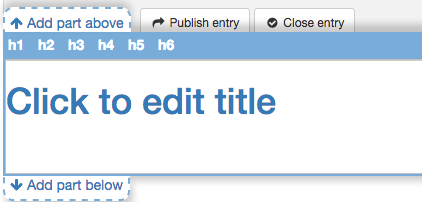

### **Paragraph**

Element to add text blocks. The paragraph element contains central formatting
and the possibility to distribute the text to columns.

  

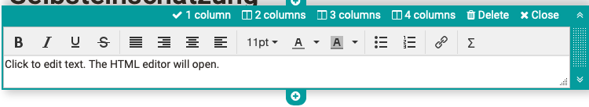

### Table

Add a table to your portfolio. Define the number of rows and columns in a
table and make further settings.

  

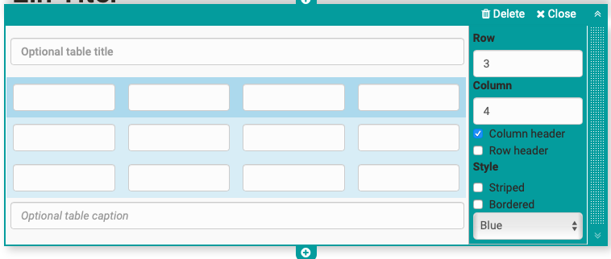

### Image

Add picture elements to your portfolio. Upload a suitable graphic file. Then
you can further configure the file, e.g. place a title or subtitle and also
define the size, placement or border.

The positioning can also be further optimized by using the container element.

  

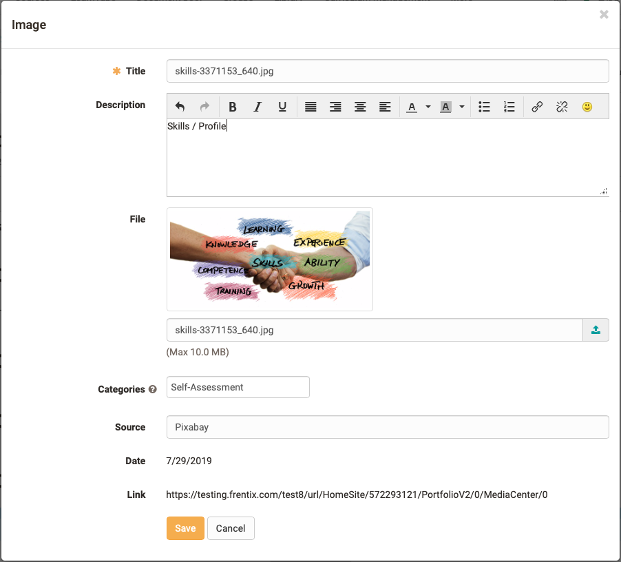

### Text section

With the help of the html-editor a "normal" text can be added. The common
formatting is possible.

With "Insert" a [math formula](Math+formula.html) can be inserted as well.

  

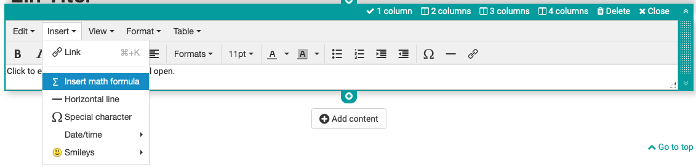

## Embed

### Create document

Here a new document can be created according to the specified file types. If,
for example, OnlyOffice is used, the created files can also be edited directly
online.

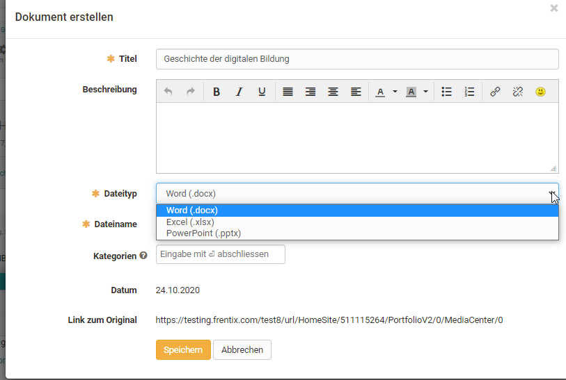

###  Citation

A quotation can be added directly in the entry, as well as in the media
library. First select the appropriate type of quotation and then fill in as
many fields as possible.

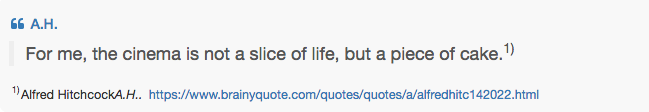

  

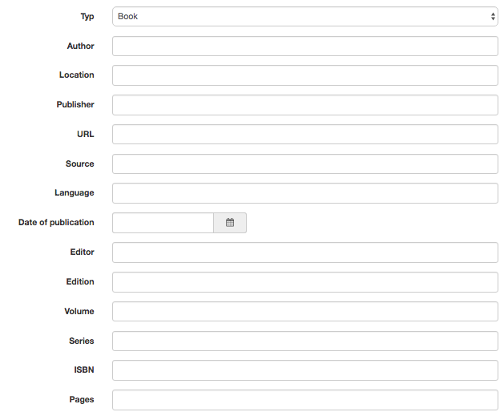

### Document

Various file formats can be uploaded here and provided via link.

If an external document editor is activated and the files are available in a
format that is supported by it, the files can also be edited directly online.

  

### Video

Videos can be uploaded to the portfolio via this link.

  

### Select from media center

Files, which can be found in the media center, can be added to the entry with
this button. The search and filter options help to find the desired files
faster.

  

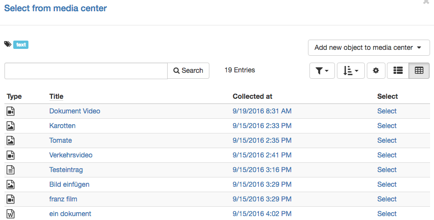

## Layout

## Container

Containers can be used to further structure a portfolio. A 1-4 column layout
is available. Nesting within a container field is also possible.

  

  

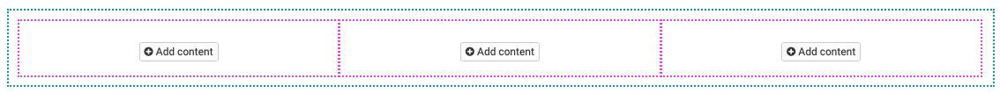

Separator

With the help of a separator a page can be divided graphically. A grey line is
created, which cannot be formatted.

  

  

  

## Further configuration

Neben dem Tab "Überblick" enthält die Portfolio Mappe noch die Tabs
"Einträge", das "Änderungsprotokoll" sowie die "Freigabe".

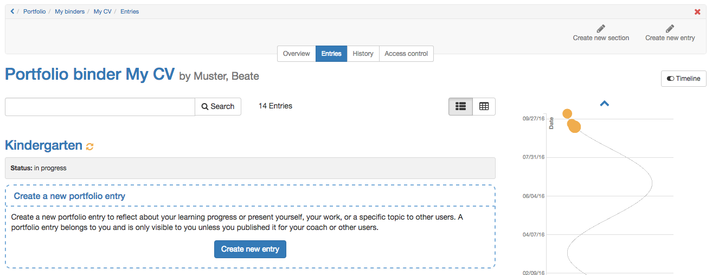

### Timeline

With the help of the timeline the user gets a graphical overview about his
activities in the portfolio. The colored points show the creation date of a
section. With a "Left button click" on a point you get details about the
corresponding entry. The different colors show the respective status of an
entry. The timeline can be helpful if a portfolio is used over a certain time
period, e.g. a semester or a year.

  

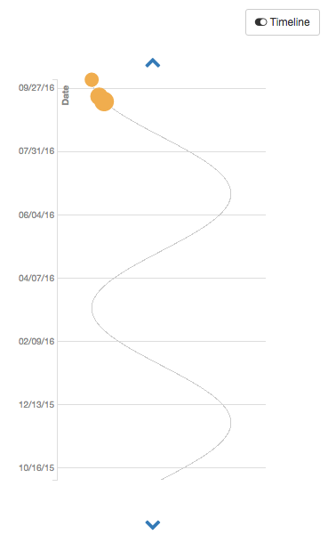

History

All changes are listed in a chronological order in the history. The latest
change is always on top.  

  

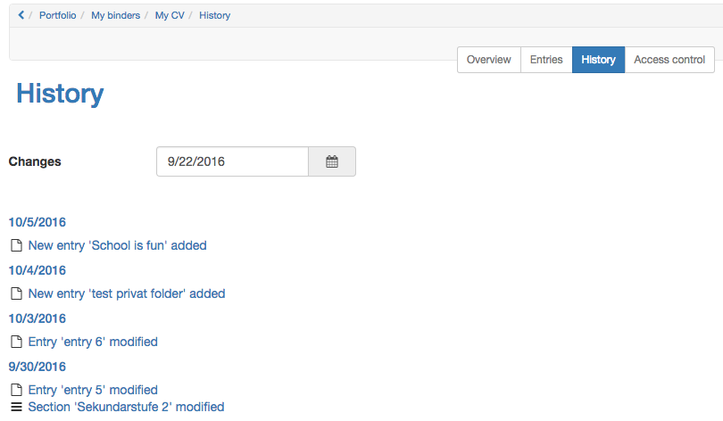

  

### Access control

Access rights can be added in the access control. Further information can be
found
[here](Portfolio+task+and+assignment%EF%B9%95+Collecting+and+editing.html#Portfoliotaskandassignment:Collectingandediting-
accessright).

  

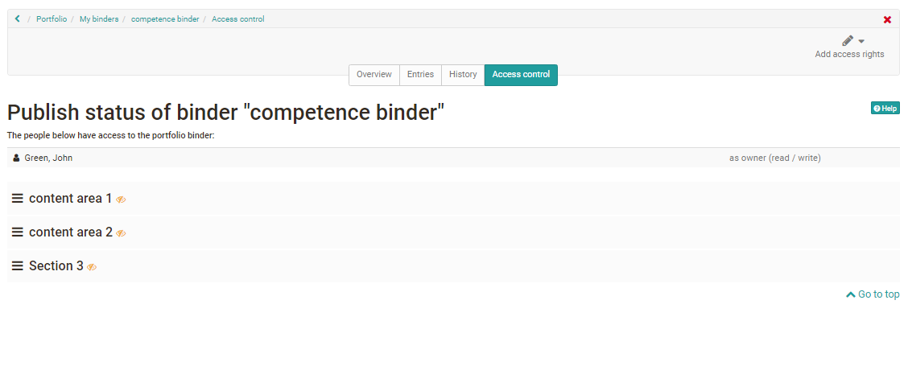

