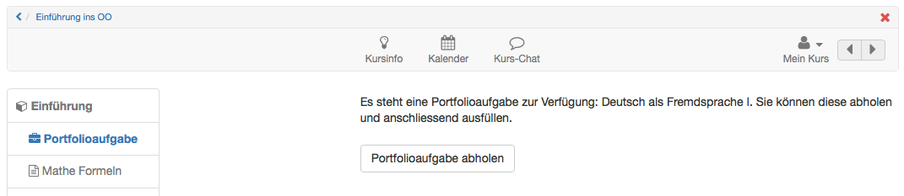
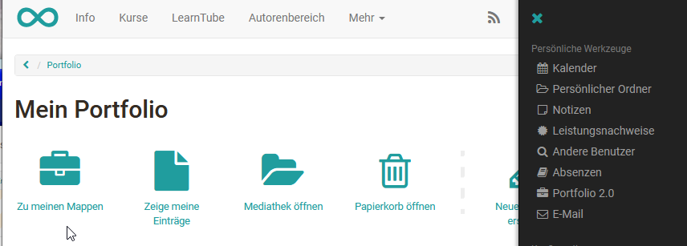
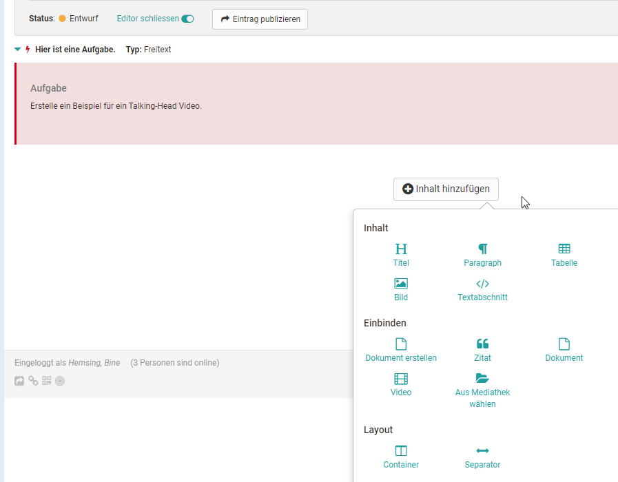
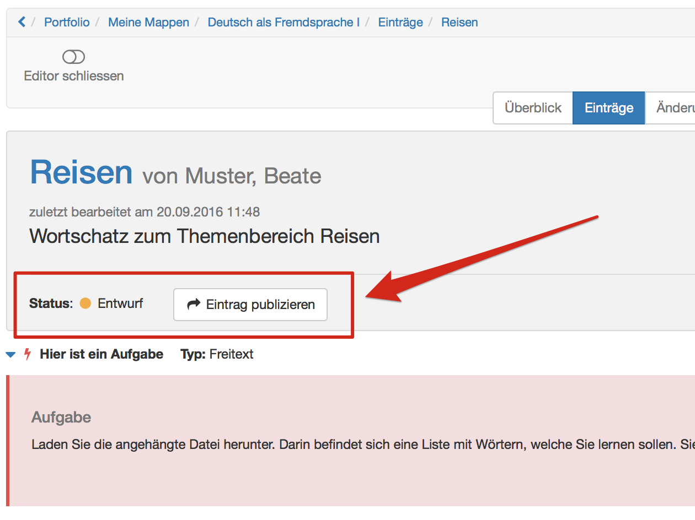
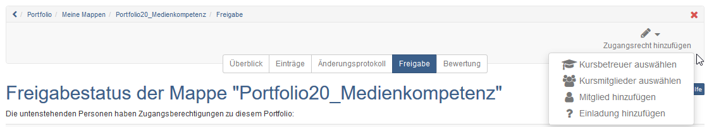
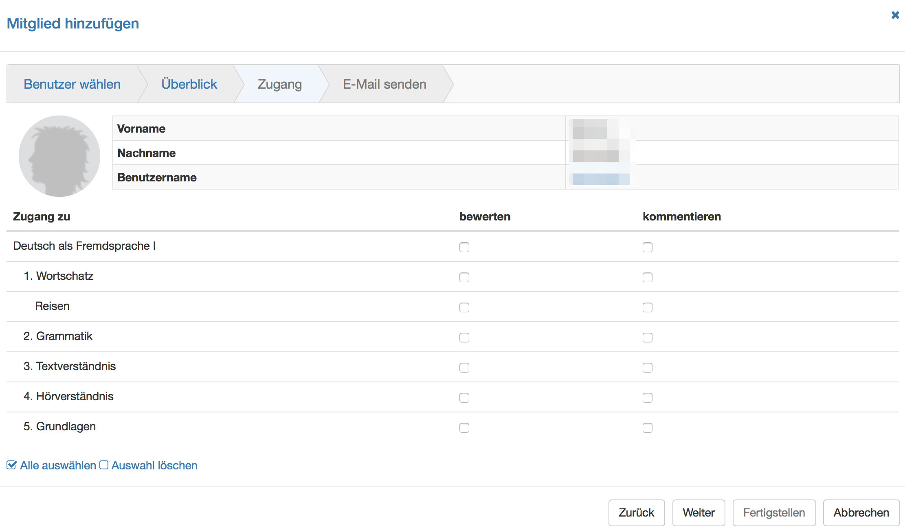

#  [Portfolioaufgabe: abholen und bearbeiten

Im Folgenden wird beschrieben wie Lernende eine im Kurs bereitgestellte
Portfolioaufgabe (auf einer Portfoliovorlage basierende Portfoliomappe mit
Aufgaben) abholen und bearbeiten können.

Portfolioaufgabe abholen  
---  
1| Kurs, indem sich die Portfolioaufgabe befindet, öffnen.  
2| Kursbaustein Portfolioaufgabe auswählen.  
3|

Button "Portfolioaufgabe abholen" anklicken.

  
  
4| Die Portfolioaufgabe ist nun abgeholt und im Portfolio unter "[Meine
Mappen](Meine+Portfolio+Mappen.html)" gespeichert.  
  
| Beim nächsten Zugriff kann die Portfolioaufgabe direkt im persönlichen
Portfolio geöffnet werden.  
  
Portfolioaufgabe bearbeiten  
  
---  
1| Portfolio öffnen.|  
  
2|

Unter "Zu meinen Mappen" die abgeholte Mappe öffnen. Aus Kursen abgeholte
Mappen sind mit einem roten linken Rand gekennzeichnet und enhtalten den
Hinweis auf den zugehörigen Kurs.

|

  
  
3|

Entweder in der Rubrik „Überblick“ oder „Einträge“ auf einen Mappen „Bereich“
klicken und dort eine hinterlegte Aufgabe auswählen. Anschließend ist die
zugehörige Aufgabenstellung sichtbar.

|

  
  
4|

Nun können die Aufgaben bearbeitet und passende Artefakte über den Portfolio
Editor hinzugefügt werden.

|

  
  
5|

Sofern in den Einstellungen der Portfolio Vorlage konfiguriert, dürfen die
User auch neue Einträge ergänzen oder die gesamte abgeholte Mappe löschen.

|

  
  
Entsprechend der farblichen Markierung ist sofort erkennbar in welchem Status
sich eine Portfolioaufgabe befindet. So symbolisiert z.B.

  * ein roter Blitz im Tag "Überblick", dass eine Aufgabe noch nicht ausgewählt wurde oder
  * ein gelber Punkt, dass die Aufgabe noch nicht publiziert wurde und sich im Entwurfsstadium befindet oder
  * ein blauer Punkt, dass die Aufgabe publiziert wurde.

In dem Tab "Einträge" werden noch nicht ausgewählte Aufgaben in einem Dropdown
Menü gebündelt, während abgeholte Aufgaben unter der Bereichsüberschrift
erscheinen.

Portfolio publizieren  
  
---  
1| Während der Bearbeitung ist der Status des Eintrags auf Entwurf.|

  
  
  
  
  
2|

Sobald der Eintrag respektive die Aufgabe abgeschlossen ist, "Eintrag
publizieren" wählen.  
  
3| Der Eintrag ist nun bereit für die Freigabe und erhält den Status
publiziert.  
  
Hinweis

Sobald ein Eintrag publiziert ist kann er nicht mehr verändert, nur noch
kommentiert werden. Deshalb sollten Lernende darauf achten einen Eintrag oder
eine bearbeitete Aufgabe erst dann zu publizieren, wenn sie komplett fertig
ist!

Damit eine Aufgabe von anderen Personen bewertet oder kommentiert werden kann
muss der Mappen Besitzer diese zunächst für die jeweilige Person(en)
freigeben.

Auch Mappen aus Kursen sind nicht automatisch für die Kursbesitzer sichtbar.

Sie können Portfolio Mappen sowohl an andere OLAT User (Lehrende, Lernende)
als auch an externe Personen freigeben.

Portfolio Freigabe einrichten  
  
---  
1| Öffnen Sie den Tab Freigabe.  
2|

Klicken Sie rechts oben auf den Link "Zugangsrecht hinzufügen".  
  
  
|

  
  
3|

Wählen Sie "Mitglied hinzufügen", um einen OpenOlat-User hinzuzufügen oder
eine der anderen Optionen.  Für die Freigabe an Externe werden Einladungen per
E-Mail verschickt.  
  
4|

Kreuzen Sie diejenigen Bereiche und Einträge an, welche zum Kommentieren oder
bewerten freigegeben werden sollen. Externe Personen können nur kommentieren
nicht bewerten.

  
  
5|

Es kann auch eine E-Mail Benachrichtigung mit Link zur entsprechenden Mappe
verschickt werden.  
  
6|

Zum Schluss speichern (für Externe) bzw. fertigstellen (für OLAT User)
auswählen um die Aktion zu finalisieren.  
  
Tipp

Wenn der User die Freigabe für die Kursbetreuer schon zu Beginn seiner
Bearbeitung einrichtet, können die Betreuer die Entwicklung des Portfolios
bereits sehen und den laufenden Prozess begleiten, sofern der User einzelne
Zwischenschritte publiziert.

