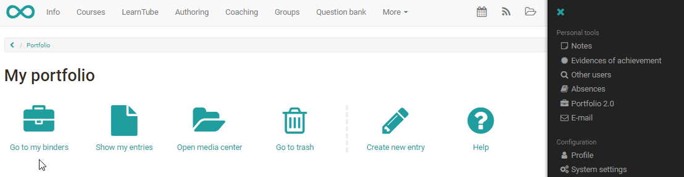
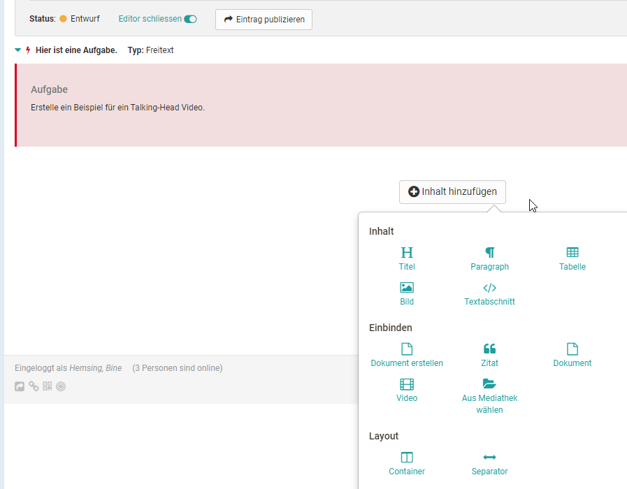

#  Portfolio task and assignment: Collecting and editing

The following section describes how a learner can collect an available
portfolio task (portfolio binder with assignments based on a portfolio
template) in a course and edit it.

Collect portfolio task  
---  
1|

Open the course where the portfolio task is located.

|

  
  
2| Select the course element portfolio task.  
3| Click the button "Collect portfolio task ".  
4|

Now, the portfolio task is collected and your portfolio is saved in "[My
portfolio binders](My_portfolio_binders.md)".  
  
  
| For the next access you can open the portfolio task directly in the
portfolio.  
  
  

  

Edit portfolio task  
---  
1| Open portfolio.|

  

|

  

  
  
  
2| Open in "My portfolio binders" the corresponding portfolio template.
Folders picked up from courses are marked with a red left border and contain
the reference to the associated course.|

  
  
3|

Under "Overview" or "Entries" click on a binder section and choose one of the
assigned tasks from the list. Afterwards the chosen assignment is visible and
ready to edit.

|

  
  
4|

Now the tasks can be edited and suitable artefacts can be added within the
portfolio editor.

|

  
  
5|

If the configuration of the Portfolio 2.0 template allows, a user can add new
entries or delete the collected binder.

|

  
  
  

With the coloured marks the status of the different portfolio tasks is visible
at a glance, for example:

  * The red lightning under "Overview" shows that a task has not been collected yet.
  * The yellow spot indicates that the task is in edit mode and has not been published yet.
  * Tasks with a blue spot are already published.

Under "Entries" all assigned tasks which have not been collected yet are
available in a dropdown list. Collected tasks will be shown under the
portfolio section title.

Publish portfolio  
  
---  
1| During editing the status of the entry/assignment is "Draft".|

  
  
  
  
  
2|

As soon as the entry/assignment is done, "Publish entry" can be selected.  
  
3|

The entry is now ready for the access control and the status is "published".  
  
Hint

As soon as the entry of a portfolio template is published, it cannot be
modified by the user anymore, but commented. So learners should be aware to
only publish entries and tasks when finished.

  

To allow another user / teacher to comment on or grade an portfolio
assignment, it must be shared.

Also binders from courses are not visible by default for the course owner.

Portfolio binders can be shared with other OpenOlat users (teachers, learners)
and external persons.

Edit access control for shared portfolios  
  
---  
1| Open the tab "Access control".|

  
  
  
2|

Select the link "Add access rights" on the top right.

  
  
3|

Choose "Add member" to add an OpenOlat user. Choose "Add invitation" to share
a binder or parts of the binder with an external person (with no OpenOlat
account). Therefore you need an email adress and additional personal
information.  
  
4

|

Chose the sections and entries for which you want to give access control for
grading and commenting. External persons only can comment, but not grade.

|

  
  
  
5|

You can send an email with a portfolio binder link as well.  
  
6|

Finally save the configuration (for external persons) or finish the dialog
(for OpenOlat user).  
  
Tip

When starting to edit a portfolio, users should add the corresponding coaches
to the access control already. If entries will be published, they will be
visible for the coach directly.

  

  

  

