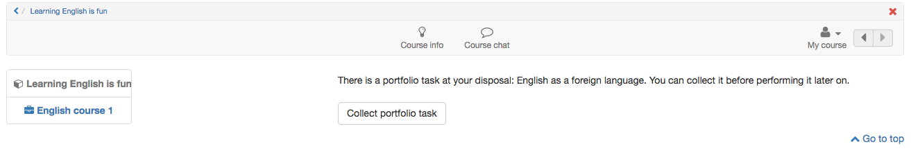

#  Portfolio task and assignment: Collecting and editing

The following section describes how a learner can collect an available
portfolio task (portfolio binder with assignments based on a portfolio template) in a course and edit it.

Dafür muss zunächst der Kurs indem sich die Portfolioaufgabe befindet aufgerufen und der entsprechende Kursbaustein ausgewählt werden.

(Open the course where the portfolio task is located.)

## Collect portfolio task  

  

## Find Portfolio task 

Select the course element portfolio task. Click the button "Collect portfolio task ".  

Now, the portfolio task is collected and your portfolio is saved in "[My
portfolio binders](My_portfolio_binders.md)".  
  
  
(For the next access you can open the portfolio task directly in the
portfolio.)

Beim nächsten Zugriff kann die Portfolioaufgabe entweder über den Link im Kurs oder auch direkt im persönlichen Portfolio geöffnet werden.   
 
Folders picked up from courses are marked with a red left border and contain
the reference to the associated course.
  
## Edit portfolio task  

Open portfolio. Je nachdem wie der Lehrende die Portfolioaufgabe vorstrukturiert hat stehen Ihnen unterschiedliche Bereiche mit Portfolioaufgaben zur Verfügung. 

Klicken Sie entweder im Tab „Überblick“ oder „Einträge“ auf einen Mappen Bereich und "Wählen Sie eine Aufgabe zur Bearbeitung". Anschliessend sind die zugehörige Aufgabenstellung sowie der Bearbeitungseditor sichtbar.
(Open in "My portfolio binders" the corresponding portfolio template.)

 

  
  
Now the tasks can be edited and suitable artefacts can be added within the portfolio editor und passende Inhalte (Texte, Bilder, Videos usw.) und Artefakte über den Portfolio
Editor hinzugefügt werden. 

  
 
 Enthält die Portfolioaufgabe Formulare können diese ebenfalls ausgefüllt werden. 

If the configuration of the Portfolio 2.0 template allows, a user can add new
entries or delete the collected binder.

  

  
## Bearbeitungsstatus 
Der Bearbeitungsstatus einer Portfolio Aufgabe wird durch die farbliche und symbolhafte Kennzeichnung erkennbar. Die Details werden in der unteren Legende in der Mappe erläutert. So symbolisiert z.B.  ein roter Blitz im Tab "Überblick", dass eine Aufgabe noch nicht ausgewählt wurde oder ein grüner Haken, dass die Aufgabe bereits publiziert wurde. 

(With the coloured marks the status of the different portfolio tasks is visible
at a glance, for example:

  * The red lightning under "Overview" shows that a task has not been collected yet.
  * The yellow spot indicates that the task is in edit mode and has not been published yet.
  * Tasks with a blue spot are already published. )

Under "Entries" all assigned tasks which have not been collected yet are
available in a dropdown list. Collected tasks will be shown under the
portfolio section title.

## Publish portfolio {: #publish}
  
During editing the status of the entry/assignment is "Draft".
  
  
  
 
As soon as the entry/assignment is done, "Publish entry" can be selected. So wird die Bearbeitung für andere Personen, die Zugang zum Portfolio haben, sichtbar und Feedbacks bzw. Kommentierungen sind möglich.   
 
!!! info "Info"

    As soon as the entry of a portfolio template is published, it cannot be
    modified by the user anymore, but commented. So learners should be aware to
    only publish entries and tasks when finished.

## Share portfolio 
  
To allow another user or teacher to comment on or grade an portfolio assignment, it must be shared.
Portfolio binders can be shared with other OpenOlat users (teachers, learners)
and external persons.

!!! info "Info"
    
    Also binders from courses are not visible by default for the course owner.

**Gehen Sie für die Freigabe wie folgt vor:**

a) Open the tab "Access control".

b) Select the link "Add access rights" on the top right.

  
  
c) Wählen Sie die gewünschte Option z.B. "Kursbetreuer auswählen", um die entsprechende Personengruppe oder Einzelperson hinzuzufügen. Für die Freigabe an externe Personen, auch ohne OpenOlat Account, wählen Sie "Einladung hinzufügen". Es werden dann Einladungen per
E-Mail verschickt. 

(c Choose "Add member" to add an OpenOlat user. Choose "Add invitation" to share
a binder or parts of the binder with an external person (with no OpenOlat
account). Therefore you need an email adress and additional personal
information.  ) 
  
d) Chose the sections and entries for which you want to give access control for
grading and commenting. External persons only can comment, but not grade.

You can send an email with a portfolio binder link as well.  
  
e) Finally save the configuration (for external persons) or finish the dialog
(for OpenOlat user).  
  
!!! info  "Info"

    When starting to edit a portfolio, users should add the corresponding coaches
    to the access control already. If entries will be published, they will be
    visible for the coach directly.
    Eine Bearbeitung der Lösung ist dann aber nicht mehr möglich.

  

  

  

