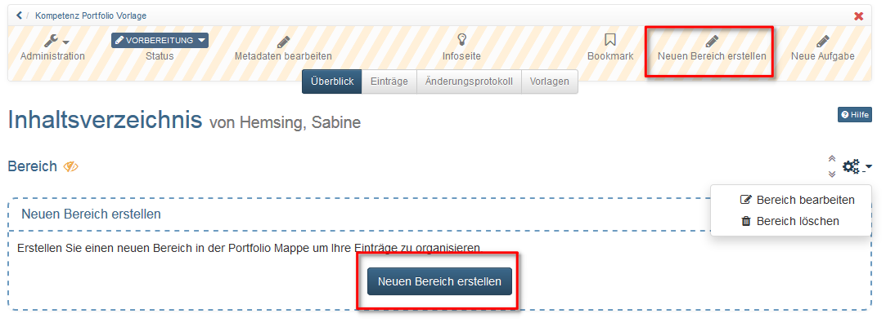
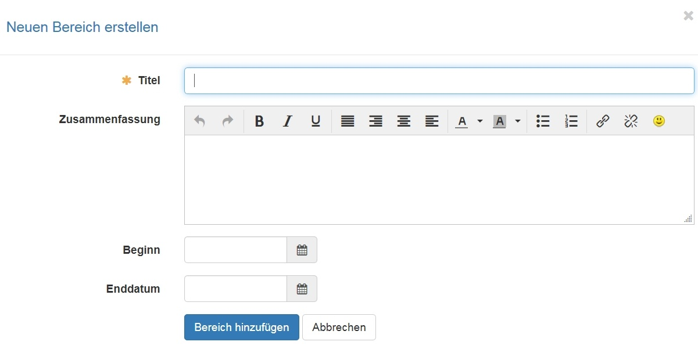
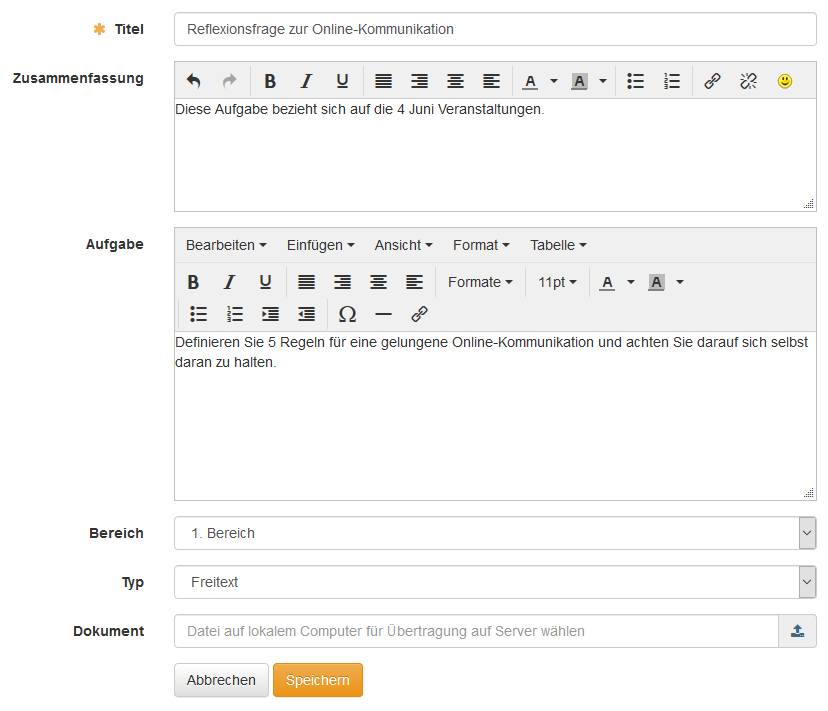
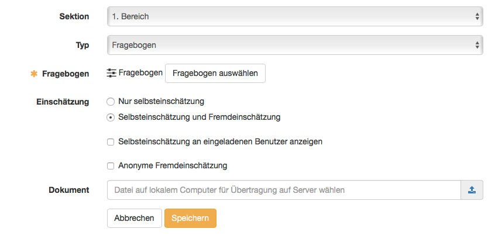

#  Portfoliovorlage: Administration und Bearbeitung

Öffnen sie Im Autorenbereich unter „Meine Einträge“ die gewünschte Portfolio
2.0 Vorlage.

Wenn sie eine Portfolio 2.0 Vorlage neu erstellt haben enthält diese bereits
einen "Bereich" den sie umbenennen und weiter ausgestalten können.

Ferner können sie neue Bereiche und Aufgaben für diese Bereiche erstellen.

  
| Bereich erstellen|  
  
---|---|---  
1| Wählen Sie "Neuen Bereich erstellen" entweder über die Menüleiste oder den
Erstellungsblock.|

  
  
2| Vergeben Sie einen Namen/Titel für diesen Bereich.|

  
  
3| Optional kann noch eine Zusammenfassung für einen kurzen Überblick sowie
ein Beginn und Enddatum für die Sichtbarkeit dieses Bereichs eingerichtet
werden.  
  
Hinweis

Bereiche können nur unter "Überblick" bearbeitet, gelöscht und verschoben
werden.

Bereiche können nicht in Unterbereiche unterteilt werden. Jedem Bereich können
allerdings mehrere Aufgaben hinzugefügt werden.

Aufgabe erstellen und bearbeiten - Typ "Freitext"  
  
---  
1| Im Autorenbereich unter „Meine Einträge“ Portfoliovorlage öffnen.|  
  
2| Entweder im "Überblick" den gewünschten Bereich anwählen und "Neue Aufgabe"
wählen oder direkt den Link "Neue Aufgabe" auswählen und anschließend der
Aufgabe einen Bereich zuordnen.|

  
  
3| Kurzen Titel eingeben|

  
  
  
  
  
4|

Die Aufgabe kann als Text im Bereich "Aufgabe" eingegeben oder als Dokument im
Bereich "Dokument" hochgeladen und gespeichert werden.  
  
5|

Unter "Bereich" gegebenenfalls den gewünschten Bereich der Aufgabe auswählen.
In dieser Sektion wird dann die Aufgabe erscheinen.  
  
6| Unter Typ "Freitext" auswählen. Der Typ "Formular" wird im nächsten
Abschnitt beschrieben.  
7| Zusätzlich kann eine Zusammenfassung zur besseren Übersicht für die Nutzer
erstellt werden.  
  
Im Tab "Einträge" können bestehende Aufgaben bearbeitet, verschoben oder
gelöscht werden.

  

Der Typ "Formular", insbesondere der Fragetyp "Rubrik", bietet sich besonders
für Peer-Reviews, Kriterien bezogenen Feedbacks oder übersichtlichen
Bewertungen an.

  

Aufgabe erstellen und bearbeiten - Typ Portfolio "Fragebogen"  
  
---  
1-3|

Die Schritte 1-3, 5 und 7 der Erstellung erfolgen analog zum Typ "Aufgabe".

  

|

  
  
4a| Unter Typ "Formular" auswählen. Der Typ "Freitext" wurde im vorhergehenden
Abschnitt beschrieben.  
6a|

Sie benötigen eine zuvor erstellte Lernressource Formular. Diese wählen Sie
über den Link "Formular auswählen" aus.  
  
8|

Anschließend kann die Art der Einschätzung bzw. des Assessments näher bestimmt
werden.

 **Nur Selbsteinschätzung** : Der Benutzer erstellt ein Self-Assessment und
beantwortet die Fragen des Fragebogens. Er kann z.B. seine eigene Kompetenz
bezüglich bestimmter Aspekte einschätzen. Eine Fremdeinschätzung entlang des
Fragebogens z.B. durch den Lehrenden ist nicht möglich.

 **Selbst- und Fremdeinschätzung** : Es können sowohl eine Selbst-, wie auch
mehrere Fremdeinschätzungen gemacht werden. Die Selbsteinschätzung wird für
die Person, welche eine Fremdeinschätzung abgibt, nicht angezeigt.

 **Selbsteinschätzung an eingeladene Benutzer anzeigen:** Mit dieser Option
wird die Selbsteinschätzung der Person angezeigt, welche eine
Fremdeinschätzung abgibt. Die Selbsteinschätzung wird erst nach Abgabe der
Fremdeinschätzung angezeigt.

 **Anonyme Fremdeinschätzung** : Die Fremdeinschätzungen sind anonym. Für den
Benutzer ist nicht sichtbar, wer welche Fremdeinschätzung abgegeben hat.  
  
9| Zum Schluss alles Speichern.  
  
Damit eine Fremdeinschätzung erfolgen kann, muss der User, nachdem er die
Portfolio Aufgabe abgeholt hat, im Tab "Freigabe" Personen für die Bewertung
freischalten, z.B. alle Kursmitglieder oder Kursbetreuer.

Anschließend können diese Personen das Formular nutzen und Bewertungen
vornehmen. Mehrere Bewertungen können darüber hinaus auch in einer Art
Spinnennetz dargestellt werden.

Seit der OpenOlat Version 15.5 wird statt des Typs "Fragebogen" die
Lernressource "Formular" verwendet.

Hinweis

Vom Ersteller einer Portfolio 2.0 Vorlage werden grundsätzlich "Aufgaben" und
keine "Einträge" erstellt.

Weitere Konfigurationen der Lernressource Portfolio Vorlage sind über die
Portfolio Toolleiste und das Menü "Administration" möglich.

In der "Administration" können im Menü "Einstellungen" weitere Konfigurationen
vorgenommen werden. Neben den Informationen für die Infoseite (Tab Info und
Metadaten), der Einrichtung der Freigabemodalitäten und dem Eintrag in den
Katalog, können im Tab "Einstellungen" folgende weitere Konfigurationen
vorgenommen werden:

  * Benutzern erlauben neue Einträge zu erstellen (nicht nur die Aufgaben zu bearbeiten)
  * Benutzern erlauben die eigene Mappe zu löschen. Wählen Sie diese Option nicht, haben die Benutzer keine Chance die Portfoliomappe wieder zu löschen.
  * Benutzern einen Vorlageordner mit weiteren Dateien und/oder Fragebögen zur Auswahl zur Verfügung stellen. Aktivieren Sie den Vorlagenordner können Sie zusätzlich definieren, ob die Benutzer neue Einträge nur basierend auf dem Vorlagenordner erstellen können.

Im Tab "Überblick" der Toolleiste können ebenfalls die Metadaten der
Portfoliovorlage bearbeitet werden.

