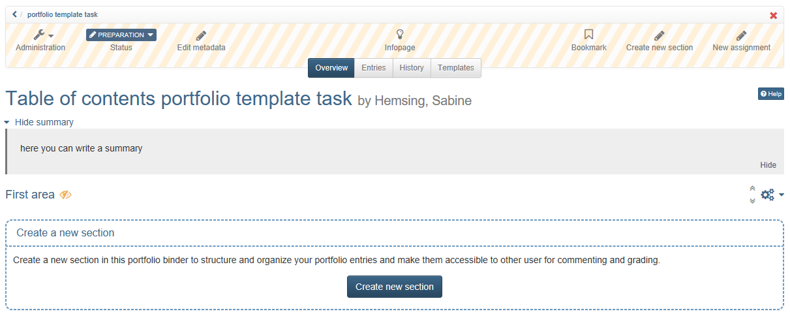
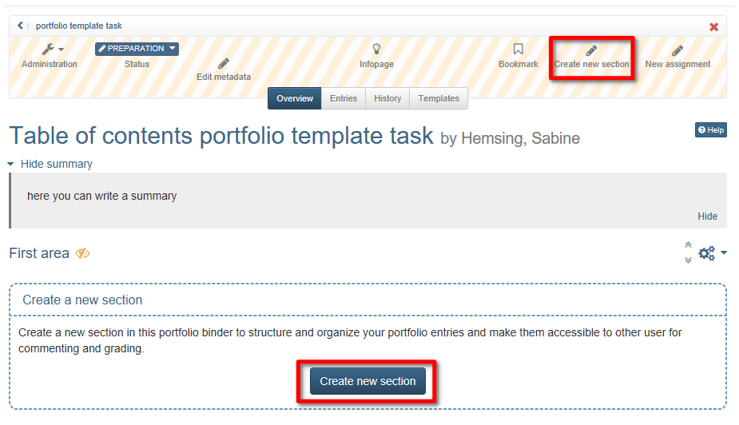
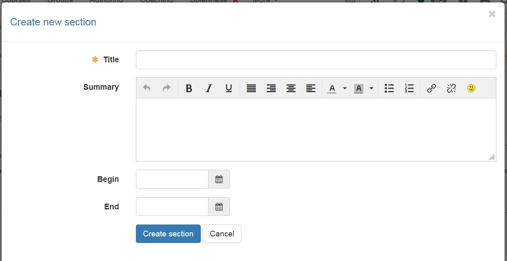
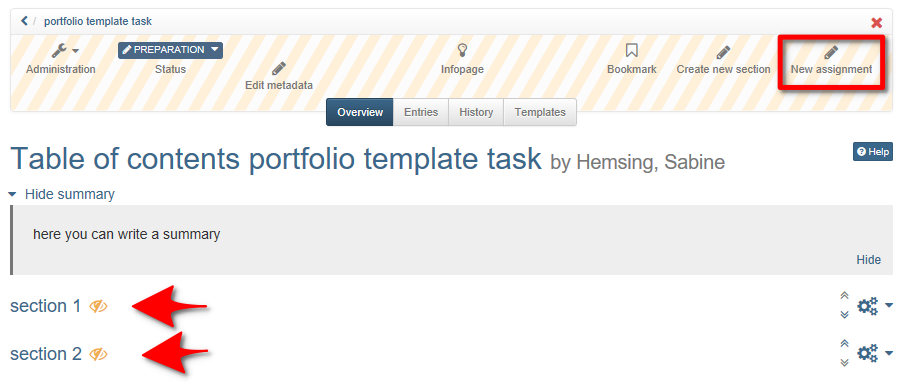
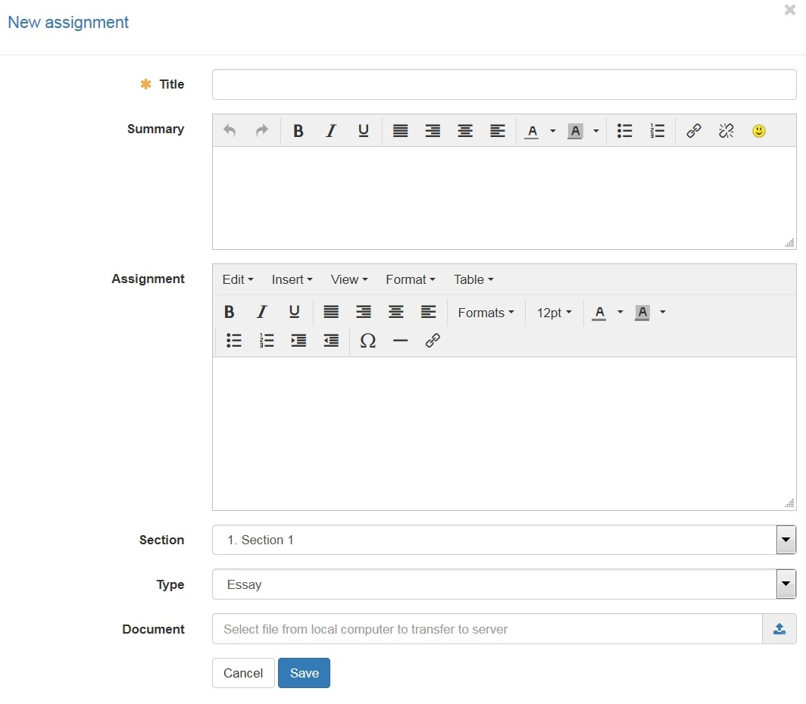
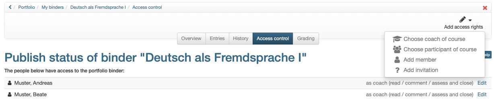
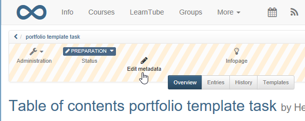

#  Portfolio template: Administration and editing

Open in the authoring area under "My entries" the desired Portfolio 2.0
template.

If you have created a new Portfolio 2.0 template, it already contains a
"section" which you can rename and further develop.

You can also create new areas and tasks for these areas.

## Create a section  

1.  Choose "Create new section" from the menu or below the section.
  
  
2. Enter a title for the section.
  
 
3. In addition you can write a summary to give an overview and choose a begin and end date for the visibility of the section.  
  
!!! Hint

	Sections can only be edited, deleted and moved in "Overview".  
	Sections cannot be divided into subsections. To every section assignments can
	be added.  
	

## Create and edit assignments - Essay  
 
1. Open the portfolio template in authoring and "My entries". 
Select either the desired section in "Overview" or the link "New assignment"
from the menu. Afterwards you can assign it to the section.
  
  
2. Insert short title and additionally a summary for a greater overview for the users can be created.  

3. Under type choose "essay". Find information about creating a form portfolio in
the next chapter.    
  
4. the concrete task can be entered as text in the "Task" area or uploaded and saved as a document in the "Document" area. 

5. Under selection choose the desired selection. The assignment will appear in
this section.  

6. Finally save the document.

  
Furthermore in "Entries" the existing assignments can be edited and deleted and the order can be changed.

## Create and edit assignments - Form
  

1. Open the portfolio template in authoring and "My entries".
Select either the desired section in "Overview" or the link "New assignment"
from the menu. Afterwards you can assign it to the section.
 
2. Insert short title and additionally a summary for a greater overview for the users can be created.

3. Under type choose "form".

4. You need to create a learning resource "form" under "Authoring". After that
you can choose it via the link "Select a form". A corresponding dialog appears. If you create a new form here, you still have to call it up and design it later in the authoring area. 

	We recommend creating the learning resource "Form" in advance and then including it in the portfolio template afterwards.    

	The actual task can be entered as text in the "Task" area, uploaded and saved as a document in the "Document" area or integrated directly into the form. 

5. Then it can be chosen between self and external evaluation.

	* **Self evaluation**: The user fills out a self evaluation. For example, he
	can assess his own competence with regard to certain aspects. An external
	assessment along the questionnaire, e.g. by the teacher, is not possible.

	* **Self- and external evaluation**: Self as well as external evaluations are
	possible. The self evaluation is not visible for the person doing the external
	evaluation.

	* **Invitee can see self evaluation**: With this option the self evaluation is
	shown to the person who does the external evaluation. The self evaluation is
	shown after the external evaluation is done.

	* **Anonymous external evaluation**: The external evaluations are anonymous.
	For the user it is not visible, who did which external evaluation.  
  
6. Under "Section", if necessary, select the desired section of the task.
The task will then appear in this section.  

7. Finally Save all.  

!!! tip "Tip"

	The type "form", in particular the question type "rubric", is particularly
	suitable for peer reviews, criterion-related feedbacks or clear evaluations.
  
!!! info "Info"

	In order for an external evaluation to take place, the user must activate persons for the evaluation, e.g. all course members or course supervisors, in the tab "Access control" after picking up the portfolio task. 
	These persons can then use the questionnaire and make assessments. Several ratings can also be displayed in a spider's web.

!!! hint

	In general the author creates assignments and not entries.

## Further configurations

Further configurations are possible via the portfolio toolbar and the
"Administration" menu.

### Administration

Further settings can be made in the "Administration" menu in the "Settings"
menu. In addition to the information for the info page, the setup of the
release modalities and the entry in the catalog, the following further
configurations can be made in the tab "Settings":

  * Allow users to create new entries (not just edit the tasks)
  * Allow users to delete their own folder. If you do not select this option, the users have no chance to delete the portfolio folder again.
  * Provide users with a template folder with additional files and/or questionnaires for selection. If you activate the template folder, you can also define whether users can only create new entries based on the template folder.

### Toolbar

In the tab "Overview" of the toolbar you can also edit the metadata of the
portfolio template.

