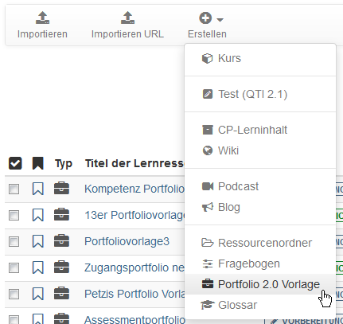

# Portfoliovorlage: Erstellung

Für ein vom Lehrenden gesteuertes Assessment-Portfolio, das beispielsweise im
Rahmen von OLAT Kursen eingesetzt wird, benötigt man als erstes eine
Portfoliovorlage.

Die "Portfolio 2.0 Vorlage" ist eine Lernressource, die wie alle
Lernressourcen im "Autorenbereich" erstellt und eingerichtet wird. Die
folgenden Schritte beschreiben, wie eine Portfolio Vorlage erstellt wird.

Portfolio Vorlage erstellen  
---  
1| Gehen Sie in den Autorenbereich und klicken Sie unter „Meine Einträge“ auf
die Option "Erstellen". Wählen Sie in der erscheinenden Lernressourcen Liste
"Portfolio 2.0 Vorlage" aus.|

  

  
  
2| Geben Sie den Titel der Lernressource ein und klicken Sie auf "Erstellen".  
3|

Es erscheint das Dialogfenster "Informationen", das sie bei Bedarf weiter
ausfüllen können.  
  
4|

Im Tab "Einstellungen" können weitere Konfigurationen des Portfolios
vorgenommen werden. Hierzu gehören:

  * ob Benutzer neben den Aufgabenbearbeitungen auch eigene unabhängige Einträge vornehmen dürfen
  * ob Benutzer eine Mappe auch wieder löschen dürfen (was häufig sinnvoll ist)
  * ob ein zusätzlicher Vorlagenordner verwendet werden soll und ob diese Vorlagen notwendig sind um neue Einträge zu erstellen.

  
5| Auch die weiteren Tabs Metadaten, Freigabe, Katalog und Einstellungen
können weiter eingerichtet werden  
  
|

Anschließend die Ansicht über das X rechts oben schliessen oder in der Bread-
Crumb-Leiste auf den Titel der gerade erstellten Portfolio Vorlage klicken.  

Nun kann mit der Bearbeitung der Portfolio Vorlage begonnen werden.  
Weitere Informationen zur Bearbeitung und Gestaltung der Portfolio Vorlage 2.0
finden Sie
[hier](Portfoliovorlage%EF%B9%95+Administration+und+Bearbeitung.html).  
  
Wenn Sie in Ihrer Portfolio 2.0 Vorlage auch den Aufgaben Typ Formular nutzen
möchten, müssen sie zusätzlich noch eine entsprechende Lernressource
"Formular" erstellen und einbinden. Das Vorgehen zur Erstellung der
Lernressource ist identisch wie bei der Erstellung der Portfolio Vorlage.

Um eine erstellte und eingerichtete Portfolio 2.0 Vorlage in einen OpenOlat
Kurs einzubinden fügen sie ihrem Kurs den Kursbaustein [Portfolioaufgabe
](Portfolioaufgabe+erstellen.html)hinzu.

