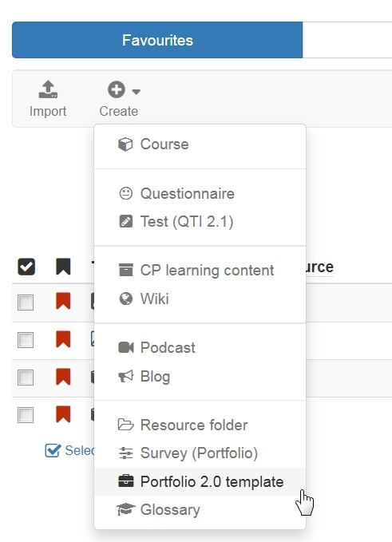

# Portfolio template: Creation

To use an assessment portfolio managed by the lecturer e.g. in an openOLAT
course you need at first a portfolio template.

The "Portfolio 2.0 template" is a learning resource you can create under
"Authoring". The following steps describe how a portfolio template is created.

Create a template  
---  
1|

Go to the author area and click on the "Create" option under "My Entries".
Select "Portfolio 2.0 Template" from the list of learning resources that
appears.

|

  
  
2| Insert the title of the learning resource and click "Create".  
3|

The "Information" dialog box appears, which you can continue to fill in if
required.  
  
4|

In the tab "Settings" further configurations of the portfolio can be made.
These include

  * whether users are allowed to make their own independent entries in addition to the task edits
  * whether users can delete a folder again (which is often useful)
  * whether an additional template folder should be used and whether these templates are necessary to create new entries.

  
5| The other tabs Metadata, Access, Catalog and Settings can also be
configured further.  
  
|

Then close the view via the X at the top right or click on the title of the
portfolio template just created in the bread-crumb bar.

Now you can start editing the portfolio template.

Further information on editing and designing the Portfolio Template 2.0 can be
found [here](Portfolio+template%EF%B9%95+Administration+and+editing.html).  
  
If you want to use the type "Form" in your assignement, you must also create
and integrate a corresponding learning resource "Form". The procedure for
creating the learning resource is the same as for other learning resources
like portfolio template.

To integrate an already created Portfolio 2.0 template in an OpenOlat course
you have to add the course element "[Portfolio
task](Creating+Portfolio+Tasks.html)" to this course.

