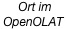
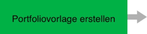
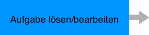
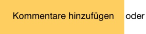
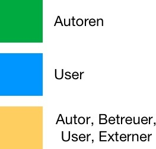

# Prozess eines Bewertungsportfolios {: #process_of_an_assessment_portfolio}

Es gibt verschiedene Varianten, ein E-Portfolio zu nutzen. Hier wird exemplarisch der Prozess für ein Lernportfolio mit vom Lehrenden bereitgestellten Aufgaben, Kommentierung und Bewertung beschrieben. Involviert sind darin sowohl Autoren als auch Nutzer, in Interaktion miteinander.

Über die "Portfolioaufgabe" können Lehrende in OpenOlat Kursen den Lernenden eine vordefinierte Portfoliomappe zur Verfügung stellen, in welche die Teilnehmenden ihren Lernprozess dokumentieren und die bereitgestellten Portfolioaufgaben individuell bearbeiten können. Die Lernenden holen die Mappen im Kurs ab, bearbeiten sie und geben die Mappen später an die Lehrenden für Feedbacks und Bewertungen frei.

Weitere Informationen zu den einzelnen Prozessen finden Sie unter dem jeweiligen Prozessschritt.

Autorenbereich  | Autorenbereich | Autorenbereich { class=size16 } { class=size16 }
---------|----------|---------
  |  | 
 { class=size16 } { class=size16 } :fontawesome-solid-briefcase: | :fontawesome-solid-briefcase: | :fontawesome-solid-briefcase:
  |  | 
 :fontawesome-solid-briefcase: | :fontawesome-solid-briefcase: |
  |  | 

!!! info "Note"

        Eine Portfoliovorlage muss nicht zwingend einem Kurs hinzugefügt werden. Sie kann auch als unabhängige Lernressource den Lernenden zur Verfügung gestellt werden.

!!! tip "Tipp"

        Die Bewertungskriterien sollten möglichst mit den Lernenden vor Bearbeitungsbeginn besprochen werden.

## Weiterführende Informationen {: #further_information}

**Auf dieser Seite erwähnt** 
[Portfoliovorlage: Erstellung >](../learningresources/Portfolio_template_Creation.de.md) 
[Portfoliovorlage: Administration und Bearbeitung >](../learningresources/Portfolio_template_Administration_and_editing.de.md) 
[Portfolioaufgabe erstellen >](../learningresources/Creating_Portfolio_Tasks.de.md) 
[Portfolioaufgabe: abholen und bearbeiten >](../learningresources/Portfolio_task_and_assignment_Collecting_and_editing.de.md) 
[Portfolioaufgabe: kommentieren und bewerten >](../learningresources/Portfolio_assignment_Grading.de.md)

[Zum Seitenanfang ^](#process_of_an_assessment_portfolio)
