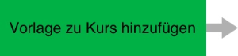
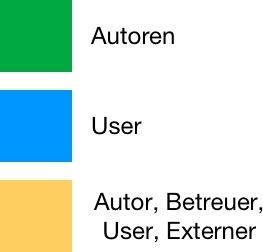

# Prozess eines Bewertungsportfolios

Es gibt verschiedene Varianten, ein E-Portfolio zu nutzen. Hier wird
exemplarisch der Prozess für ein Lernportfolio mit vom Lehrenden
bereitgestellten Aufgaben, Kommentierung und Bewertung beschrieben. Involviert
sind darin sowohl Autoren als auch Nutzer, in Interaktion miteinander.

Über die "Portfolioaufgabe" können Lehrende in OpenOlat Kursen den Lernenden
eine vordefinierte Portfolio Mappe zur Verfügung stellen, in welche die
Kursteilnehmenden ihren Lernprozess dokumentieren und die bereitgestellten
Portfolioaufgaben individuell bearbeiten können. Die Lernenden holen die
Mappen im Kurs ab, bearbeiten sie und geben die Mappen später an die Lehrenden
für Feedbacks und Bewertungen frei.

Weitere Informationen zu den einzelnen Prozessen finden Sie unter dem
jeweiligen Prozessschritt.

  

## Autorenbereich

## Autorenbereich

##
Autorenbereich

Eine Portfolio Vorlage muss nicht zwingend einem Kurs hinzugefügt werden. Sie
kann auch als unabhängige Lernressource dem Lerner zur Verfügung gestellt
werden.

Tipp: Die Bewertungskriterien sollten möglichst mit den Usern vor
Bearbeitungsbeginn besprochen werden.

