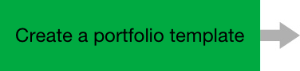
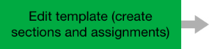
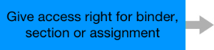

# Process of an assessment portfolio

There are different variations of how a portfolio can be used. Here the
process of a learning portfolio is shown exemplarily including provided tasks,
comments and assessments from the lecturer. In this process authors as well as
users are involved in interaction with each other.

Via "portfolio task" lecturers are able to provide predefined portfolio
binders to learners, where they can document their learning process and work
on assigned portfolio tasks individually. Learners collect the assigned
binders directly in the course, edit them and share the binders subsequently
with their lecturers for feedback and assessments.

More information about the particular processes you can find in the
corresponding process step.

  

## Authoring

## Authoring

##
Authoring

  

You do not necessarily have to add a portfolio template to a course. It can
actually also be provided as an independent learning resource.

Hint: It is best practice to discuss the assessment criteria with the users
beforehand.

