# Der Portfolio Editor

##  Portfolio Einträge mit Inhalten gestalten

Jedem Portfolio Eintrag können unterschiedliche Inhaltselemente hinzugefügt
werden.

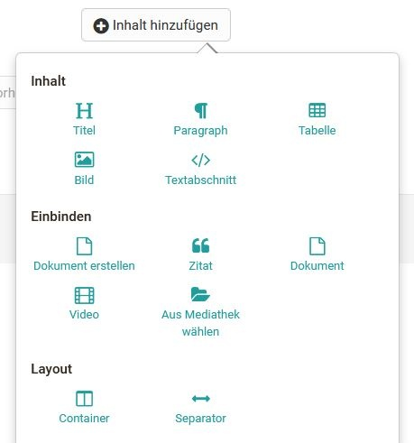

Der Portfolio Editor entspricht in großen Teilen dem Formular Editor.

Zitate, Videos und Bilder werden der Mediathek hinzugefügt und können nur dort
bearbeitet werden. Die Bearbeitung ist möglich, solange der Eintrag, indem
sich das Medium befindet, noch nicht publiziert wurde!

## Inhalt

  

### Titel

Ein Eintrag kann mehrere Titel und Untertitel beinhalten.

Mit der Auswahl von h1-h6 kann die Größe der Überschrift ausgewählt werden,
wobei h1 der "Überschrift 1" entspricht und somit am grössten und h6 der
"Überschrift 6" und somit am kleinsten ist.

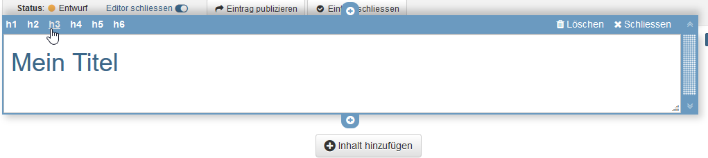

### Paragraph

Element zum Hinzufügen von Textblöcken. Das Paragraph Element beinhaltet
zentrale Formatierungen sowie die Möglichkeit den Text auf Spalten zu
verteilen.

  

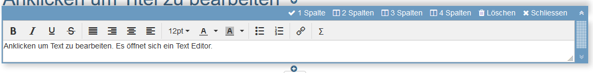

### Tabelle

Fügen Sie Ihrem Portfolio eine Tabelle hinzu. Definieren sie die Anzahl der
Zeilen und Spalten einer Tabelle und nehmen Sie weitere Einstellungen vor.

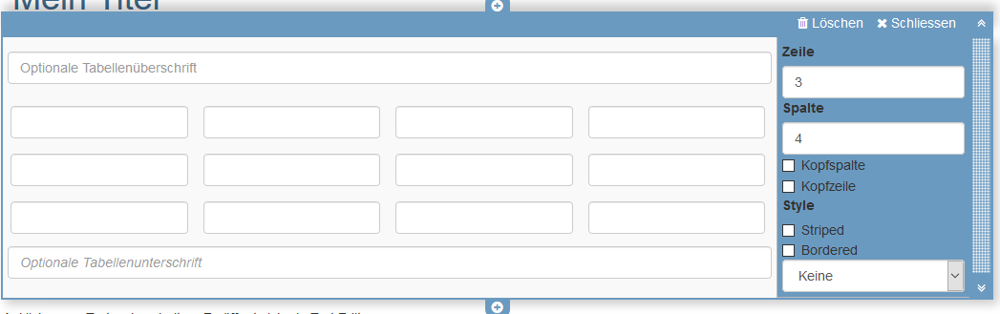

### Bild

Fügen Sie Ihrem Portfolio Bildelemente hinzu. Laden Sie dafür eine passende
Grafikdatei hoch. Anschließend können Sie die Datei weiter konfigurieren, z.B.
einen Titel oder Untertitel platzieren und auch die Größe, Platzierung oder
Umrandung definieren.

Auch kann die Positionierung durch die Verwendung des Container Element weiter
optimiert werden.

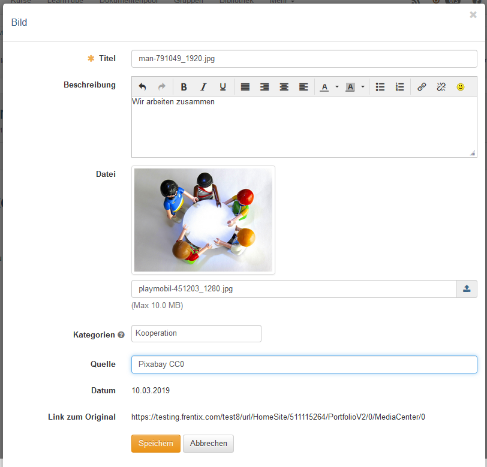

### Textabschnitt

Mithilfe des html-Editors kann "normaler" Text hinzugefügt werden. Dabei kann
die übliche Formatierung vorgenommen werden.  
Unter "Einfügen" können auch [mathematische
Formeln](../personal/Math_formula.de.md) eingefügt werden.

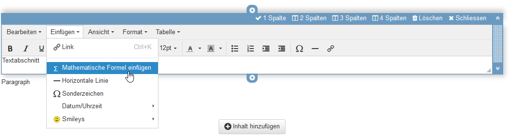

## Einbinden

  

### Dokument erstellen

Hier kann ein neues Dokument entsprechend der angegebenen Dateitypen erstellt
werden. Wird beispielweise OnlyOffice verwendet, können die erstellten Dateien
auch direkt online bearbeitet werden.

###  Zitat

Direkt im Eintrag, wie auch in der Mediathek, kann ein Zitat hinzugefügt
werden. Zuerst wird der entsprechende Zitat Typ ausgewählt und anschliessend
möglichst jedes vorgegebene Feld ausgefüllt.

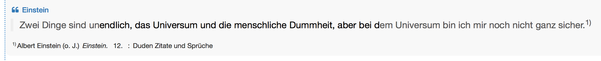

  

  

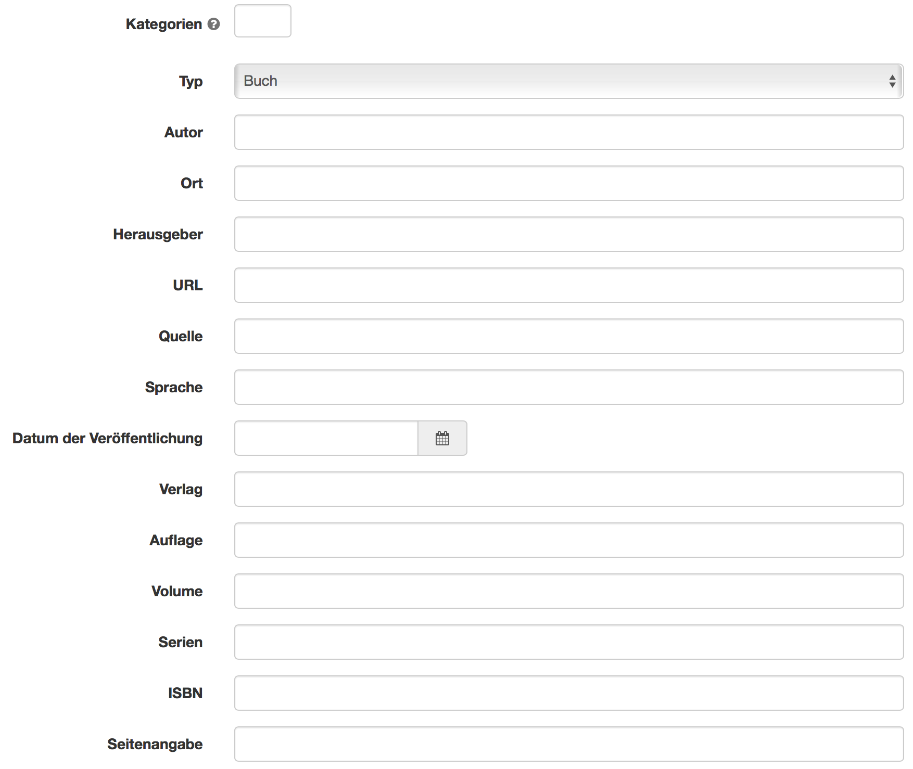

### Dokument

Hier können diverse Dateiformate hochgeladen und per Link bereitgestellt
werden.

Ist ein externer [Dokumenteneditor
](Externe+Werkzeuge+-+Administration.html)aktiviert und liegen die Dateien in
einem Format vor, das von diesem unterstützt wird, können die Dateien auch
direkt online weiter bearbeitet werden.

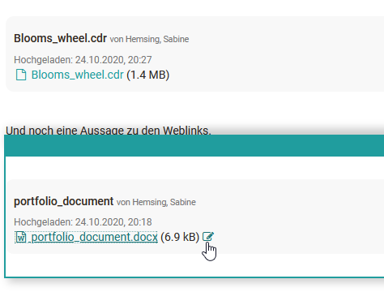

### Video

Über diesen Link können Videos ins Portfolio hochgeladen werden.

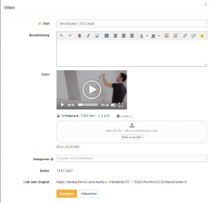

### Aus Mediathek wählen

Dateien, welche sich bereits in der [Mediathek ](Mediathek.html)befinden,
können hiermit einem Eintrag hinzugefügt werden. Die Such- und Filteroptionen
helfen, die gewünschte Datei schneller zu finden.

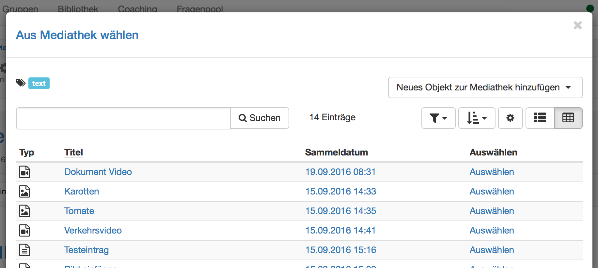

## Layout

  

### Container

Mit Containern kann ein Portfolio weiter strukturiert werden. Es steht dabei
ein 1-4 spaltiges Layout zur Verfügung. Auch Verschachtelungen innerhalb eines
Container Feldes sind möglich.

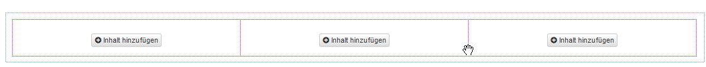

### Separator

Ein Separator hilft, die Seite grafisch zu unterteilen. Es wird eine graue
Linie erstellt, wobei deren Formatierung nicht angepasst werden kann.

  

  

## Weitere Konfigurationen

Neben dem Tab "Überblick" enthält die Portfolio Mappe noch die Tabs
"Einträge", das "Änderungsprotokoll" sowie die "Freigabe".

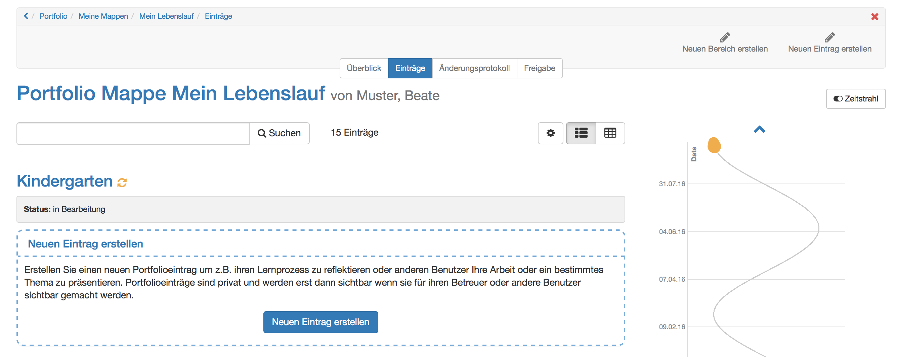

### Zeitstrahl

Mit Hilfe des Zeitstrahls erhält der User eine grafische Übersicht über die
Tätigkeiten im Portfolio. Die farbigen Punkte zeigen an, wann etwas geändert
wurde. Mit "Linksklick" auf einen Punkt erscheinen Details zu den
entsprechenden Einträgen. Die unterschiedlichen Farben stehen für den
jeweiligen Status des Eintrags. Der Zeitstrahl ist hilfreich, wenn ein
E-Portfolio über einen bestimmten Zeitraum verwendet wird, z.B. über ein
Semester oder ein Jahr.

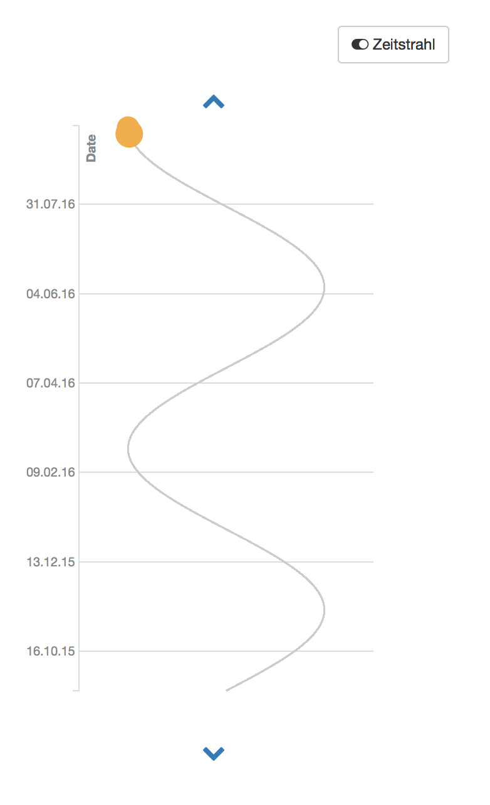

### Änderungsprotokoll

Im Änderungsprotokoll werden alle vorgenommenen Änderungen in chronologischer
Reihenfolge aufgelistet. Die neueste Änderung befindet sich dabei jeweils
zuoberst.

  

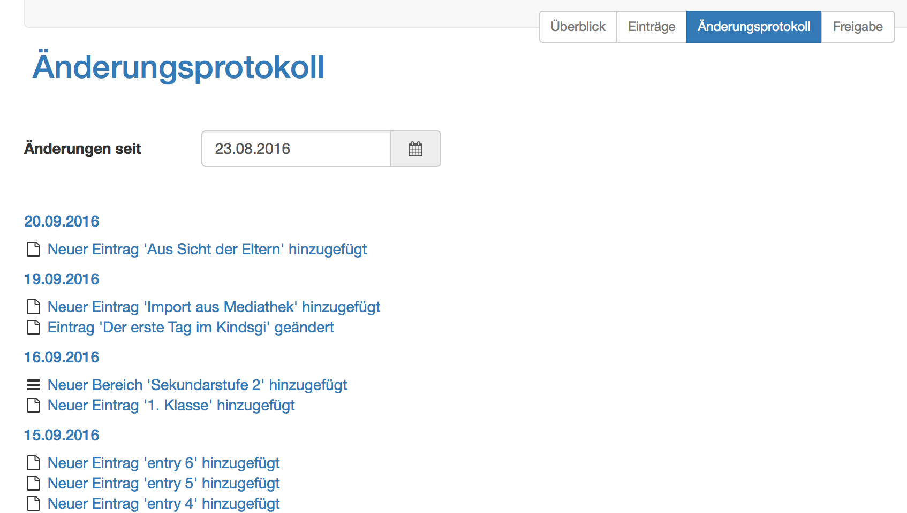

### Freigabe

Unter Freigabe werden Bereiche und Einträge freigegeben. Mehr dazu finden Sie
[hier](Portfolioaufgabe%EF%B9%95+abholen+und+bearbeiten.html#Portfolioaufgabe:abholenundbearbeiten-
freigabe).

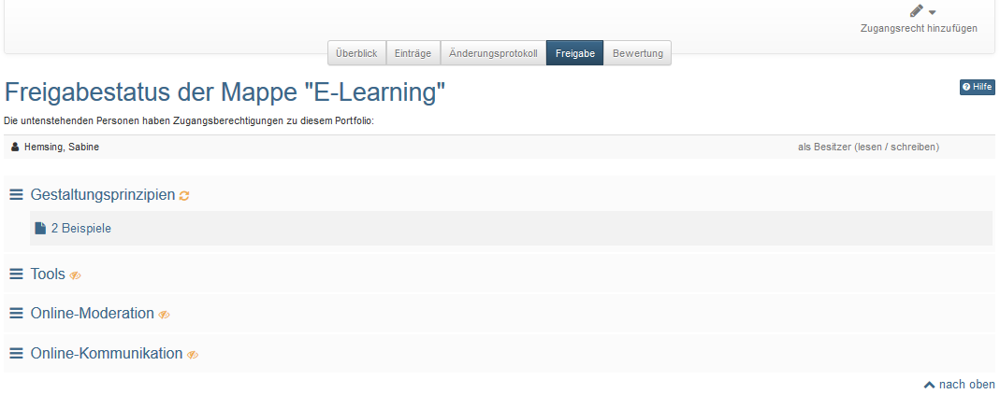

