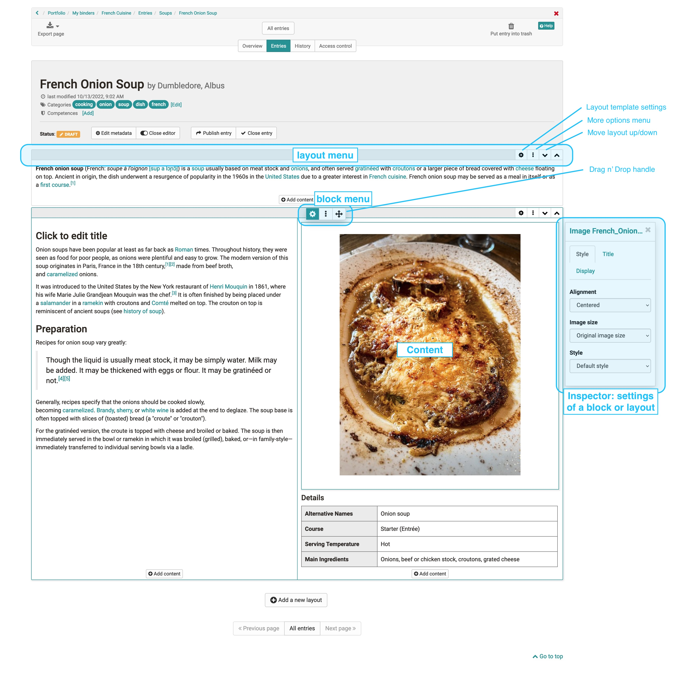

# The Portfolio Editor

!!! note "Availability"

    As of :octicons-tag-24: release 17.1. this portfolio editor is available. It contains conceptual and UX improvements to ensure a more pleasant creation. Old portfolio entries can be opened and edited.

## Controls

In the middle is the content area.
* **Layout Menu**: There you can set all the template for the layout, add layouts on top and bottom and move the layout in position or order.
* **Block Menu**: (from left to right) Turn the inspector on and off. Add blocks and move the block at the button to the desired position using drag n drop.
* **Inspector**: There are all settings that change the functionality, as well as the appearance of the respective block or layout.

{ class="lightbox" }

### Layout

A layout is a higher-level block that allows you to structure the content in different ways using columns and rows. Within a column and row you can add as many blocks as you want.

Currently the following layout templates are available: 1/2 , 1/3 ,

### Inspector

The settings for the respective blocks are located in the Inspector. On larger screens, it opens by default to the right of the selected block. You can show and hide the window by clicking on the :material-cog: settings icon.

By clicking on the title bar of the inspector window you can also move it. When you select a new block, the inspector jumps back to the default position.

## Content blocks

### Title

An entry can contain several titles and subtitles.

With the selection of h1-h6 the size of the heading can be chosen,
where h1 corresponds to "Heading 1" and is therefore the largest and h6 corresponds to
"Heading 6" and thus smallest.

### Paragraph

Element for adding text blocks. The Paragraph element contains
central formatting as well as the possibility to distribute the text to columns.
columns.

### Table

Add a table to your portfolio. Define the number of rows and
rows and columns of a table and add a header row.

### Image

Add image elements to your portfolio. Upload a suitable
graphic file. Then you can further configure the file, e.g.
place a title or subtitle and also define the size, placement or
define the border.

Also, the positioning can be further optimized by using the container element.
optimized.

If you want to place an image next to a text, use a 1/2 / 1/2 layout and place the blocks as desired.

### Text section

Using the html editor, "normal" text can be added. You can use
the usual formatting can be applied.  
Under "Insert" you can also add [mathematical
formulas](../personal/Math_formula.en.md) can be inserted.

## Inserting media

### Create document

Here a new document can be created according to the specified file types.
can be created. If, for example, OnlyOffice is used, the created files can also be directly
can also be edited directly online.

### Quote

A citation can be added directly in the entry, as well as in the media library.
can be added. First, select the appropriate citation type and then fill in as many
then fill in as many of the given fields as possible.

### Document

Various file formats can be uploaded here and provided via link.
can be uploaded.

If an external [Document editor
](../../manual_admin/administration/External_Tools_-_Administration.en.md)is activated and the files are available in a format
the files are in a format that is supported by the editor, the files can also be
can also be edited directly online.

### Video

Videos can be uploaded to the portfolio via this link.

### Select from media library

Files that are already in the [Media Library](Media_center.de.md),
can be added to an entry. The search and filter options
help to find the desired file faster.

Translated with www.DeepL.com/Translator (free version)