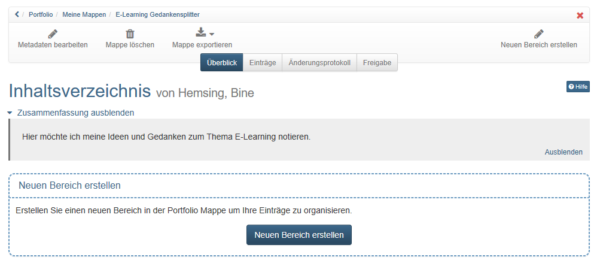
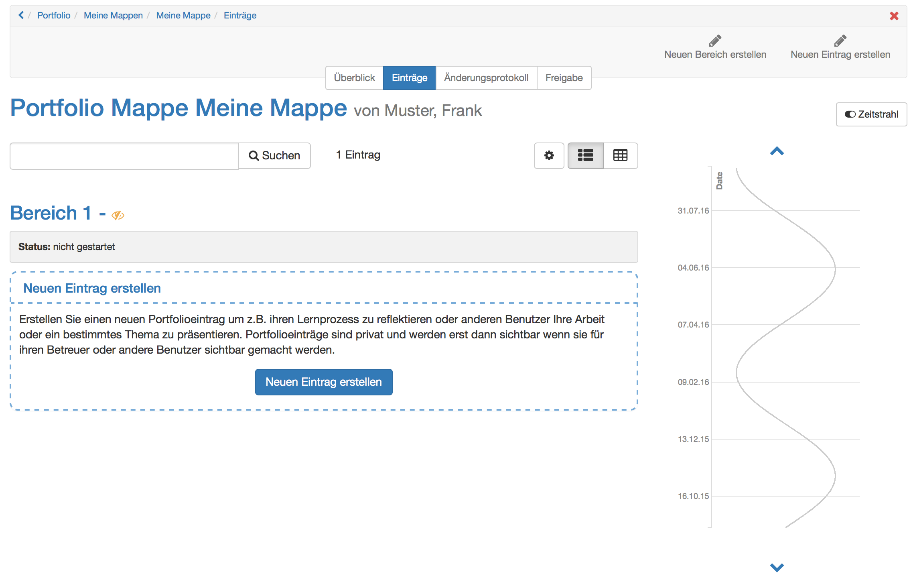

# Drei Schritte zu Ihrer Mappe {: #portfolio_binder_three_steps}

Jede Person kann in OpenOlat unabhängig von einem Kurs oder von Autorenrechten
eigene Mappen erstellen.

Eine Mappe besteht aus Bereichen, Einträgen und Inhalten. Schritt für Schritt
wird hier gezeigt, wie eine Mappe erstellt wird.

## Schritt 1: Mappe erstellen
1. Gehen Sie in den Bereich Portfolio 2.0 und wählen Sie "Zu meinen Mappen".

{ class="shadow lightbox" }

2. Wählen Sie "Neue Mappe erstellen". Wenn Sie die untere Option zur
Erstellung nutzen, können Sie zwischen einer leeren Mappe, einer Mappe aus
einer Portfoliovorlage oder einer Portfolioaufgabe aus einem Kurs wählen.

3. Bei einer leeren Mappe kann ein Titel selbst gewählt und auch eine
Zusammenfassung und ein Titelbild hochgeladen werden. Der Text der
Zusammenfassung erscheint auf der Überblicksseite der Mappe und kann später
auch über „Metadaten bearbeiten“ geändert werden. Bei den Mappen, die auf
Portfoliovorlagen beruhen bzw. die im Kurs abgeholt werden, haben Sie diese
Möglichkeit nicht.

## Schritt 2: Bereich erstellen
1. Sobald eine leere Mappe erstellt worden ist, kann ein Bereich angelegt und
so die Mappe strukturiert werden.

{ class="shadow lightbox" }

2. Rechts oben oder mit dem Button unten in der Mitte einen neuen Bereich
erstellen.
3. Kurzen Titel eingeben und speichern.
4. Zusätzlich kann eine Zusammenfassung hinzugefügt werden.

!!! info "Wichtig"

    Bereiche können nur im Tab "Überblick" bearbeitet werden. Bereiche können nicht in Unterbereiche unterteilt werden. Jedem Bereich können Einträge hinzugefügt werden.

## Schritt 3: Eintrag erstellen
1. Sobald ein Bereich vorhanden ist, können dem Bereich "Einträge" hinzugefügt
werden.

{ class="shadow lightbox" }

2. Rechts oben oder mit dem Button unten in der Mitte einen neuen Eintrag
erstellen.
3. Kurzen Titel eingeben und mit "Neuer Eintrag erstellen" speichern.
4. Zusätzlich können eine Zusammenfassung, ein Titelbild und Kategorien
hinzugefügt werden.
5. Anschliessend können verschiedene
[Inhalte](../area_modules/The_portfolio_editor_17_1.de.md)
bzw. Artefakte hinzugefügt werden.

!!! info "Info"

    Solange ein Eintrag noch bearbeitet wird, befindet er sich im Status "Entwurf". Nach der Fertigstellung sollte er publiziert werden. Nach dem Publizieren kann der Eintrag nicht mehr bearbeitet werden. Allerdings besteht dann die Möglichkeit, Kommentare zu hinterlassen.

## Weiterführende Informationen {: #further_information}

**Auf dieser Seite erwähnt** 
[Der Portfolio Editor](../area_modules/The_portfolio_editor_17_1.de.md)

[Zum Seitenanfang ^](#portfolio_binder_three_steps)

