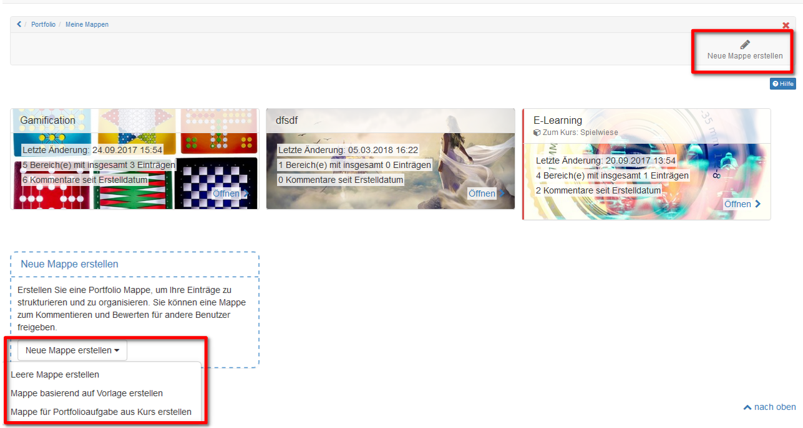
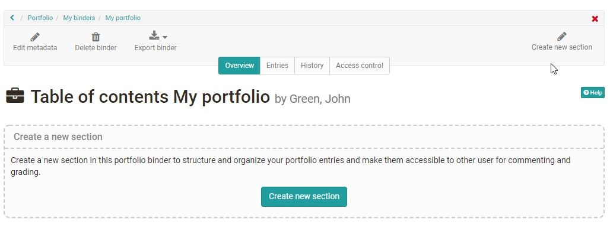
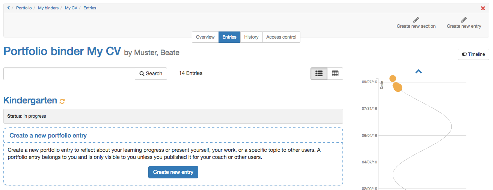

# Three steps to your portfolio binder {: #portfolio_binder_three_steps}

In OpenOlat, anyone can create their own binders independent of a
course or author rights.

A binder consist of sections, entries and contents. Here it is shown step by
step how a binder is created.

## Step 1: Create binder
1. Open landing page of the portfolio 2.0 and choose "My binders".

{ class="shadow lightbox" }

2. Click on "Create new binder". If you use the option below to create it,
you can choose between an empty binder, a binder from a portfolio template,
or a portfolio task from a course.

3. If choosing an empty binder you can add a title and a summary and also upload
a teaser image. The text of the summary appears on the overview page of the
binder and can also be changed later via "Edit metadata". If choosing a binder
from template or from course portfolio task you are not able to do so.

## Step 2: Create section
1. As soon as a binder is created, sections can be created.

{ class="shadow lightbox" }

2. On the top right or with the button in the middle "Create new section".

3. Insert a title and create section.
4. Additionally a summary can be added.

!!! info "Important"

    Sections can only be edited in the tab "Overview".
    Sections cannot be divided in subsections. To every section entries can be added.

## Step 3: Create entry
1. As soon as a section is created, entries can be created.

{ class="shadow lightbox" }

2. On the top right or with the button in the middle "Create new entry".
3. Insert a title and save with "Create entry".
4. Additionally a summary, a teaser image and categories can be added.

5. Afterward, various [content elements](../area_modules/The_portfolio_editor_17_1.md)
or artifacts can be added.

!!! info "Info"

    As long as the entry will be edited it is in the status "Draft". If it is finished it should be published. Afterward the entry cannot be edited nor reopened anymore. But there will be the possibility to add comments.

## Further information {: #further_information}

**Mentioned on this page** 
[The Portfolio Editor](../area_modules/The_portfolio_editor_17_1.md)

[To the top of the page ^](#portfolio_binder_three_steps)
