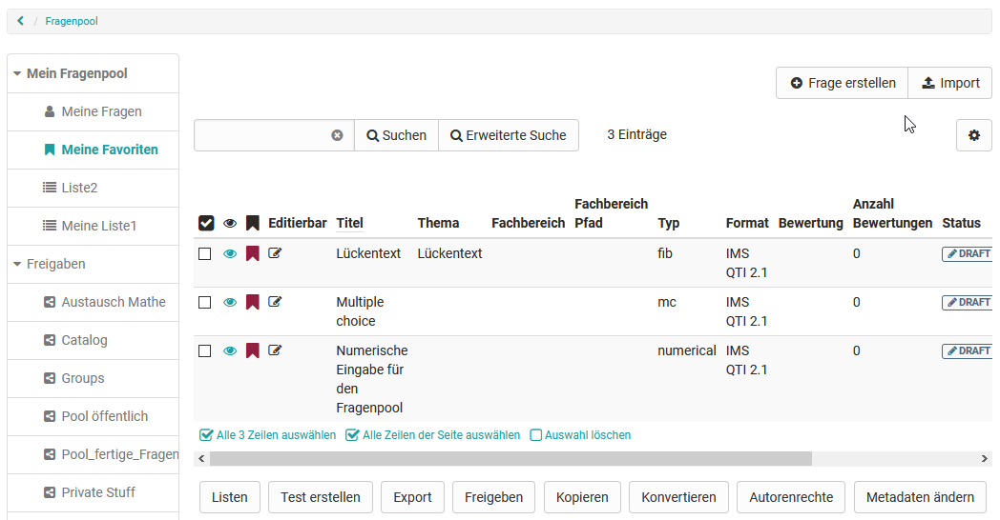
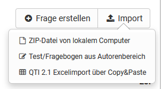

# Handhabung der Daten - Fragen erstellen oder importieren

Die Tabellenansicht der Fragen die im Fragenpool abgelegt sind bietet
vielfältige Möglichkeiten. Achten Sie darauf, dass alle für Sie relevanten
Spalten über das Zahnrad Symbol ausgewählt sind

## Fragen erstellen

Frageitems werden hier im QTI 2.1 Format erstellt und direkt zur weiteren
Nutzung gespeichert. Bei der Erstellung wird ein Titel angegeben,
anschliessend der Fragetyp und zum Schluss, wenn vorhanden, der Fachbereich
ausgewählt. Die so erstellten Fragen kann dann in die OpenOlat Lernressource
Test importiert und verwendet werden.

Informationen zur _Testerstellung_ finden [hier](Tests+erstellen.html).
Informationen zur weiteren Ausgestaltung einer Frage im Kapitel
"[Detailansicht einer Frage"](Item_Detailed_View.de.md).

  

##  Fragen importieren {: #import}

  

Fügen Sie QTI 2.1 Items zum Fragenpool hinzu, indem Sie vorbereitete Zip-
Dateien vom lokalen Computer hochladen, eine Lernressource Test auswählen und
alle Fragen importieren oder die Vorlage für den Excelimport nutzen. Sie
können Fragen direkt in eine Liste, einen Pool oder eine Gruppenfreigabe
importieren. Die folgenden Varianten stehen für den Import zur Verfügung:

  *  **ZIP-Date** i von lokalem Computer: Falls Ihnen ein Set an Fragen oder ein Test als .zip-Datei zur Verfügung steht, können Sie diese hier importieren.
  *  **Lernressource Test** aus Autorenbereich: Wählen Sie aus den verfügbaren Test Lernressourcen den Test aus, den Sie importieren möchten. Klicken Sie dazu in der entsprechenden Zeile auf den Link „Lernressource importieren“. Alle Fragen der gewählten Lernressource werden direkt in den Fragenpool importiert. Abhängig davon, ob Sie dies in der Fragendatenbank oder einem Pool tun, werden die Fragen entweder nur in „Meine Fragen“ kopiert, oder auch in den entsprechenden Pool.
  * QTI 2.1 **Excelimport** über Copy&Paste: Bereiten Sie die Fragen in Excel entsprechend der Excelimport-Vorlage vor, die Ihnen im Wizard ebenfalls zur Verfügung steht. Nachstehend finden Sie ausführliche Informationen zum Import von Fragen über Excel-Dateien (CSV).

  

  

  

Besonders relevante Fragen, die Sie erstellt haben, können Sie als Favorit
markieren und so schnell wiederfinden.  Eine andere Möglichkeit ist mehrere
Fragen in Listen zu organisieren und so eine individuelle Systematik für Ihre
Fragen aufzubauen.

Mit dem Fragenimport über Exceldateien können viele Fragen auf einen Schlag
auf einfache Art und Weise importiert werden. Der Import von Excel Fragen
bietet sich beispielsweise an, um Fragen aus anderen Systemen zu importieren,
welche auch im QTI Standard 2.1 vorliegen. Für den Excelimport benützen Sie
bitte die **Vorlage** , welche Sie beim Aufrufen des Imports vorfinden.

Zurzeit werden folgende Fragentypen für den Import unterstützt:

  * Single-Choice
  * Multiple-Choice
  * Kprim
  * Lückentext
  * Essay
  * Matrix
  * Drag&Drop
  * TrueFalse

Wenn Sie die Fragen erstellt haben, können sie die Fragen in Excel markieren
und mit Copy&Paste in das Eingabefeld übertragen.

Beim Kopieren wandelt Excel die Daten in einen Komma-Separierten Text um. Es
funktioniert gleichermaßen auch mit anderen Tabellenkalkulationsprogrammen wie
z.B. Apple Numbers oder OpenOffice.

**Schlüsselwörter**

Die Tabelle besteht aus zwei bis vier Spalten: die Schlüsselwörter / Punkte,
die Schlüsselwerte und Extra Informationen. Die Fragen werden mit jeweils
einer Trennzeile untereinander aufgeführt.

#### Multiple-Choice Fragen

 **type**|

MC für Multiple-Choice  
  
---|---  
 **title**|

Titel der Frage / Themengebiet  
  
 **question**|  Der Fragetext. Minimale HTML Formatierung ist erlaubt.  
 **max. answers**|  Max. Anzahl möglicher Antworten.  
 **min. answers**|  Min. Anzahl möglicher Antworten.  
 **points**|

Maximal erreichbare Punktzahl. Die minimale Punktzahl ist 0.  
  
 **"1" für korrekte Option, "-1" für falsche Optionen  
**|

Optionstext. Es können beliebig viele Optionen angegeben werden, jede Option
verwendet eine eigene Zeile mit der jeweiligen Punktzahl.  
  
#### Single-Choice Fragen

 **type**|

SC für Single-Choice  
  
---|---  
 **title**|

Titel der Frage / Themengebiet  
  
 **question**|

Der Fragetext. Minimale HTML Formatierung ist erlaubt.  
  
 **points**|

Maximal erreichbare Punktzahl. Die minimale Punktzahl ist 0.  
  
 **Punkte wenn Option gewählt z.B. "1" (richtig) oder "0" (falsch)**|

Optionstext. Es können beliebig viele Optionen angegeben werden, jede Option
verwendet eine eigene Zeile mit der jeweiligen Punktzahl.  
  
#### Lückentext Fragen

 **type**|

FIB für Lückentext

|  
  
---|---|---  
 **title**|

Titel der Frage / Themengebiet

|  
  
 **points**|

Maximal erreichbare Punktzahl. Die minimale Punktzahl ist 0.

|  
  
 **text**|  Ein Textelement|  
  
 **Punkte, wenn Lücke korrekt z.B. "1"**|

Korrekte Antwort in Lücke. Synonyme werden mit ";" getrennt.

| Grösse der Lücke und die maximale Anzahl Zeichen, z.B: "10,8".  
  
  

 **KPRIM Fragen**

 **type**|  KPRIM  
---|---  
 **title**|  Titel der Frage / Themengebiet  
 **question**|  Fragentext  
 **points**|  Maximal erreichbare Punktzahl. Die minimal Punktzahl ist 0.  
+| korrekte Antwort  
-| falsche Antwort  
-| falsche Antwort  
+| korrekte Antwort  
  
 **Essay Fragen**

**type**|  ESSAY  
---|---  
 **title**|  Titel der Frage / Themengebiet  
 **question**|  Fragentext  
 **points**|  Maximal erreichbare Punktzahl. Die minimale Punktzahl ist 0.  
 **min**|  Mindestanzahl Wörter  
 **max**|  Maximale Anzahl Wörter  
  
  

 **Matrix Fragen**

**type**|  MATRIX|  
|  
  
---|---|---|---  
 **title**|  Titel der Frage / Themengebiet|  
|  
  
 **question**|  Fragentext|  
|  
  
 **points**|  Maximal erreichbare Punktzahl. Die minimale Punktzahl ist 0.|  
|  
  
  
| A| B| C  
Antwort 1| 1 (korrekte Antwort)| 0 (falsche Antwort)| 0 (falsche Antwort)  
Antwort 2| 0| 0| 1  
Antwort 3| 0| 1| 0  
  
 **Drag &Drop Fragen**

**type**|  Drag&drop|  
|  
  
---|---|---|---  
 **title**|  Titel der Frage / Themengebiet|  
|  
  
 **question**|  Fragentext|  
|  
  
 **points**|  Maximal erreichbare Punktzahl. Die minimale Punktzahl ist 0.|  
|  
  
  
| Algerien| Kenia| Namibia  
Nairobi| 0 (falsche Antwort)| 1 (korrekte Antwort)| 0 (falsche Antwort)  
Windhoek| 0| 0| 1  
Algier| 1| 0| 0  
  
 **TrueFalse Fragen**

 **type**|  Truefalse|  
|  
  
---|---|---|---  
 **title**|  Titel der Frage / Themengebiet|  
|  
  
 **question**|  Fragentext|  
|  
  
 **points**|  Maximal erreichbare Punktzahl. Die minimale Punktzahl ist 0.|  
|  
  
  
| Unanswered| Right| Wrong  
Paris ist in Frankreich| 0| 1 (korrekte Antwort)| 0 (falsche Antwort)  
Bern ist in Schweiz| 0| 1| 0  
Stockholm ist in Daenemark| 0| 0| 1  
  
Neben den aufgeführten Feldern gibt es noch weitere optionale Felder wie
"Topic", "Keywords", "License" usw. Weitere Details dazu finden Sie in der im
Rahmen des Importprozesses bereitgestellten Datei "Vorlage Excelimport".

