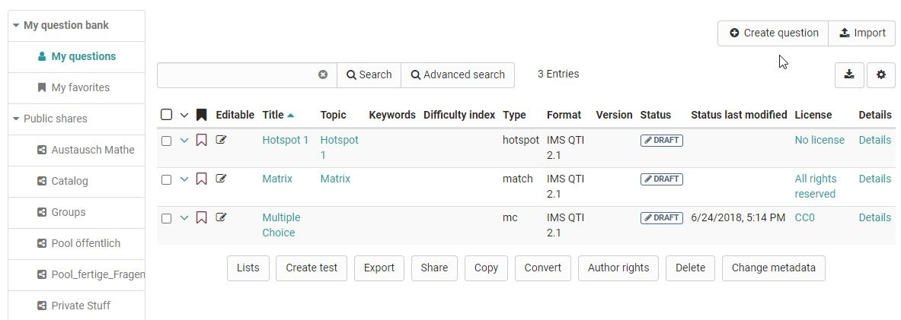

# Data Management - Create or import questions

  

  

The table view of the questions stored in the question pool offers a variety
of options. Make sure that all columns relevant to you are selected via the
cogwheel icon

  

## Create question

Question items are created here in the QTI 2.1 format and stored directly for
further use.  A title is specified during creation, followed by the question
type and, if available, the subject selected at the end. The questions created
this way can then be imported into the OpenOlat learning resource Test and be
utilized.

sites/manual_user/docs/question_bank/Data_Management.md §Creating_Tests.md§ 481
Information on test creation can be found [here](Creating+Tests.html).
Information on the further design of a question in the chapter "[Item Detailed

sites/manual_user/docs/question_bank/Data_Management.md §Item_Detailed_View.md§ 481
view](Item_Detailed_View.md)".

##  Import questions

Add QTI 2.1 items to the question bank by importing test or questionnaire
learning resources from OpenOlat, from external files or by via Copy & Paste
from Excel files. Question items are always added to the table from where the
import was started, as well as to "My Questions". Items can thus be directly
imported into lists, pools or group shares.

The following Import types are available:

  *  **ZIP-file** from local computer: Choose this option if you have a set of questions or a test as .zip-file.
  *  **Learning resource** "Test": Select the test you want to import from the available learning resources. To do this, click on the "Import learning resource" link in the corresponding line. All questions of the selected learning resource are imported directly into the question pool. Depending on whether you do this in the question database or in a pool, the questions are copied either only to "My Questions" or also to the corresponding pool.
  * QTI 2.1 **Excel import** via copy&paste: Prepare the questions in the "template excel import" you can find in the import wizard. Below you will find detailed information on importing questions via Excel files (CSV).

  

You can mark particularly relevant questions that you have created as
favorites and thus quickly find them again. Another possibility is to organize
several questions in lists and thus build up an individual systematics for
your questions.

The question import via Excel files allows you to import multiple questions at
once in simple way. The import of excel questions can for example be used to
import questions from other systems when the questions do also support the QTI
2.1 standards. Please use the template which can be found when opening the
import.

At this time the following question types are supported:

  * Single-Choice
  * Multiple-Choice
  * Kprim
  * Fill-in-blank
  * Essay
  * Match
  * Drag and Drop
  * TrueFalse

When you are finished creating your questions in the Excel file, select the
the questions in Excel and copy&paste them to the input field.

When copying the questions, Excel will convert the cells to a comma separated
formatting. The same does also work with other tools like Apple Numbers or
OpenOffice.

Keywords

The table consists of two, three or four columns: the keywords / points, the
values and extra information. The questions are separated with an empty line.

  

#### Multiple-choice question

 **type**|

MC for multiple-choice  
  
---|---  
 **title**|

Title of the question / topic  
  
 **question**|

The question text. Minimal HTML formatting is allowed.  
  
 **max. answers**|  Max. number of possible answers.  
 **min. answers**|  Min. number of possible answers.  
 **points**|

The maximal score. The minimal score is always set to 0.  
  
 **"1" for a correct option, "0" for a wrong option**|

Options text. You can have as many options as you like, each on a separated
line with a point configuration  
  
  

#### Single-choice question

SC for single-choice

|

SC for single-choice  
  
---|---  
 **title**|

Title of the question / topic  
  
 **question**|

The question text. Minimal HTML formatting is allowed.  
  
 **points**|

The maximal score. The minimal score is always set to 0.  
  
 **Points when this option is selected, e.g. "1" (correct) or "-1"
(incorrect)**|

Options text. You can have as many options as you like, each on a separated
line with a "0" or "1" point configuration  
  
  

#### Fill-in-blank (gap) question

 **type**|

FIB for fill-in-blank

|  
  
---|---|---  
 **title**|

Title of the question / topic

|  
  
 **points**|

The maximal score. The minimal score is always set to 0.

|  
  
 **text**|  A text element|  
  
  
 **Points when the gap is correctly answered, e.g. "1"  **

|

Correct answer in a gap. Synonyms can be entered separated with ";".

| Size of the gap and the maximum characters that can be entered is
configured, e.g. "10,8".  
  
  

 **KPRIM question**

 **type**|  KPRIM  
---|---  
 **title**|  Title of the question / topic  
 **question**|  The question text. Minimal HTML formatting is allowed.  
 **points**|  1  
\+ or -| Options text  
\+ or -| Options text  
\+ or -| Options text  
\+ or -| Options text  
  
  

 **Essay question**

 **type**|  ESSAY  
---|---  
 **title**|  Title of the question / topic  
 **question**|  The question text. Minimal HTML formatting is allowed.  
 **points**|  The maximal score. The minimal score is always set to 0.  
 **min**|  Minimum word count  
 **max**|  Maximum word count  
  
  

 **MATCH question**

 **type**|  MATCH|  
|  
  
---|---|---|---  
 **title**|  Title of the question / topic|  
|  
  
 **question**|  The question text. Minimal HTML formatting is allowed.|  
|  
  
 **points**|  The maximal score. The minimal score is always set to 0.|  
|  
  
  
| A| B| C  
Antwort 1| 1 (correct answer)| 0 (false answer)| 0 (false answer)  
Antwort 2| 0| 0| 1  
Antwort 3| 0| 1| 0  
  
  

 **Drag and Drop question**

 **type**|  KPRIM|  
|  
  
---|---|---|---  
 **title**|  Title of the question / topic|  
|  
  
 **question**|  The question text. Minimal HTML formatting is allowed.|  
|  
  
 **points**|  The maximal score. The minimal score is always set to 0.|  
|  
  
  
| Algerien| Kenia| Namibia  
Nairobi| 0 (false answer)| 1 (correct answer)| 0 (false answer)  
Windhoek| 0| 0| 1  
Algier| 1| 0| 0  
  
  

 **TrueFalse question**

 **type**|  Truefalse|  
|  
  
---|---|---|---  
 **title**|  Title of the question / topic|  
|  
  
 **question**|  The question text. Minimal HTML formatting is allowed.|  
|  
  
 **points**|  Maximum achievable score. The minimum score is 0.|  
|  
  
  
| Unanswered| Right| Wrong  
Paris is in France| 0| 1 (correct answer)| 0 (false answer)  
Bern is in Switzerland| 0| 1| 0  
Stockholm is in Danmark| 0| 0|

1  
  
  

In addition to the listed fields, there are other optional fields such as
"Topic", "Keywords", "License", etc. For more details, see the Excel import
template provided as part of the import process.

