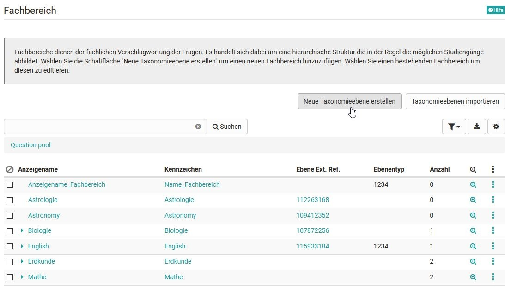
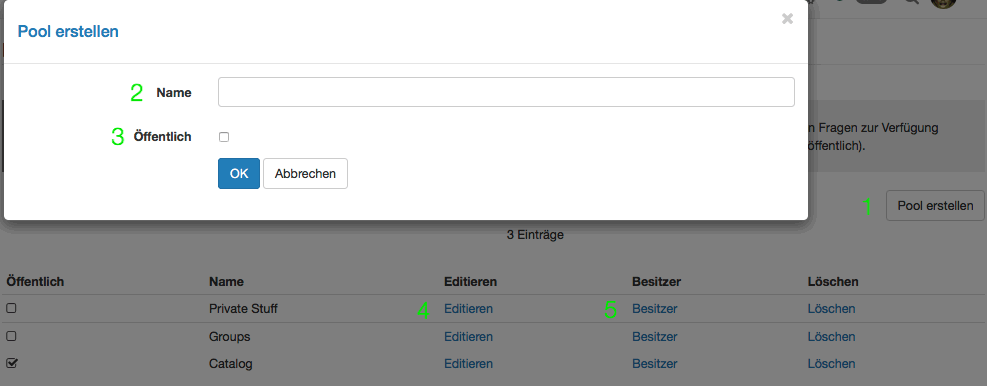
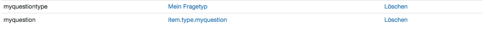
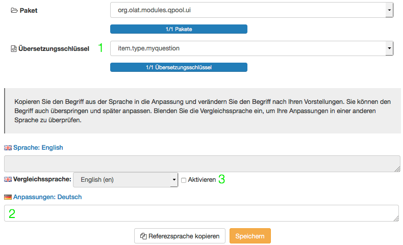
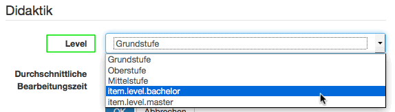

# Fragenpool Administration

## Konfiguration durch Poolverwalter

Im Administrationsbereich des Fragenpools verwalten Poolverwalter fünf
Bereiche zur Organisation des Fragenpool-Moduls. Der Poolverwalter ist wie
z.B. der Benutzerverwalter oder Autor eine [Rolle](../general/Roles_and_Rights.de.md),
die ein Systembenutzer von einem Systemadministrator zugewiesen bekommt. Der
Poolverwalter hat das Recht, organisatorische Aspekte der Fragenbank zu
ändern, er hat jedoch keinen Einfluss auf den Inhalt der Fragenbank sowie
einzelner Pools. Auf die folgenden Bereiche des Fragenpool hat der
Poolverwalter Zugriff:

  * Beurteilungsprozess
  * Fachbereich
  * Pool-Verwaltung
  * Fragetyp
  * Stufe

###  Beurteilungsprozess

Hier kann definiert werden wann eine Frage, für die ein Beurteilungsprozess
gestartet wurde, den Status "final" erhält. Liegt ein Item unterhalb dieser
Grenze wird das Item auf "Revision" gesetzt.

###  Fachbereich

Fachbereiche dienen der fachlichen Verschlagwortung der Fragen (Items), und
werden in einer hierarchischen Struktur dargestellt. Diese bildet z.B. in
Ausbildungsorganisationen mögliche Studiengänge ab, oder eventuell in der
Privatwirtschaft Organisationseinheiten. Neue Fachbereiche werden über die
Schaltfläche "Neue Taxonomieebene erstellen" oder über "Taxonomieebenen
importieren" hinzugefügt. Bereits bestehende Fachbereiche können auch
bearbeitet werden.

###  Pool-Verwaltung

Ein Pool (engl. Sammelbecken, Reservoir etc.) ist eine Fragendatenbank, die
dafür freigegebenen Benutzern (Autoren) des Systems für den Austausch von
Testfragen zur Verfügung steht. Fragenpools können entweder öffentlich sein,
und stehen damit automatisch allen Autoren zur Verfügung, oder nicht
öffentlich, wodurch sich der Zugriff auf ausgesuchte Personen einschränken
lässt, z.B. die Mitarbeiter einer Abteilung. Diese Personen können über den
Link "Besitzer" dem Pool hinzugefügt werden. So erstellte Pools erscheinen mit
diesem Icon:

Benutzer ohne Poolverwalterrechte können ebenfalls eigene Pools erstellen. Die
Freigabe für diese Pools erfolgt allerdings über OpenOlat Gruppen.  Solche
Gruppenfreigaben erscheinen mit dem folgenden Icon:

Neue Pools werden über die Schaltfläche "Pool erstellen" hinzugefügt. Bereits
bestehende Pools können ebenfalls bearbeitet, oder gelöscht werden.

 **Pool erstellen**

  1. Schaltfläche Pool erstellen: Damit wird ein neuer Pool erstellt. Es öffnet sich ein Formular "Pool erstellen"
  2. Geben Sie den Namen des neuen Pools ein.
  3. Legen Sie fest ob der Pool öffentlich (für alle Autoren sichtbar), oder Privat sein soll. Ist der Pool privat, können Sie unter Besitzer (5) festlegen, welche Benutzer Zugriff auf den Pool erhalten.
  4. Für bereits bestehende Pools können Sie den Namen und die Sichtbarkeit ändern,
  5. Besitzer hinzufügen oder entfernen

###  Fragetyp

OpenOlat verfügt über diverse Test [Fragetypen ](../tests/Test_question_types.de.md)die
entweder im Testeditor der Lernressource Test oder im Itemeditor der
Fragenbank erstellt werden können. Erstellen Sie zusätzliche Fragetypen, wenn
die Standard Fragetypen von OpenOlat nicht genügen. Die Standard Fragetypen
können nicht gelöscht werden.

Ein vom Standard abweichender Fragetyp kann nicht über den Editor erstellt
werden, sondern muss einer bestehenden Frage eines Standard-Typs in der
Detailansicht mit Hilfe des Metadatums "Typ" in der Kategorie "Itemanalyse"
zugewiesen werden. Eine in diesem Stil geänderte Frage wird nach wie vor dem
ursprünglichen Fragetyp entsprechen, allerdings wird nun im Fragepool in der
Spalte "Typ" der neue Typ angezeigt.

Neu erstellte Fragen müssen pro verfügbare Sprache übersetzt werden, damit
sowohl z.B. deutsch- als auch englisch-sprachige Benutzer die korrekten
Begriffe angezeigt bekommen, und nicht den hier sichtbaren
Übersetzungsschlüssel.

**Fragentyp erstellen**

Nachdem Sie mit Hilfe der Schaltfläche "Fragetyp erstellen" einen neuen
Fragetyp erstellt haben, erscheint dieser zuunterst in der Tabelle der Typen,
in der Spalte Übersetzung. Dazu wird stets folgende Namenskonvention
angewandt:

    
    
    item.type.[Typenname]

Dies ist der sogenannte Übersetzungsschlüssel, mit dem der Typenname in die
verschiedenen, auf ihrer OpenOlat-Instanz verfügbaren, Sprachen übersetzt
wird.

Klicken Sie in der Tabellenspalte "Übersetzung" auf die entsprechende Zeile.
Es öffnet sich das folgende Formular:

  1. Im Dropdown-Menü "Übersetzungsschlüssel" sehen Sie den Typennamen wie er noch in der Tabelle aufgelistet erscheint. Hier und im darüber liegenden Menü "Paket" können Sie keine Änderungen vornehmen.
  2. Tragen Sie im Feld "Anpassungen: Deutsch" den gewünschten Typennamen ein. Dieser wird ab nun in der Tabellenübersicht hier, in der Typenauswahl in der Detailansicht sowie bei eventuell bereits bestehenden Fragen unter 'Typ' angezeigt.
  3. Aktivieren Sie die Vergleichssprache und wählen Sie die entsprechende Sprache im Dropdown-Menü dazu aus, um die Begriffe zu vergleichen und zu überprüfen.

Wiederholen Sie diese Schritte für jede in ihrer Instanz verfügbaren Sprache.

###  Stufe

Stufen stellen eine weitere Kategorisierungsmöglichkeit dar, und können z.B.
mit einer Schwierigkeitsstufe verglichen werden. Hier erstellen Sie Stufen die
in ihrem Kontext ihren verfügbaren Ausbildungsleveln entsprechen. Beispiele
für Stufen im schulischen Kontext sind: Unterstufe, Oberstufe, Gymnasium,
Bachelor, Master. In einem Unternehmenskontext könnten Stufen so aussehen:
ohne Berufsausbildung, mit Berufsausbildung, Führungsfunktion, Administration,
Kader, Management. Stufen erstellen Sie analog zur Vorgehensweise der
Erstellung neuer Fragetypen.

Die Stufe eines Frageitems kann in der Detailansicht mit Hilfe des Metadatums
"Level" in der Kategorie "Didaktik" zugewiesen werden. So kann z.B. die
Schwierigkeitsstufe einer Frage festgelegt werden.

Wie Fragetypen müssen auch Stufen pro verfügbare Sprache übersetzt werden,
damit sowohl z.B. deutsch -als auch englisch-sprachige Benutzer die korrekten
Begriffe angezeigt bekommen. Gehen Sie dazu wie unter "Fragetypen erstellen"
beschrieben vor.

