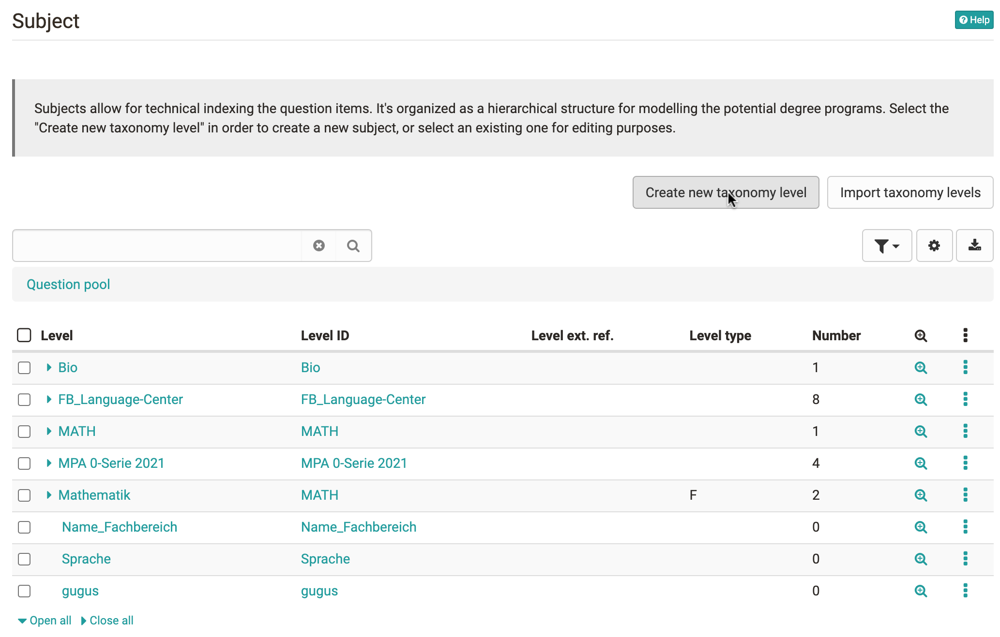
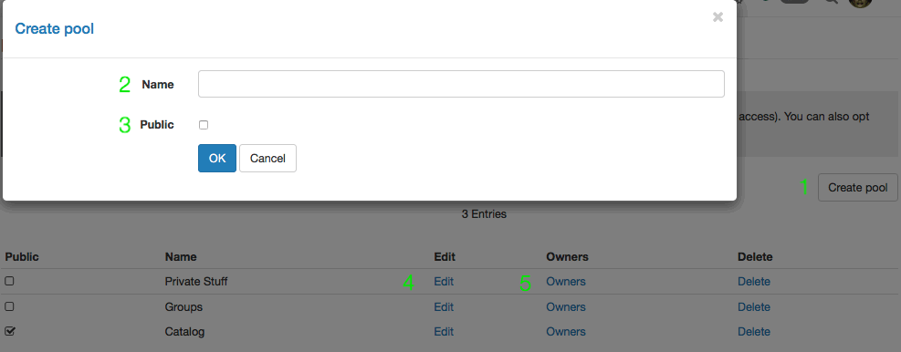
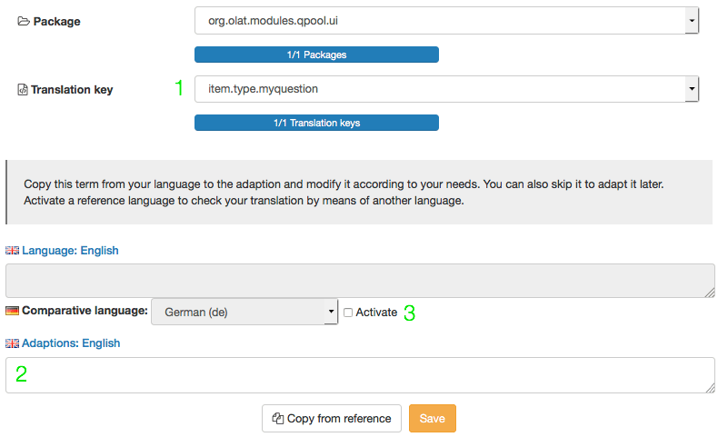
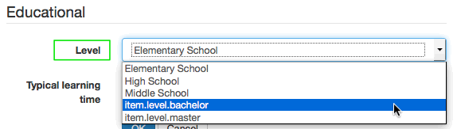

# Question Bank Administration

## Configuration by pool administrator

The administration area of the question bank provides question bank managers
with access to the five organisational domains of the question bank. Just like
e.g. the user manager or the author, question bank manager is a
[role](../general/Roles_and_Rights.md) assigned to a system user by an administrator.
The question bank manager has the right to change / manipulate/regulate
organisational aspects of the question bank, but he has no control over the
content of the question bank or individual pools. The question bank manager,
however, has access to the following domains of the question bank.

  * 1 Question Bank Administration 
  * 2Configuration by pool administrator
    * 2.1 Assessment process
    * 2.2 Subject
    * 2.3 Pool administration
    * 2.4 Question Type
      * 2.4.1Create question type
    * 2.5 Level

###  Assessment process

Here you can define when a question, for which an assessment process has been
started, receives the status "final". If an item is below this limit, the item
is set to "revision".

###  Subject

Subject areas are used for subject-specific keywording of the questions
(items), and are presented in a hierarchical structure. This represents, for
example, possible courses of study in educational organizations, or possibly
organizational units in the private sector. New subject areas are added via
the "Create new taxonomy level" button or via "Import taxonomy levels".
Already existing departments can also be edited.

###  Pool administration

A pool is a question bank that allows all system users with the appropriate
rights (authors) the exchange of question items. Pools can be either public,
thus automatically granting access to all system authors, or privat, giving
access only to selected users, e.g. members of staff to a particular
department. Pools, whether public or private, both display this icon:

Users without question bank managing rights are able to set up their own pools
by sharing question items with one or more groups. Group shares display this
icon:

Create a new pool by clicking the "Create pool" button. Already existing pools
may also be edited or deleted.

  

 **Create Pool**

  1. "Create pool" button: Creates a new pool. The "Create pool" form opens
  2. Enter the name of the new pool
  3. Define whether the pool should be public (visible to all authors) or private. If you are creating a private pool, add owners (5) to determine who should have access to the pool
  4. Edit name or visibility for already existing pools
  5. Add or remove owners - only relevant for private pools

###  Question Type

OpenOlat has several standardized [question types](../tests/Test_question_types.md)
that can be created either in the test editor of the learning resource Test or
in the item editor of the question bank. Create additional question types if
the default question types of OpenOlat are not sufficient. The default
question types cannot be deleted.

A question type different from the default cannot be created using the editor,
but must be assigned to an existing question of a default type in the detail
view using the "Type" metadata in the "Item Analysis" category. A question
modified in this style will still correspond to the original question type,
but the new type will now be displayed in the "Type" column in the question
pool.

Newly created questions must be translated per available language so that both
German and English speaking users, for example, will see the correct terms and
not the translation key visible here.

Newly created questions need to be translated into each language available, so
as to make sure that e.g. german as well as english speaking users are shown
the correct terms instead of the translation key visible in the screenshot.

**Create Type**

#### Create question type

After successfully creating a new question type, the new type will appear in
the type table at the very bottom. The Translation - or the missing
translation - is shown in the translation column. The following name
convention will always apply:

    
    
    item.type.[Type name]

This is the so-called translation key, which allows the new type to be
translated into the various languages available on your OpenOlat system.

Click in the corresponding line in the translation column. The following form
opens:

  1. You can see the type name listed in the drop down menu "Translation key" as it is momentarily displayed in the table. No changes can be made to this menu or the "Package" menu above.
  2. Enter the designated type name in the field "Adaptions: English". From now on, this name will be displayed in the table here, in the type selection in the detailed view as well as in the question bank table under "Type" for already existing questions of this type.
  3. Active the comparative language and select the relevant language in order to compare and verify the terms.

Repeat these steps for all languages available in your OpenOlat system.

###  Level

Level add another categorisation option to the question bank, and can be
compared to difficulty levels. Create those levels that apply to your
organisations' educational level. Examples for levels in an academic context
could be elementary school, middle school, high school, bachelor, master.
Within a corporation context, levels could be the following: without
apprenticeship, with vocational training, administration, middle management,
CO. New levels are created similar to the creation of new question types.

The level of a question item can be assigned by opening that questions' detail
page and then altering the "Level" metadata in the "Educational" categorie.

Just like question types, newly created level need to be translated into each
language available, so as to make sure that e.g. german as well as english
speaking users are shown the correct terms. Proceed as described under "Create
types".

