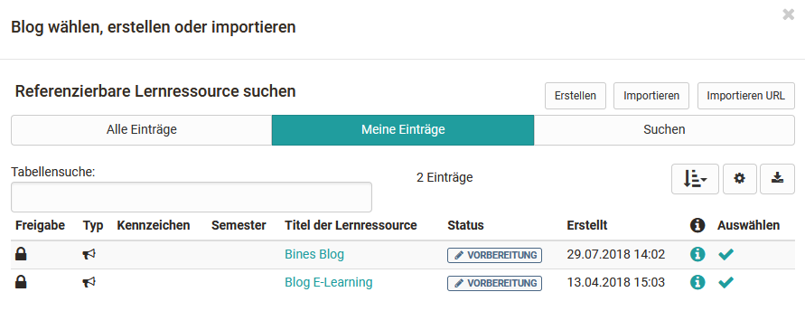
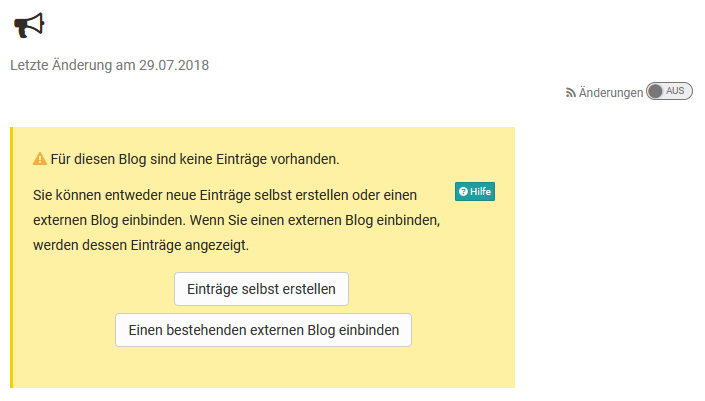

# Blog - Weitere Konfigurationen

## Konfiguration im Kurseditor

### Tab "Blog-Lerninhalt"

Im Tab "Blog-Lerninhalt" können Sie einen neuen Blog erstellen, einen
vorhandenen OpenOlat Blog auswählen, einen mit dem Kursbaustein verbundenen
Blog auswechseln, einen Blog importieren oder einen eingebundenen Blog
editieren.

Darüber hinaus können Sie in dem Tab die Benutzerberechtigungen einstellen.

### Benutzerberechtigungen

#### **Moderator**

Hier können Sie konfigurieren, ob auch alle Betreuer den Blog moderieren
dürfen.

Der moderierende Zugang erlaubt es alle Einträge zu lesen, zu kommentieren, zu
editieren, zu löschen und neue Einträge zu erstellen. Zudem können Moderatoren
auch den Titel und die Beschreibung des ganzen Feeds anpassen.

Anschließend kann der Blog im Kursrun weiter konfiguriert werden.

Wird ein externer Blog eingebunden, können Sie in OpenOlat keinen Einfluss
darauf nehmen, wer Einträge erstellen darf.

Darüber hinaus sind je nach Kurstyp noch weitere Einstellungen in den Tabs
Sichtbarkeit + Zugang (herkömmliche Kurse) bzw. Lernpfad (Lernpfad Kurse)
möglich.

#### **Beiträge erstellen**

Hier wird definiert welche Personengruppen des Kurses Blogbeiträge erstellen
dürfen. Neben den Kursbesitzern können das alle Betreuer und alle
Teilnehmenden sein.

----

## Blog für die Bearbeitung vorbereiten

Beim ersten Aufruf Ihres neuen Blogs werden Sie als Kursbesitzer gefragt, ob
Sie einen bestehenden externen Blog einbinden oder einen OpenOlat Blog nutzen
und die Einträge in OpenOlat selbst erstellen wollen. Diese Konfiguration ist
notwendig, damit der gewählte Blog auch von allen Beteiligten verwendet werden
kann.

 **Einträge selbst erstellen: OLAT interner Blog**

Klicken Sie auf "Einträge selbst erstellen" wenn sie oder andere
Kursbeteiligte Blogeinträge direkt in OpenOlat erstellen und bearbeiten
wollen.

**Bestehender externer Blog**

Sie können den Blog-Kursbaustein auch dazu verwenden, einen externen  Blog
einzubinden. Wählen Sie beim erstmaligen Editieren des Blogs „Einen
bestehenden externen Blog einbinden“. Im Feld „URL“ geben Sie den Feed-Link
des externen Blogs ein. In der Regel ist dies eine URL mit der Erweiterung
.xml. Im Kursbaustein werden die Einträge des externen Blogs angezeigt. 

!!! warning "Achtung"

    Wenn Sie sich für eine Art des Blogs (Einträge selber erstellen oder externen Blog einbinden) entschieden haben, können Sie diese später nicht mehr ändern.

!!! info ""

    Die Wahl eines existierenden Blogs bietet sich an, wenn Sie bereits unabhängig von OpenOlat einen Blog führen oder einen bekannten Blog als Inhalt oder Diskussionsgrundlage in Ihren OLAT Kurs einbinden wollen. In diesem Fall können Sie keine eigenen Blogbeiträge erstellen aber die externen Beiträge können mit Sternchen bewertet und kommentiert werden.

## Abonnieren von Blogs

:octicons-device-camera-video-24: **Video-Einführung**: [Abonnements](<https://www.youtube.com/embed/h9gOqt7TR7Q>){:target="_blank”}

Kursteilnehmende können über den RSS-Feed den Blog abonnieren und werden so
informiert, sobald neue Einträge veröffentlicht werden. Geplante Blog-
Einträge, die noch nicht veröffentlicht sind, werden nicht in die
Benachrichtigung einbezogen.

  

