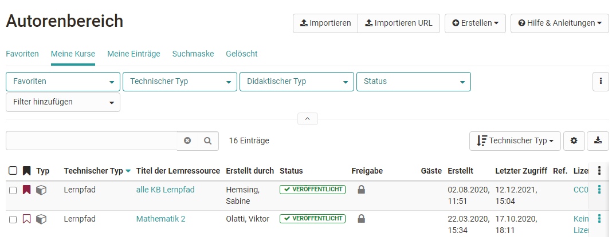
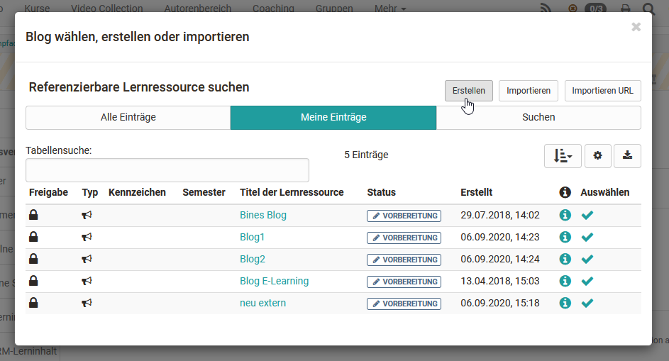

# Vier Schritte zu Ihrem Blog

Mit dieser Anleitung haben Sie in kurzer Zeit in Ihrem Kurs einen Blog
erstellt und ihn Ihren Wünschen entsprechend angepasst.

  

## Schritt 1: Kurseditor öffnen und Kursbaustein Blog einfügen  
---  
1. Im Autorenbereich unter „Meine Kurse“ Kurs oder "Favoriten" suchen und
öffnen.|

  
  
  
2. Oben im Dropdown-Menü „Administration“ auf „Kurseditor“ klicken.  
3. Kurselement, unter dem der Blog-Kursbaustein eingefügt werden soll, durch
Klicken auswählen.  
4. Oben im Pop-Up „Kursbausteine einfügen“ „Blog“ wählen  
5. Im Tab „Titel und Beschreibung“ kurzen Titel des Kursbausteins eingeben und
speichern.  
  
## Schritt 2: Blog erstellen  
---  
1. Im Tab „Blog-Lerninhalt“ auf „Blog wählen, erstellen oder importieren“
klicken.

  
  
2. „Erstellen“ klicken.  
3. Titel des Blogs eingeben und auf "Erstellen" klicken.  
4. Nun können im Tab "Blog-Lerninhalt" noch die Benutzerberechtigungen
definiert werden. Je nach Bedarf dürfen Betreuer, Teilnehmer und Gäste
Blogbeiträge erstellen und eventuell Betreuer Blogs moderieren.  
  
!!! info ""

    Um den Blog nutzen zu können muss im nächsten Schritt ein erster Beitrag erstellt oder ein externer Blog eingebunden werden.

    Erst wenn ein externer Blog eingebunden oder ein OpenOlat Blog mit einem ersten Beitrag angelegt wurde, können auch Blogbeiträge im Kursrun von der zuvor definierten Personengruppe erstellt werden.

# Vorgehen für einen OpenOlat internen Blog

## Schritt 3: Blog Beiträge hinzufügen  
---  
1. Auf „Editieren“ klicken oder den Kurseditor schließen um einen ersten
Initialbeitrag zu erstellen.

  
  
2. "**Einträge selbst erstellen**" wählen um den ersten Initialbeitrag des
Blogs zu erstellten  Dieser Schritt ist wichtig, damit Blogbeiträge von der
definierten Zielgruppe anschließend ebenfalls eingestellt werden können.  
3. Titel, Beschreibung und Inhalt eingeben und auf „Veröffentlichen“ klicken.
Es kann auch eine Audio- oder Video-Datei bereitgestellt werden.  
4. Weitere Einträge können anschließend über "Neuen Eintrag erstellen" einfach im
Kursrun hinzugefügt werden.  
  
    Teilnehmer und Betreuer erstellen ihre Beiträge bei geschlosenem Editor im Kursrun. Besitzer können neue Einträge auch im Kurseditor hinzufügen.

## Schritt 4: Kurs publizieren und freischalten  
---  
  
1. Den Kurseditor schließen und den Kurs publizieren.

  
  
Der Blog ist nun eingebunden und Kursteilnehmer können den ersten Eintrag
lesen.

!!! info ""

    Alternativ kann ein Blog so wie alle anderen Lernressourcen im Autorenbereich erstellt und anschließend in den gewünschten Kurs eingebunden werden. 
    
    Dieses Vorgehen empfiehlt sich um zu verstehen, dass Lernressourcen kursübergreifende Tools sind und die Einbindung in dem gewählten Kurs nur eine Möglichkeit darstellt. 
    
    Derselbe Blog kann in mehreren OpenOlat-Kursen eingebunden und auch kursunabhängig verwendet werden.

  

  

  

