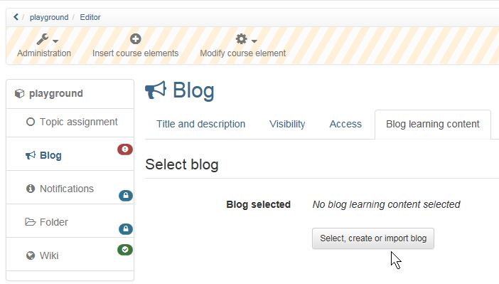
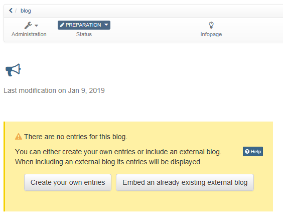

# Four Steps to Your Blog

With the aid of the following guidelines you will create a blog for your
course before adapting it according to your needs.

## Step 1: Open course editor and insert Blog course element

a) Go to the desired course and open the course editor, which is located in the "Administration" menu.

b) Select the position in the course menu where the course element should be added. Course elements are always inserted below the currently selected course element.

c) Click "Insert course element" or use the Quick-Add function and select "Blog".

The course element has now been added to the course.

d) Now assign a suitable title in the tab „Title and description“ and save the course element.

## Step 2: Create Blog

a) Go to the tab „Blog learning content“ and click "Select, create or import blog".

{ class="shadow lightbox" }

Here you can now create a new blog, upload a blog you already have as a file (e.g. through an export), or specify a URL for the blog import.

In the following we assume that you want to use a new
_OpenOlat blog_.

* Click the „Create“ button

* Enter a title for your blog and confirm with "Create".

Done, a new Blog learning resource has been created, and further settings as well as the concrete design can now be made.

## Step 3: Define user permissions

In the tab **"Blog learning content"** it is defined who may create blog entries and moderate the blog.
More differentiated settings are also possible via the advanced configuration.

Blog moderators additionally have the "Edit blog" button in the course run and can determine the title, description and image of a blog. They also decide at the outset whether an external blog or an OpenOlat blog is to be used. This decision is necessary before blog entries can be created, for example by participants.

Finally, the course must be published and the course editor closed for the changes to become visible.

## Step 4: Add blog entries

{ class="shadow lightbox" }

* Click "**Create your own entries**" to create the first initial entry of the blog. This step is necessary so that blog entries can subsequently also be published by the defined target group.

* Create the first blog entry by giving it a title. The actual blog entry is added under "Content". Audio or video files can additionally be inserted, or more files uploaded.

* Once you have filled in all desired fields, publish the blog entry.

Additional entries can then simply be added via the "Create new entry" button in the
course run.

!!! info "Info"

    A prerequisite for course owners, coaches or participants to create blog entries is the use of an OpenOlat blog (not the integration of an external blog). Commenting, however, is generally possible.

!!! info "Note"

    Participants and coaches create their entries in the course run while the editor is closed. Owners can also add new entries in the course editor.

### Embed an external blog

In addition to OpenOlat blogs, external blogs from the internet can also be embedded in a course. This requires the RSS feed of the desired external blog.

Instead of clicking "Create your own entries," click the **"Embed an already existing external blog"** button and insert the RSS feed link in the dialog that appears.

The content of the external blog is then displayed directly in the OpenOlat course and can be rated with stars and also commented on. These comments are only visible within the course, not publicly on the internet.

!!! tip "Tip"

    Alternatively, an OpenOlat blog can be created in the author area like any other learning resource and then integrated into the desired course in the course editor in the tab "Blog learning content".

    This approach is recommended to understand that learning resources are cross-course tools and that the integration in the selected course is only one option.

    The same blog can be embedded in several OpenOlat courses and can also be used independently of a course.

