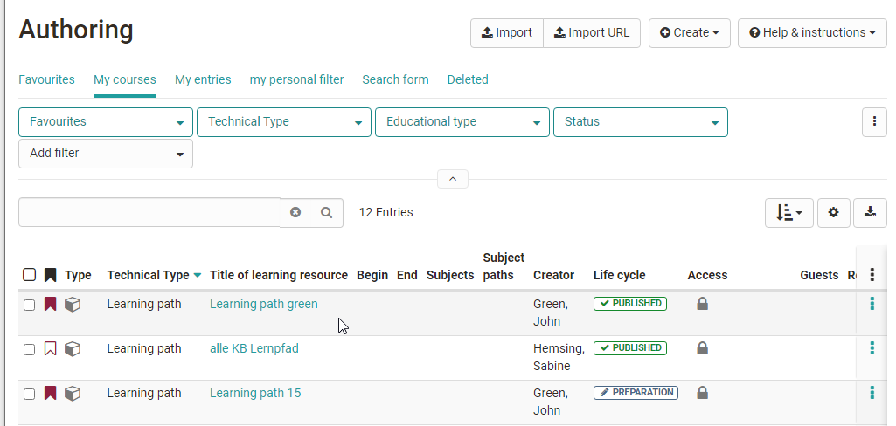

# Four Steps to Your Blog

With the aid of the following guidelines you will create a blog for your
course before adapting it according to your needs.

  

Step 1: Open course editor and insert blog course element  
---  
1| Search for your course in "Authoring", section "My entries," and open it.|

  
  
  
2| Click on "Course editor" in the drop-down menu "Administration" in the
toolbar.  
3| Select position at which your Blog course element should be inserted by
clicking on it.  
4| Select "Blog" in the pop-up "Insert course elements" in the toolbar.  
5| Indicate a short title for your course element in the tab "Title and
description" and save your settings.  
  
Step 2: Create Blog  
---  
1| Click on "Select, create or import blog" in the tab "Blog learning
content."|

  
  
  
2| Click on "Create."  
3| Indicate the title of your blog and click on "Create".  
4| In the "Blog learning content" tab, define whether other groups of people
(coaches, participants, guests) are allowed to create posts in the blog in
addition to the course owner.  
  
To be able to use the blog, the next step is to create a first post or
integrate an external blog.

  

Only when an external blog has been integrated or an OpenOlat blog has been
created with a first post, blog posts can also be created in the course run by
the previously defined group of people.

Procedure for an OpenOlat internal blog

Step 3: Fill Blog with Content  
---  
1| Click on "Edit." Afterwards, an external blog can be integrated or a new
OpenOlat blog can be created. In the following it is assumed that a new blog
is created.|

  
  
  
2| Click on "Create your own entries" to create an OpenOlat learning resource
blog and provide the first entry.  
3|

Indicate title, description and content before clicking on "Publish." An audio
or video file can also be provided.  
  
  
4| Additional entries can then be added via "Create new entry" in the course
editor or when the editor is closed.  
  
Further entries can be added later on following the same pattern or directly
within the course view.

Step 4: Publish and activate your course  
---  
  
|

Close the course editor and publish the course.

  
  
Your blog is now embedded and course participants can read the first entry.

Alternatively, a blog can be created just like any other learning resource in
the author area and then integrated into the desired course. This is a good
way to understand that learning resources are cross-course tools and that
inclusion in the course is only one way. The same blog can be included in
several OpenOlat courses and can also be used independently of the course.

