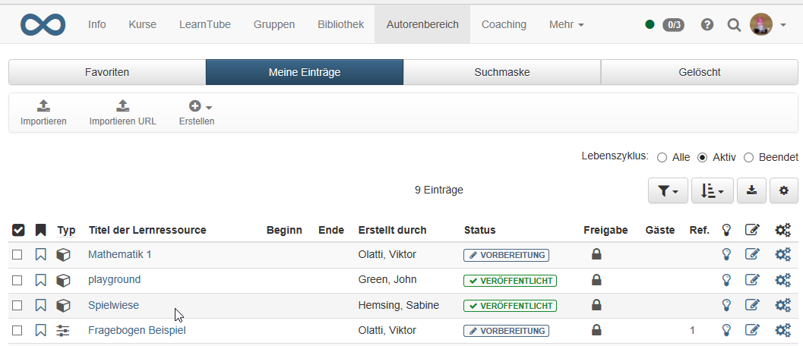
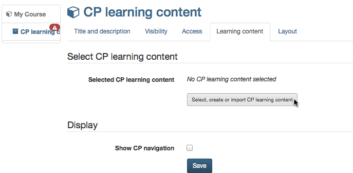
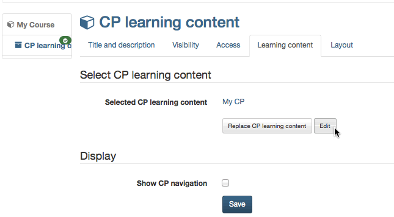
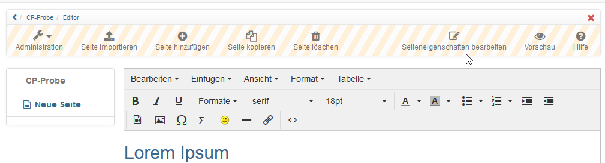
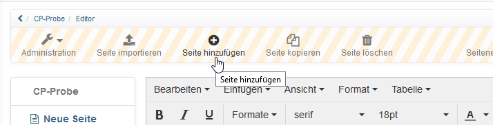
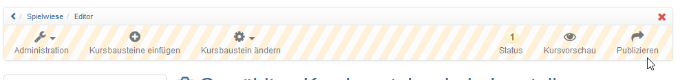
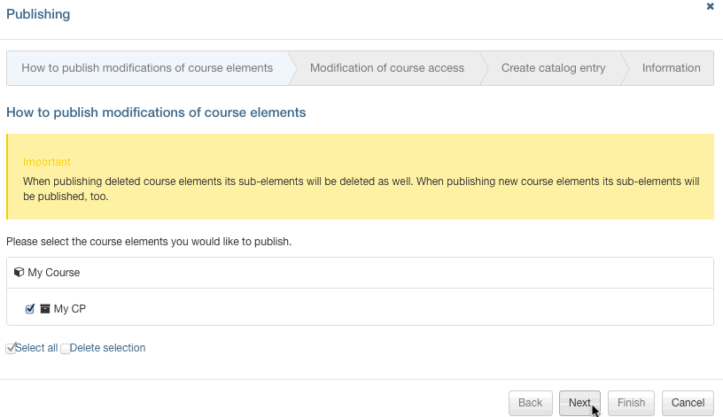
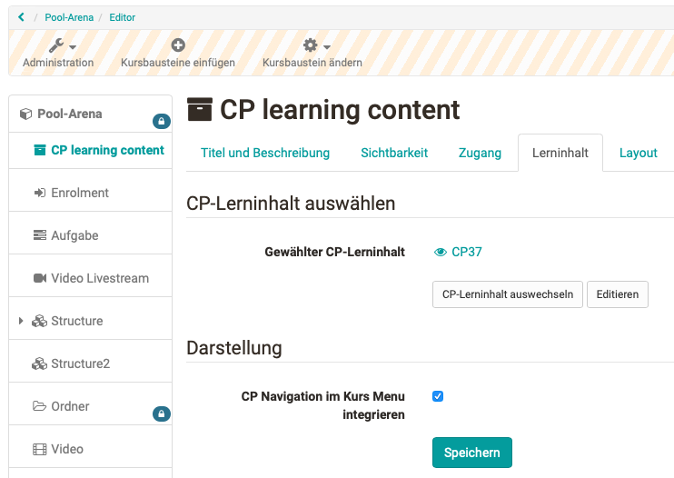

# Fünf Schritte zu Ihrem Content-Packaging

Mit der folgenden Anleitung haben Sie in kurzer Zeit ein Content-Packaging
erstellt, dieses in Ihren Kurs eingebunden und den Kurs für Teilnehmer
freigeschaltet.

## Schritt 1: Kurseditor öffnen und CP-Kursbaustein einfügen  
  
 1. Im Autorenbereich unter “Meine Einträge“ Kurs suchen und öffnen.
  
 2. Oben im Dropdown-Menü “Administration“ auf “Kurseditor“ klicken.  
 3. Kurselement, unter dem der CP-Kursbaustein eingefügt werden soll, durch Klicken auswählen.  
 4. Oben im Pop-Up “Kursbausteine einfügen“ “CP-Lerninhalt“ wählen.  
 5. Im Tab “Titel und Beschreibung“ kurzen Titel des Kursbausteins eingeben und speichern.  
  
## Schritt 2: CP-Lerninhalt erstellen  

 1. Im Tab “Lerninhalt“ auf “CP-Lerninhalt wählen, erstellen oder importieren“ klicken.

 2. “Erstellen“ klicken.  
 3. Titel des CPs eingeben und auf "Erstellen" klicken.  
  
Sie befinden sich nun im Editor. Ein neues CP besteht standardmässig aus einem Kapitel (“CP-Lerninhalt“) und einer Seite (“Neue Seite“).

## Schritt 3: CP bearbeiten

1. Auf “Editieren“ klicken.     

2. **Titel bearbeiten**: Oben in der Toolbar auf "Seiteneigenschaften bearbeiten" klicken und neuen Titel eingeben.

3. **Inhalt bearbeiten**: Im vorgesehenen Feld Seite bearbeiten und formatieren.Speichern.
4. **Neue Seite einfügen:** Icon “Seite hinzufügen“ klicken. Die neue Seite wird unterhalb des markierten Elements eingefügt.

5. **Seite kopieren**: Icon “Seite kopieren“ klicken. Die kopierte Seite wird unterhalb des markierten Elements eingefügt.
6. **Seite importieren**: Icon “Seite importieren“ klicken. “Datei wählen“ klicken und eine HTML-Seite auswählen. “Importieren“ klicken. Sie können mehrere HTML-Seiten auf einmal importieren, wenn Sie diese zippen und dann die ZIP-Datei hochladen.
7. **Seite löschen**: Icon “Seite löschen“ klicken und bestätigen.
8. **Vorschau**: Klicken Sie rechts oben in der Toolbar auf das “Vorschau“-Icon, um das CP vor dem Speichern zu betrachten.

Fügen Sie nun weitere Seiten nach demselben Prinzip ein. Mehr Informationen zu den verschiedenen Funktionen des Editors finden Sie im Kapitel [**CP Editor**](CP_Editor.de.md).

## Schritt 4: CP speichern  

1. Unten in der Mitte auf “Speichern“ klicken.  
2. CP-Tab schliessen und zurück zum Kurs navigieren.

## Schritt 5: Kurs publizieren und freischalten  

1. Oben in der Toolbar “Publizieren“ wählen.

  

2. Kursbaustein überprüfen und “Weiter“ klicken.
3. Unter “Änderung des Kurszugriffs“ “veröffentlicht“ auswählen und bei Bedarf noch den "Zugang für Teilnehmer der Organisation" einrichten.  
4. “Fertigstellen“ klicken.  

Das Content-Packaging ist nun in Ihren Kurs eingebunden und Kursteilnehmer können die Inhalte lesen. Um das CP weiter zu bearbeiten, klicken Sie im Tab “Lerninhalt“ auf “Editieren“.

Unter Abschnitt “Darstellung“ können Sie bestimmen, ob das CP-eigene Komponentenmenü in die Kursnavigation integriert werden soll.

Im Tab “Layout“ definieren Sie die Einstellungen für die Anzeige des CPs. Die Einstellungsmöglichkeiten sind identisch mit denen einer [Einzelseite](Course_Element_Single_Page.de.md).

!!! tip "Alternativer Weg"

    Ein CP kann, wie alle anderen Lernressourcen, im Autorenbereich erstellt und anschließend in den gewünschten Kurs eingebunden werden. Dieses Vorgehen empfiehlt sich um zu verstehen, dass Lernressourcen kursübergreifende Tools sind und die Einbindung in dem gewählten Kurs nur eine Möglichkeit darstellt. Dasselbe CP kann in mehreren OpenOLAT-Kursen eingebunden und verwendet werden.
