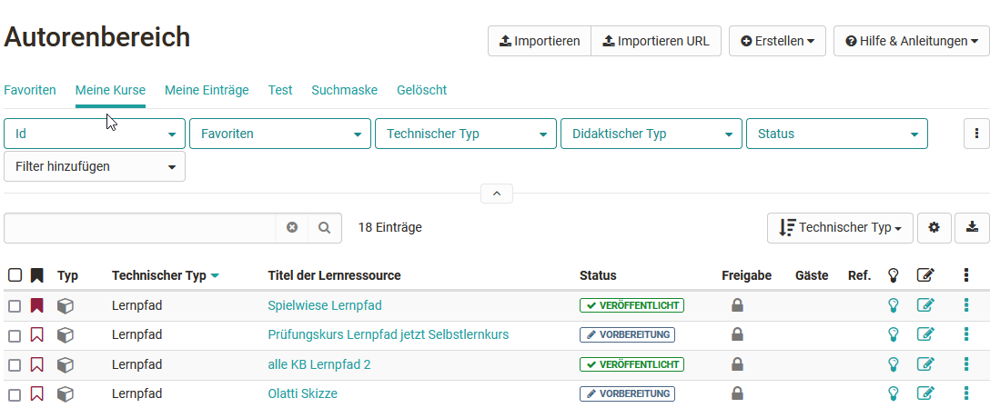
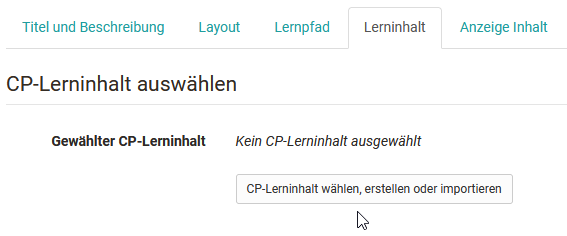
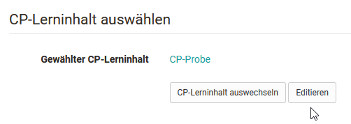

# Fünf Schritte zu Ihrem Content-Packaging

Mit der folgenden Anleitung haben Sie in kurzer Zeit ein Content-Packaging
erstellt, dieses in Ihren Kurs eingebunden und den Kurs für Teilnehmende
freigeschaltet.

## Schritt 1: Kurseditor öffnen und CP-Kursbaustein einfügen  
  
 - Im Autorenbereich unter “Meine Kurse" Kurs suchen und öffnen.
{ class="shadow" }
 - Oben im Dropdown-Menü “Administration“ auf **“Kurseditor“** klicken.  
 - Kurselement, unter dem der CP-Kursbaustein eingefügt werden soll, durch Klicken auswählen.  
 - Oben im Pop-Up **“Kursbausteine einfügen“** “CP-Lerninhalt“ wählen.  
 - Im Tab “Titel und Beschreibung“ einen Titel und eventuell auch einen Titel für das Kursmenü eintragen. Weitere Beschreibung in diesem Tab können später noch vorgenommen werden.   
  
## Schritt 2: CP-Lerninhalt erstellen  

 - Im Tab “Lerninhalt“ auf **“CP-Lerninhalt wählen, erstellen oder importieren“** klicken.
{ class="shadow" }
 - Im erscheinenden Dialog rechts oben auf **“Erstellen“** klicken.  
 - Titel des CPs eingeben und mit "Erstellen" bestätigen.

 Die Lernressource CP ist nun angelegt und Sie können sie über den Link "Editieren" bearbeiten. Alternativ kann die erstellte Lernressource auch direkt im Autorenbereich aufgerufen und bearbeitet werden. 

## Schritt 3: CP bearbeiten und speichern

- Auf den **“Editieren“** Button klicken.
    
    { class="shadow" }

   Nun befindet man sich in der Lernressource CP. Sie wird in einem neuen OpenOlat Tab geöffnet. 

- Öffnen sie den **CP-Editor**: 

    Gehen Sie in das Menü "Administration" der CP Lernressource und wählen Sie hier **"Inhalt editieren"**. So gelangen Sie in den CP-Editor. Hier können Sie den Inhalt mit Hilfe des HTML-Editors bearbeiten, formatieren und speichern. Sie können auch neue Seiten und Dateien hochladen um Ihr CP zu gestalten. Erstellen Sie hier einen strukturierten Hypertext mit mehreren Seiten.    

- Wenn Sie alle gewünschten Änderungen vorgenommen haben, wählen Sie "speichern" und schliessen Sie den CP-Editor. 

Mehr Informationen zu den verschiedenen Funktionen des CP-Editors finden Sie im Kapitel [CP Editor](CP_Editor.de.md).

## Schritt 4: Kurs publizieren  

Sie müssen nun wieder zurück zum Kurs navigieren, der in einem weiteren Olat Tab noch geöffnet ist. Hier sollten nun noch ein paar weitere Einstellungen vorgenommen werden.

- Definieren Sie im Tab "Lerninhalt" ob die **Navigationsstruktur des CPs** im Kurs angezeigt werden soll oder nicht. 

- Konfigurieren Sie bei Bedarf die weiteren Tabs des Kursbausteins.
Im Tab “Layout“ definieren Sie beispielsweise die Einstellungen für die Anzeige des CPs. Die Einstellungsmöglichkeiten sind identisch mit denen einer [Einzelseite](../course_elements/Course_Element_Single_Page.de.md).

- Publizieren Sie anschliessend den Kurs indem Sie in der Breadcrumb-Leiste auf den Kurstitel klicken und den Kurs automatisch oder manuell publizieren. 

## Schritt 5: Kurszugang einrichten

Das Content-Packaging ist nun in Ihren Kurs eingebunden. Damit Lernende das CP im Kurs sehen und bearbeiten können muss der Kurs den Status "Veröffentlicht" haben und die [Zugangskonfiguration](../course_create/Access_configuration.de.md) sollte passend eingerichtet sein. 

Um das CP weiter zu bearbeiten, können Sie jederzeit wieder bei Schritt 3 ansetzen oder die Lernressource CP direkt im Autorenbereich über den Bereich "Meine Einträge" aufrufen. 

!!! tip "Alternativer Weg"

    Ein CP kann, wie alle anderen Lernressourcen, im Autorenbereich erstellt und anschliessend in den gewünschten Kurs eingebunden werden. Dieses Vorgehen empfiehlt sich um zu verstehen, dass Lernressourcen kursübergreifende Tools sind und die Einbindung in den gewählten Kurs nur eine Möglichkeit darstellt. Dasselbe CP kann in mehreren OpenOlat-Kursen eingebunden und verwendet werden.
