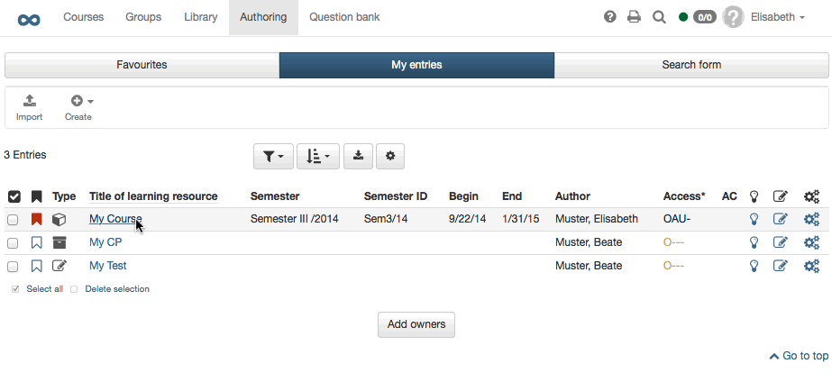

# In Five Steps to Your Content Package

The following helps you to create a Content Package in no time before
embedding it in your course and activating it for your participants.

## Step 1: Start course editor and insert CP course element  

 - Search for your course in "Authoring", section "My entries," and open it.
{ class="shadow" }
 - Click on **"Course editor"** in the drop-down menu "Administration" in the toolbar.  
 - Select position at which your CP course element should be inserted by clicking on it.  
 - Select "CP learning content" in the pop-up **"Insert course elements"** in the toolbar.  
 - Indicate a short title for your course element in the tab "Title and description" and save your settings.  
  
## Step 2: Creating CP learning content  

 - Click on **"Select, create or import CP learning content"** in the tab "Learning content."
{ class="shadow" }
 - Click on "Create" im erscheinenden Dialog rechts oben
 - Indicate the title of your CP and click on "Create".  
  
 Die Lernressource CP ist nun angelegt und Sie können sie über den Link "Editieren" bearbeiten. Alternativ kann die erstellte Lernressource auch direkt im Autorenbereich aufgerufen und bearbeitet werden. 

## Step 3: Edit and save CP  

 - Click on "Edit."
    
    { class="shadow" }

     Nun befindet man sich in der Lernressource CP. Sie wird in einem neuen OpenOlat Tab geöffnet. 

 - Open the **CP-Editor**:
 
 Gehen Sie in das Menü "Administration" der CP Lernressource und wählen Sie hier **"Inhalt editieren"**. So gelangen Sie in den CP-Editor. Hier können Sie den Inhalt mit Hilfe des HTML-Editors bearbeiten, formatieren und speichern. Sie können auch neue Seiten und Dateien hochladen um Ihr CP zu gestalten. Erstellen Sie hier einen strukturierten Hypertext mit mehreren Seiten.  
 
 - Wenn Sie alle gewünschten Änderungen vorgenommen haben, wählen Sie "speichern" und schliessen Sie den CP-Editor. 

More information on the available editor features can be found in the **[CP Editor](CP_Editor.md)** chapter.

## Step 4: Publish the course

Sie müssen nun wieder zurück zum Kurs navigieren, der in einem weiteren Olat Tab noch geöffnet ist. Hier sollten nun noch ein paar weitere Einstellungen vorgenommen werden.

- Under "Display" you can determine whether the CP's own component menu should be integrate into course navigation.

- Konfigurieren Sie bei Bedarf die weiteren Tabs des Kursbausteins.
In the tab "Layout" you define the settings for the display of the CP. The setting options are identical to those of a [single page](Course_Element_Single_Page.md)

- Publizieren Sie anschliessend den Kurs indem Sie in der Breadcrumb-Leiste auf den Kurstitel klicken und den Kurs automatisch oder manuell publizieren.   

## Step 5: Kurszugang einrichten  

The CP is now embedded in your course. 
Damit Lernende das CP im Kurs sehen und bearbeiten können muss der Kurs den Status "Veröffentlicht" haben und die [Zugangskonfiguration](../course_create/Access_configuration.de.md) sollte passend eingerichtet sein.

Um das CP weiter zu bearbeiten, können Sie jederzeit wieder bei Schritt 3 ansetzen oder die Lernressource CP direkt im Autorenbereich über den Bereich "Meine Einträge" aufrufen. 

!!! tip "Alternative Way"
    A Content Package can be created just like any other learning resource in the author area and then integrated into the desired course. This procedure is recommended to understand that learning resources are cross-course tools and that integration into the selected course is only one possibility. The same CP can be integrated and used in several OpenOlat courses.
