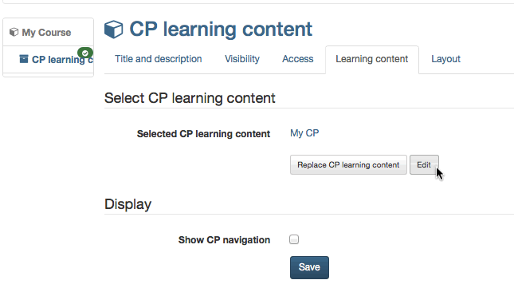

##  [In Five Steps to Your Content
Package](In+Five+Steps+to+Your+Content+Package.html)

The following helps you to create a Content Package in no time before
embedding it in your course and activating it for your participants.

  

Step 1: Start course editor and insert CP course element  
---  
1| Search for your course in "Authoring", section "My entries," and open it.|

  
  
2| Click on "Course editor" in the drop-down menu "Administration" in the
toolbar.  
3| Select position at which your CP course element should be inserted by
clicking on it.  
4| Select "CP learning content" in the pop-up "Insert course elements" in the
toolbar.  
5| Indicate a short title for your course element in the tab "Title and
description" and save your settings.  
  
Step 2: Creating CP learning content  
---  
1| Click on "Select, create or import CP learning content" in the tab
"Learning content."|

  
  
2| Click on "Create."  
3| Indicate the title of your CP and click on "Create".  
  
Now you are within the editor. A new CP usually consists of one chapter ("CP
learning content") and one page ("New page").

Step 3: Edit CP  
---  
1| Click on "Edit."|

  
  
2| Edit title: Click on icon "Edit page properties" and insert a new one.|

  
  
  
3| Edit content: Edit page in the provided field and format before saving it.  
4| Insert new page: Click on icon "Add page." Your new page will be inserted
underneath the highlighted element.|

  
  
  
5| Copy page: Click on icon "Copy page." Your copied page will be inserted
underneath the highlighted element.|

  
  
  
6| Import page: Click on "Import page." Then click on "Select file" before
selecting a HTML page. Click on "Import."|  
  
7| Delete page: Click on icon "Delete page" and confirm.|  
  
  
Now you can insert more pages following the same pattern. More information on
the available editor features can be found in the **[CP
Editor](CP+Editor.html)** chapter.

You can import several HTML pages at once by zipping them before uploading the
resulting ZIP file.

Click on the icon "Preview" on your top right in the toolbar to have a look at
your CP before saving it.

Step 4: Save CP  
---  
1| Click on "Save" in the lower center.  
2| Close CP tab and navigate back to your course.  
  
  

Now go back to your OpenOlat course.

Step 5: Publish and activate your course  
---  
1| Select "Publish" in the toolbar on top.|

  
  
2| Check course element and then go "Next."  
3| Select "All registered OpenOlat users" from the pull-down menu in
"Modification of course access."  
4| Click on "Finish."  
  
The CP is now embedded in your course and course participants can read its
content. In order to edit this CP just click on "Edit" in the tab "Learning
content."

Under " **Display** " you can determine whether the CP's own component menu
should be integrate into course navigation.

In the tab " **Layout** " you define the settings for the display of the CP.
The setting options are identical to those of a [single
page](Course+Element%EF%B9%95+Single+Page.html#CourseElement%3ASinglePage-
_splayout).

  

Alternatively, a CP can be created just like any other learning resource in
the author area and then integrated into the desired course. This procedure is
recommended to understand that learning resources are cross-course tools and
that integration into the selected course is only one possibility. The same CP
can be integrated and used in several OLAT courses.

