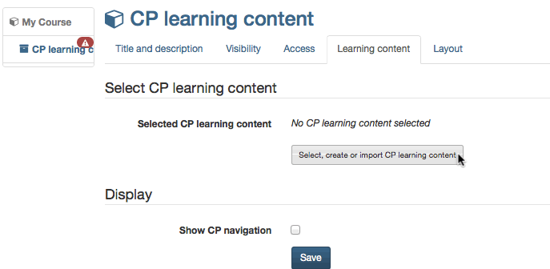

# In Five Steps to Your Content Package

The following helps you to create a Content Package in no time before
embedding it in your course and activating it for your participants.

## Step 1: Start course editor and insert CP course element  

 - Search for your course in "Authoring", section "My entries," and open it.
{ class="shadow" }
 - Click on **"Course editor"** in the drop-down menu "Administration" in the toolbar.  
 - Select position at which your CP course element should be inserted by clicking on it.  
 - Select "CP learning content" in the pop-up **"Insert course elements"** in the toolbar.  
 - Indicate a short title for your course element in the tab "Title and description" and save your settings.  
  
## Step 2: Creating CP learning content  

 - Click on **"Select, create or import CP learning content"** in the tab "Learning content."
{ class="shadow" }
 - Click on "Create" im erscheinenden Dialog rechts oben
 - Indicate the title of your CP and click on "Create".  
  
 Die Lernressource CP ist nun angelegt und Sie können sie über den Link "Editieren" bearbeiten. Alternativ kann die erstellte Lernressource auch direkt im Autorenbereich aufgerufen und bearbeitet werden. 

## Step 3: Edit and save CP  

 - Click on "Edit."
    
    { class="shadow" }

     Now you are in the learning resource CP. It is opened in a new OpenOlat tab.

 - Open the **CP-Editor**:
 
    Go to the menu "Administration" of the CP learning resource and select **"Edit content "**. This way you get to the CP editor. Here you can edit, format and save the content using the HTML editor. You can also upload new pages and files to design your CP. Create a structured hypertext with multiple pages here.   
 
 - When you have made all the desired changes, select "save" and close the CP-editor. 

More information on the available editor features can be found in the **[CP Editor](../learningresources/CP_Editor.md)** chapter.

## Step 4: Publish the course

You must now navigate back to the course, which is still open in another Olat tab. Here you should now configure a few more settings.

- Under "Display" you can determine whether the CP's own component menu should be integrated into course navigation.

- Configure the other tabs of the course element if necessary.
In the tab "Layout" you define the settings for the display of the CP. The setting options are identical to those of a [single page](Course_Element_Single_Page.md)

- Then publish the course by clicking on the course title in the breadcrumb bar and publish the course automatically or manually.   

## Step 5: Set up course access   

The CP is now embedded in your course. 
To enable learners to view and edit the CP in the course, the course must have the status "Published" and the [Access configuration](../learningresources/Access_configuration.md) should be set up appropriately.

To edit the CP further, you can always start again at step 3 or access the learning resource CP directly in the author area via the area "My entries".

!!! tip "Alternative Way"
    A Content Package can be created just like any other learning resource in the author area and then integrated into the desired course. This procedure is recommended to understand that learning resources are cross-course tools and that integration into the selected course is only one possibility. The same CP can be integrated and used in several OpenOlat courses.
