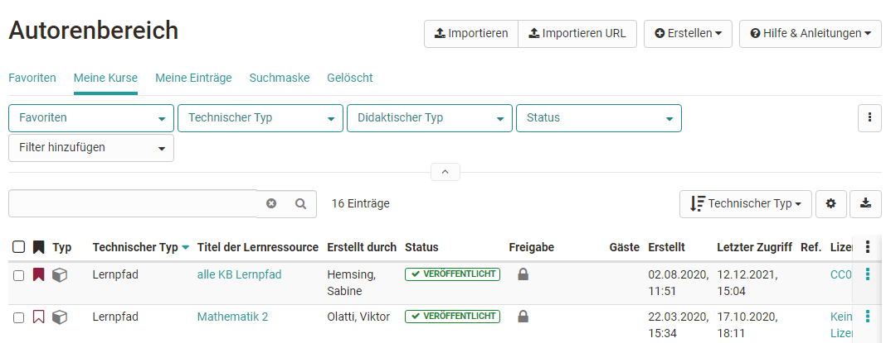
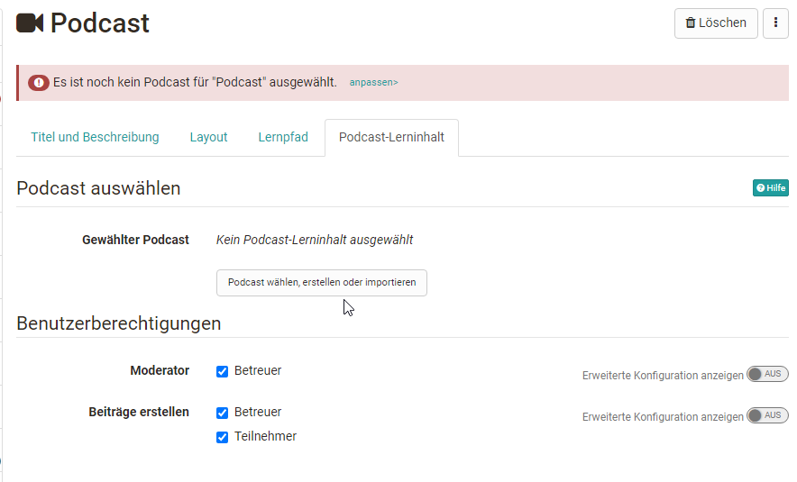
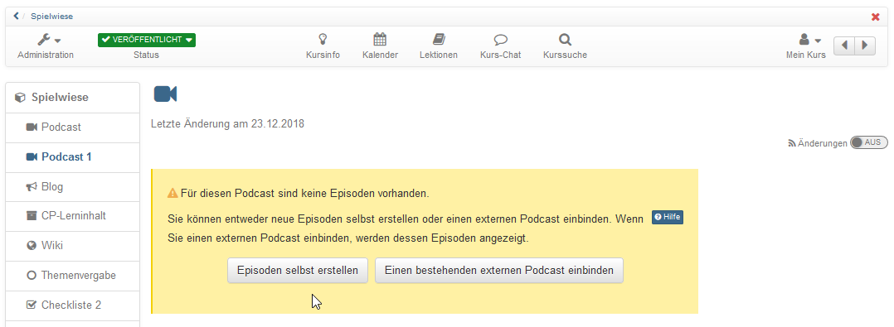

# Vier Schritte zu Ihrem Podcast

Mit dieser Anleitung haben Sie in kurzer Zeit Ihrem Kurs einen Podcast
hinzugefügt und eine erste Episode erstellt.

##  Voraussetzungen

Produzieren Sie die Audio- oder Videodatei für Ihre Podcast-Episode mit einer
dafür vorgesehenen Aufnahmesoftware (z.B.
[GarageBand](http://www.apple.com/ilife/garageband/ "GarageBand")) und
speichern Sie sie in einem der angegebenen Formate: MP3, MP4, M4V, M4A oder
AAC und achten Sie auf die angegebene Maximalgrösse.

Wenn Sie noch keinen Kurs erstellt haben, steht im Kapitel [„Kurs erstellen"](../learningresources/Creating_Course.de.md), wie Sie vorgehen müssen, bevor Sie mit Hilfe
der folgenden Anleitung Ihren Podcast erstellen.

##  Podcast erstellen

  

### Schritt 1: Kurseditor öffnen und Podcast-Kursbaustein einfügen  
---  
1. Im Autorenbereich unter „Meine Kurse“ oder "Favoriten" Kurs suchen und
öffnen.

  
  
  
2. Oben im Dropdown-Menü „Administration“ auf „Kurseditor“ klicken.  
3. Kurselement, unter dem der Podcast-Kursbaustein eingefügt werden soll,
durch Klicken auswählen.  
4. Oben im Pop-Up „Kursbausteine einfügen“ „Podcast“ wählen.  
5. Im Tab „Titel und Beschreibung“ kurzen Titel des Kursbausteins eingeben und
speichern.  
  
### Schritt 2: Podcast erstellen  
---  
1. Im Tab „Podcast-Lerninhalt“ auf „Podcast wählen, erstellen oder
importieren“ klicken.|

  
  
  
2. „Erstellen“ klicken.  
3. Titel des Podcasts eingeben. Diese Information wird im Header des Podcasts
angezeigt. Auf "Erstellen" klicken.  
  
### Schritt 3: Podcast mit Inhalt füllen  
---  
1. Im Kurseditor im Tab "Podcast Lerninhalt" auf „Editieren“ klicken.

  
  
  
  
2. „Episoden selbst erstellen“ wählen.

!!! info ""

    Falls Sie schon über einen externen Podcast verfügen können Sie diesen ebenfalls einbinden.

  
  
  
3. Titel eingeben, Audio- oder Videodatei von Ihrem Rechner wählen und auf
„Veröffentlichen“ klicken. Bei Bedarf noch eine Beschreibung ergänzen.  
  
!!! info ""

    Weitere Episoden können später mit demselben Vorgehen oder direkt in der Kursansicht hinzugefügt werden.

!!! warning "Achtung"

    Schritt 3 ist auch erforderlich, wenn die Lernenden Podcasts hochladen sollen. Es muss auf jeden Fall zunächst vom Lehrenden die erste Episode, also das erste Video hochgeladen werden bevor die Lernenden selbst Videos hochladen können.

### Schritt 4: Kurs publizieren und freischalten  
---  
1. Am einfachsten erfolgt das Publizieren, wenn Sie den Kurseditor schließen und
direkt in die normale Kursansicht wechseln.

    Klicken Sie dafür einfach in der Bread-Crumb-Leiste auf den Kurstitel und es erscheint die Abfrage wie Sie den Kurs publizieren wollen.

    Wählen sie hier "**ja, automatisch**" wenn alle gemachten Änderungen publiziert
werden sollen. Wählen sie "**Ja, manuell**" wenn Sie nur einige Änderungen zum
publizieren auswählen wollen.

  
  
!!! tip "Tipp"

    Alternativ kann auch der ausführliche Publizier-Prozess über den Link in der Toolbar im Kurseditor gewählt werden.

Der Podcast ist nun eingebunden und Kursteilnehmende können die erste Episode
herunterladen.

Wie bei allen OpenOlat Lernressourcen kann auch zunächst die Lernressource
(hier Podcast) erstellt und dann die erstellte Lernressource in den
gewünschten Kurs eingebunden werden.

